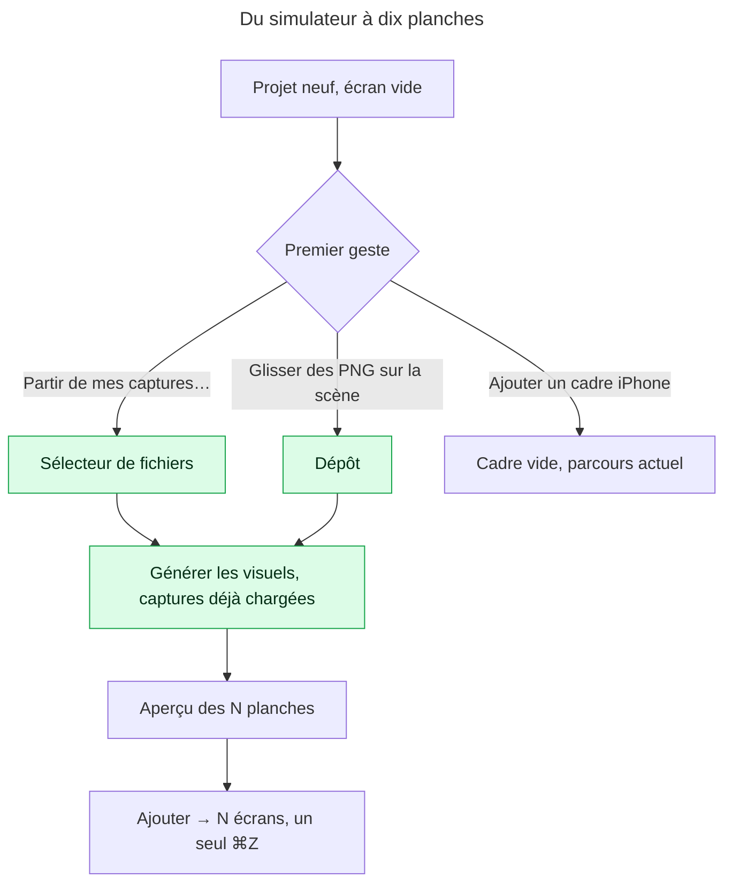

# Instruction: le premier geste est « mes captures »

## Architecture projection

> Tree of the final files. ✅ create · ✏️ modify · ❌ delete

```txt
apps/web/src/
├── stores/ui.store.ts                           ✏️ `pendingCaptures: File[]` + `openCampaignWithCaptures(files)` : la passation d’un dépôt vers le dialogue
├── components/
│   ├── layers-panel/LayersPanel.tsx             ✏️ écran vide : « Partir de mes captures… » en premier, « Ajouter un cadre iPhone » en second
│   ├── canvas/CanvasEditor.tsx                  ✏️ `onDragOver`/`onDrop` d’images sur la scène → `openCampaignWithCaptures`
│   └── campaign-dialog/CampaignDialog.tsx       ✏️ consomme `pendingCaptures` à l’ouverture via `loadShots`, puis le vide
└── e2e/smoke.spec.ts                            ✏️ le parcours « projet neuf → captures → dialogue pré-rempli »
```

## User Journey



## Test Scope

```mermaid
---
title: Test scope
---
journey
  section Setup
    Ouvrir l’éditeur sur un projet neuf => écran vide visible dans Calques: 5: browser
  section Happy path
    Cliquer « Partir de mes captures… » et choisir 3 PNG => le dialogue Générer les visuels s’ouvre avec 3 captures listées et « Visuels » à 3: 5: browser
    Cliquer « Proposer 3 visuels » puis « Ajouter » => le projet compte 3 écrans, chaque appareil porte sa capture: 5: browser
  section Edge case - dépôt sur la scène
    Projet avec écrans => glisser 2 PNG sur la scène => le même dialogue s’ouvre avec 2 captures ; rien n’est écrit au projet avant « Ajouter »: 1: browser
  section Edge case - fichier non image
    Glisser un .txt => la scène refuse le dépôt, aucun dialogue: 1: browser
  section Edge case - projet plein
    Projet à 10 écrans => dépôt de PNG => le dialogue s’ouvre et affiche « Campagne pleine », aucun plan proposé: 1: browser
```

## Wireframe

```txt
┌──────────────────────────────┐
│ (1) Calques            0     │
│ (2) [🔍 Filtrer…]            │
│                              │
│        (3) ▯                 │
│      Écran vide.             │
│  Partez de vos captures de   │
│  simulateur, ou composez à   │
│  la main.                    │
│                              │
│ (4) [ Partir de mes captures…]│
│ (5)  Ajouter un cadre iPhone │
└──────────────────────────────┘
```

1. Titre et compteur — inchangés.
2. Filtre — inchangé.
3. Pictogramme et phrase d’état : nomme les deux chemins.
4. Action principale (`variant="primary"`, `size="sm"`) : ouvre le sélecteur de fichiers puis le dialogue Générer les visuels.
5. Action secondaire (`variant="ghost"`) : parcours actuel, conservé.

## Tasks to do

### `1)` Une passation, pas un second import

> Le dépôt pré-remplit le dialogue existant ; il ne compose rien lui-même.

1. Dans `ui.store.ts`, ajouter `pendingCaptures: File[]` et `openCampaignWithCaptures(files)` qui pose les fichiers puis `setShowCampaignDialog(true)` (passe par `onlyModal`).
2. Dans `CampaignDialog.tsx`, à l’ouverture, si `pendingCaptures.length > 0` : `void loadShots(pendingCaptures)` puis vider le store (un seul effet, garde `react-hooks/set-state-in-effect` : lire le store dans le handler d’ouverture, pas dans un effet qui `setState`).
3. Filtrer sur `image/png` et `image/jpeg` avant la passation ; ignorer le reste silencieusement côté dépôt (le dialogue a déjà son message pour une capture illisible).

### `2)` L’écran vide commence par le bon chemin

> La cible arrive avec ses captures, pas avec l’envie de poser un cadre vide.

1. `LayersPanel.tsx` : remplacer le bloc vide par le wireframe ci-dessus ; un `<input type="file" multiple accept="image/png,image/jpeg" className="hidden">` piloté par le bouton principal.
2. Réutiliser `Button` (`primary` / `ghost`) ; aucune nouvelle primitive.
3. Le bouton principal appelle `openCampaignWithCaptures` avec les fichiers choisis ; sans fichier choisi il ne fait rien.

### `3)` Déposer sur la scène

> Le geste Finder → fenêtre doit faire quelque chose d’utile, jamais ouvrir le PNG dans l’onglet.

1. `CanvasEditor.tsx` : `onDragOver` (preventDefault si `dataTransfer.types` contient `Files`), `onDrop` → fichiers image → `openCampaignWithCaptures`.
2. Pendant le survol, un état visuel minimal : classe `ring-1 ring-marker` sur le conteneur (`--color-marker` est l’état « ici », c’est le cas), retirée au `dragleave`/`drop`.
3. Ne rien écrire au projet : la règle « rien n’est écrit pendant un geste » tient, le dialogue décide.

### `4)` Prouver le parcours

> Un test qui part d’un projet neuf et finit avec trois écrans portant leurs captures.

1. `e2e/smoke.spec.ts` : nouveau test avec `setInputFiles` sur l’input caché de l’écran vide, trois PNG de `e2e/fixtures` (ou générés par `helpers.ts`), attente du dialogue, « Proposer », « Ajouter », assertion `screens.length === 3` et `assetId` posé sur chaque appareil.
2. Cas dépôt : `page.dispatchEvent('drop', { dataTransfer })` sur le conteneur de scène (helper existant `fileDataTransfer` s’il existe, sinon `evaluateHandle` sur un `DataTransfer`).

## Test acceptance criteria

| Task | Acceptance criteria                                                                                                                                       |
| ---- | --------------------------------------------------------------------------------------------------------------------------------------------------------- |
| 1    | `grep -rn 'useProjectStore.setState' apps/web/src` liste toujours exactement trois modules ; le dépôt n’écrit rien au projet.                             |
| 2    | Sur un projet neuf, le premier bouton de l’écran vide ouvre un sélecteur multi-fichiers ; le dialogue s’ouvre avec les captures chargées et le bon compte. |
| 3    | Glisser des PNG sur la scène ouvre le même dialogue ; un `.txt` est ignoré ; l’onglet ne navigue jamais vers le fichier.                                  |
| 4    | Le test e2e aboutit à trois écrans portant chacun sa capture, en un seul pas d’annulation.                                                                |
