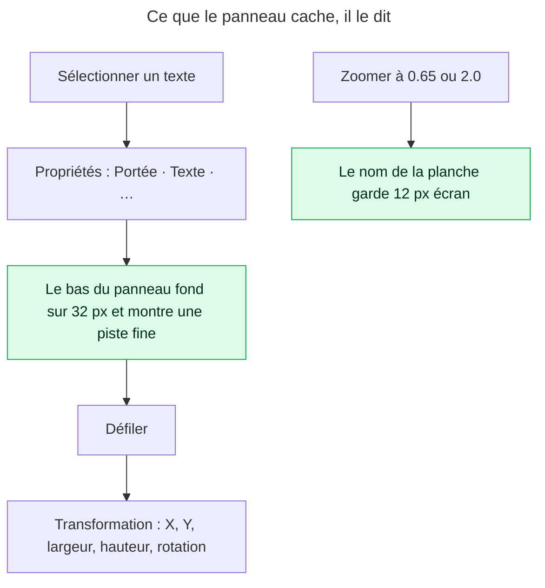
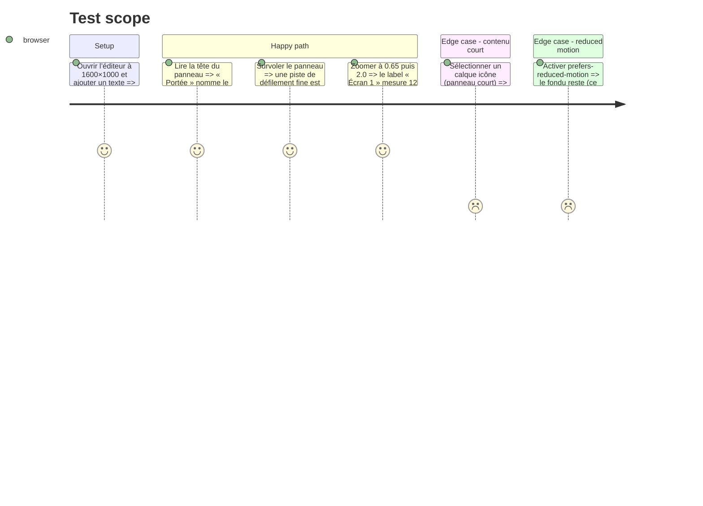

# Instruction: panneau Propriétés et planche lisibles

## Architecture projection

> Tree of the final files. ✅ create · ✏️ modify · ❌ delete

```txt
apps/web/src/
├── components/
│   ├── properties-panel/PropertiesPanel.tsx     ✏️ la portée du calque porte un label inline « Portée » ; le défilement annonce ce qu’il cache
│   └── ui/scroll-area.tsx                       ✏️ fondu de 20 → 32 px et piste de défilement fine visible au survol/focus quand il y a débordement
├── index.css                                    ✏️ `.scroll-fade` plus haut ; `scrollbar-width: thin` + `scrollbar-color` sur `.scroll-fade[data-fade]`
├── lib/canvas/
│   ├── canvas-sync.ts                           ✏️ le label de planche lit le zoom et se rend en 12 px écran (`fontSize = 12 / zoom`)
│   ├── install-viewport.ts                      ✏️ après chaque changement de zoom, remet à l’échelle les labels (`rendererType === 'label'`)
│   └── __tests__/canvas-sync.test.ts            ✏️ le label fait 12 px écran à 0.65 et à 2.0
└── e2e/canvas-viewport.spec.ts                  ✏️ le label reste 12 px écran après zoom avant/arrière
```

## User Journey



## Test Scope



## Wireframe

```txt
┌──────────────────────────────────┐
│ (1) Propriétés                   │
│ (2) Portée  [Cet écran|Partout]  │
│ (3) ⌄ Texte                      │
│     Contenu, Police, Taille …    │
│     …                            │
│ (4) ░░░░░░░░░░░░░░░░░░░░░░░░░░ ▌ │
└──────────────────────────────────┘
```

1. Titre — inchangé.
2. Portée : label inline à gauche du segmenté, même grammaire que `Select`/`Input` (`label` prop).
3. Sections de type puis Transformation — ordre inchangé.
4. Fondu de 32 px et piste fine : visibles seulement quand `scrollHeight > clientHeight`.

## Tasks to do

### `1)` Nommer la portée

> Un segmenté seul en tête de panneau se lit comme des onglets.

1. Dans `PropertiesPanel.tsx`, entourer `Segmented` d’une rangée `Field`-like : `<span className="field-label">Portée</span>` inline à gauche, ou étendre `Segmented` d’une prop `label` sur le modèle de `Slider` si la primitive ne l’a pas (vérifier `components/ui/segmented.tsx`).
2. Garder `ariaLabel="Portée du calque"` ; si un label visible existe, le lier par `aria-labelledby` et retirer `ariaLabel`.

### `2)` Rendre le défilement visible

> Une section invisible par défaut n’existe pas pour l’utilisateur.

1. `index.css` `.scroll-fade[data-fade]` : fondu `calc(100% - 32px)` ; ajouter `scrollbar-width: thin; scrollbar-color: var(--color-input) transparent;` sous le même sélecteur, et `scrollbar-gutter: stable` sur `.scroll-fade` pour que la piste ne décale pas les champs.
2. `scroll-area.tsx` : vérifier que `data-fade` est posé dès le montage quand il y a débordement (pas seulement après un scroll) ; sinon mesurer dans un `ResizeObserver` déjà présent ou à ajouter.
3. Rejouer `pnpm run audit:scale` (aucune nouvelle hauteur) et `audit:contrast` (la piste est décorative, hors matrice — le noter dans le commentaire).

### `3)` Un label de planche en pixels écran

> À 65 %, 12 unités de scène font 7,8 px : illisible, donc inutile.

1. `canvas-sync.ts` : à la création et à la mise à jour du label, `fontSize: 12 / canvas.getZoom()` et `top: -26 / canvas.getZoom()` pour garder la même distance à la planche.
2. `install-viewport.ts` : dans le chemin qui applique le zoom (`setZoom`), parcourir les objets `data.rendererType === 'label'` et réappliquer la même formule, puis `requestRenderAll()`.
3. `install-thumbnails.ts` : vérifier que la capture des vignettes ignore déjà les labels (ils sont hors planche) ; sinon les exclure du rendu de capture.
4. Test unitaire : à zoom 0.65 et 2.0, `label.fontSize * zoom === 12` ; e2e : lire `__sfCanvas.getObjects()` après zoom avant/arrière.

## Test acceptance criteria

| Task | Acceptance criteria                                                                                                                       |
| ---- | ----------------------------------------------------------------------------------------------------------------------------------------- |
| 1    | Le mot « Portée » est visible à gauche du segmenté et le contrôle porte un nom accessible unique.                                          |
| 2    | Avec un texte sélectionné à 1600×1000, le bas du panneau est fondu sur 32 px et une piste fine apparaît ; sur un panneau court, rien.      |
| 2    | `audit:scale` et `audit:contrast` restent verts ; aucun champ ne change de largeur quand la piste apparaît.                               |
| 3    | Le label de planche mesure 12 px écran à 0.65 et à 2.0 ; il n’apparaît dans aucune vignette ni aucun export.                               |
