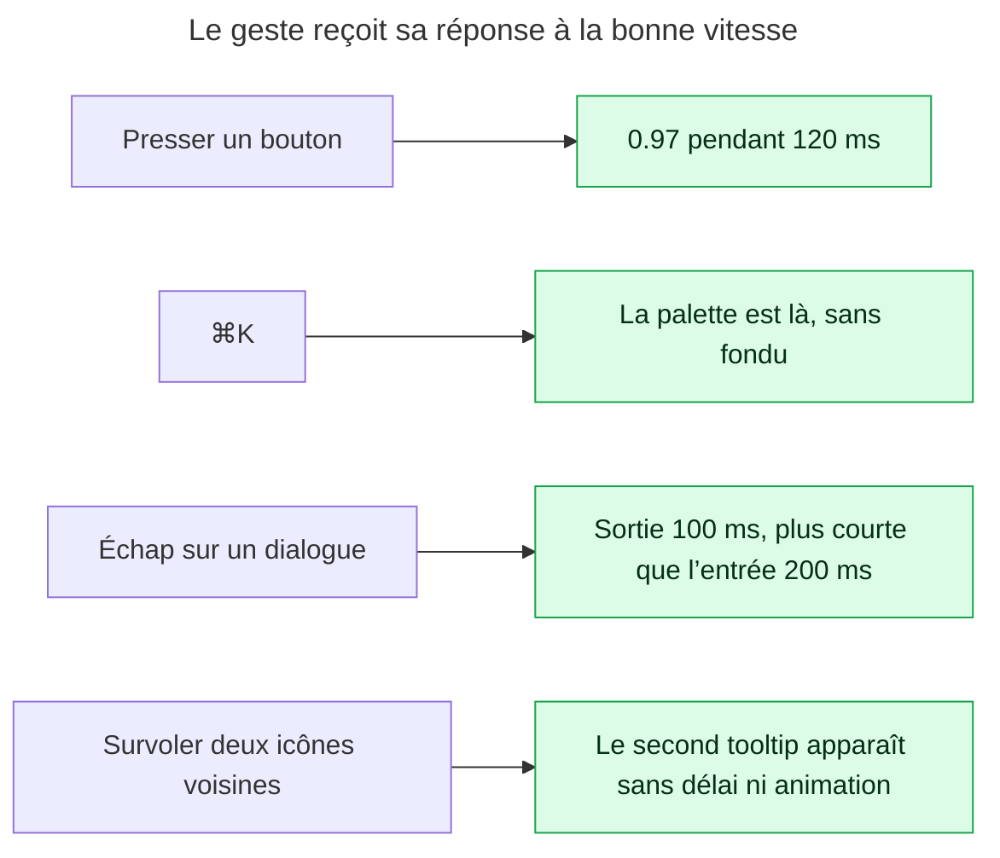
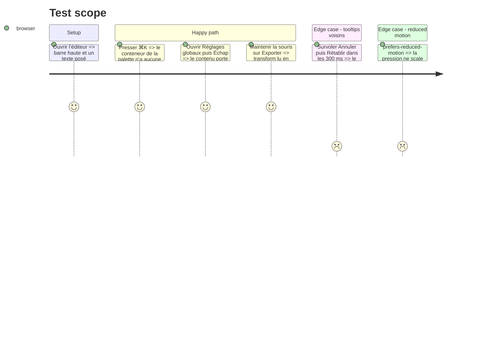

# Instruction: motion — pression, clavier, sortie

## Architecture projection

> Tree of the final files. ✅ create · ✏️ modify · ❌ delete

```txt
apps/web/src/
├── index.css                                    ✏️ `--animate-exit-fast` (100 ms), règle `:active` de pression partagée, `[data-instant]` tooltip sans animation
├── components/ui/
│   ├── button.tsx                               ✏️ `active:scale-[0.97]` + `transition-transform` 120 ms ; `transition-[…]` garde ses propriétés nommées
│   ├── icon-button.tsx                          ✏️ idem, 0.96 (plus petit, retour plus visible)
│   ├── command-palette.tsx                      ✏️ plus d’`animate-palette-in` ni d’`animate-fade-in` sur le voile : ouverture et fermeture instantanées
│   ├── dialog.tsx                               ✏️ sortie 100 ms (`data-[state=closed]:animate-exit-fast`) sur contenu et voile
│   ├── dropdown.tsx                             ✏️ sortie 80 ms sur le contenu
│   └── tooltip.tsx                              ✏️ `data-[state=instant-open]:animate-none` — Radix pose cet état quand `skipDelayDuration` joue
└── e2e/motion.spec.ts                           ✏️ la palette n’anime pas ; un dialogue sort en ≤ 120 ms ; un bouton pressé passe à 0.97
```

## User Journey



## Test Scope



## Tasks to do

### `1)` Le retour de pression

> Un bouton qui ne bouge pas sous le doigt paraît sourd.

1. `button.tsx` : ajouter `transition-transform duration-[120ms] ease-out active:scale-[0.97]` à la base ; conserver la liste explicite de propriétés existante (jamais `transition-all`).
2. `icon-button.tsx` : `active:scale-[0.96]`.
3. `index.css`, bloc `prefers-reduced-motion` : `transform` est déjà retiré de `transition-property` ; vérifier qu’un `:active` avec `scale` n’y saute pas brutalement — sinon y neutraliser `active:scale` par `transform: none`.
4. Ne pas toucher aux tuiles du filmstrip ni aux poignées : elles ont leur propre grammaire (lift, `--shadow-handle`).

### `2)` ⌘K n’anime pas

> Une action clavier répétée des dizaines de fois par jour ne se regarde pas arriver.

1. `command-palette.tsx` : retirer `animate-fade-in` du voile et `animate-palette-in` du contenu ; aucune classe de sortie non plus.
2. Vérifier que `--animate-palette-in` n’est plus consommé (`grep -rn palette-in apps/web/src`) et supprimer le keyframe de `index.css`.
3. Le bouton `⌘K` de la barre et la commande `Ouvrir la palette` passent par le même composant : rien d’autre à changer.

### `3)` Des sorties plus courtes que les entrées

> Une disparition sèche se lit comme un bug ; une sortie aussi longue que l’entrée fait attendre.

1. `index.css` : `@keyframes exit-fast { to { opacity: 0; transform: scale(0.98) } }` et `--animate-exit-fast: exit-fast 0.1s var(--ease-out) both`.
2. `dialog.tsx` : `data-[state=closed]:animate-exit-fast` sur `Content` et `data-[state=closed]:animate-fade-out` (à créer, 100 ms) sur `Overlay`. Radix attend la fin de l’animation avant de démonter (`Presence`) ; aucun `forceMount` requis.
3. `dropdown.tsx` : `data-[state=closed]:animate-exit-fast` (80 ms via `duration-[80ms]` ou un second token si la grille l’exige — préférer réutiliser 100 ms).
4. `prefers-reduced-motion` : les sorties deviennent `opacity` seule, même durée, comme les entrées aujourd’hui.

### `4)` Tooltips voisins instantanés

> Le premier attend 300 ms ; les suivants doivent simplement être là.

1. `tooltip.tsx` : `data-[state=instant-open]:animate-none` sur `Content` (Radix pose `instant-open` quand l’ouverture passe par `skipDelayDuration`).
2. Vérifier que le `Provider` de `App.tsx:231` garde le `skipDelayDuration` par défaut (300 ms) ; ne pas le changer.

### `5)` Prouver dans `motion.spec.ts`

> Ce que l’œil ne peut pas chronométrer, `getAnimations()` le peut.

1. Test palette : après ⌘K, `document.querySelector('[cmdk-root]')?.getAnimations().length === 0`.
2. Test dialogue : ouvrir Réglages globaux, Échap, lire `getAnimations()[0].effect.getTiming().duration ≤ 120` sur le contenu pendant `data-state=closed`.
3. Test pression : `page.mouse.down()` sur Exporter, lire `getComputedStyle(el).transform` ≈ `matrix(0.97, …)`.

## Test acceptance criteria

| Task | Acceptance criteria                                                                                                                 |
| ---- | ----------------------------------------------------------------------------------------------------------------------------------- |
| 1    | `Button` et `IconButton` se réduisent à la pression et reviennent en ≤ 120 ms ; sous reduced motion, aucun mouvement.               |
| 2    | La palette s’ouvre et se ferme sans animation ; le keyframe `palette-in` n’existe plus.                                            |
| 3    | Dialogues et menus sortent en 80–100 ms, entrée inchangée ; sous reduced motion la sortie est un fondu.                            |
| 4    | Le second tooltip survolé dans les 300 ms apparaît sans animation ; le premier garde son délai.                                    |
| 5    | `motion.spec.ts` couvre les trois mesures et reste vert avec les tests existants (entrées de lignes, coche de succès).              |
