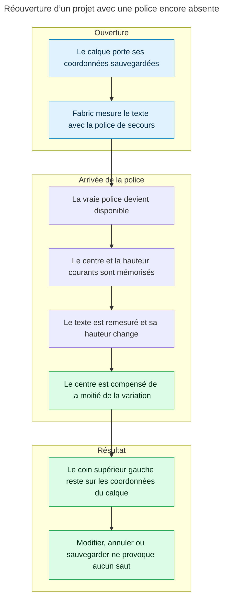
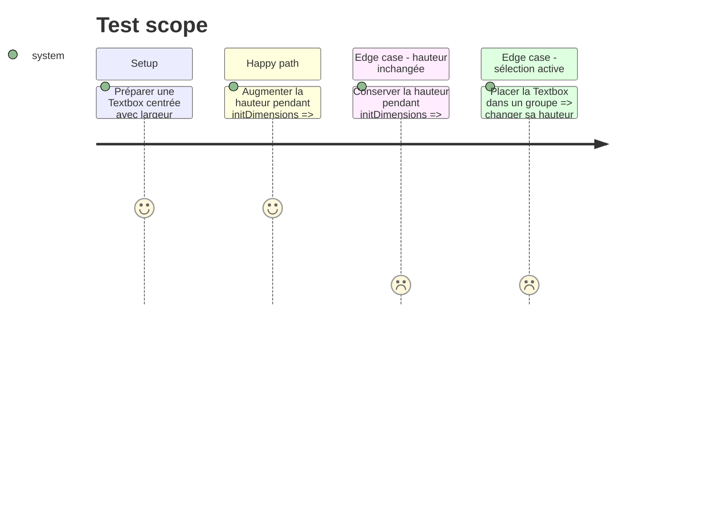

# Instruction: la remesure conserve l’ancrage du calque

## Architecture projection

> Tree of the final files. ✅ create · ✏️ modify · ❌ delete

```txt
apps/web/src/lib/canvas/
├── canvas-utils.ts                         ✏️ compense la variation de hauteur dans le point unique de remesure
└── __tests__/
    └── declared-width.test.ts              ✏️ verrouille ensemble largeur déclarée et position verticale
```

## User Journey



## Test Scope



## Tasks to do

### `1)` Préserver la position dans le helper partagé

> Corriger une fois le chemin emprunté par la synchronisation initiale, les polices tardives et les instances de layout.

1. Dans `rewrapTextbox`, mémoriser le centre de scène et la hauteur avant `initDimensions()`.
2. Conserver la restauration actuelle de `declaredWidth` par `_set`.
3. Si la hauteur a changé, replacer le centre sur le même `x` et sur l’ancien `y` augmenté de la moitié de la variation de hauteur.
4. Réutiliser `placeAtSceneCenter` afin que la compensation passe par `setXY` lorsque l’objet appartient à une `ActiveSelection`.
5. Garder `setCoords()` en dernier, après la taille et la position définitives.

### `2)` Épingler l’invariant de géométrie

> Le test doit échouer si le réenroulement recommence à déplacer le haut du calque.

1. Étendre le double `bumpedTextbox` pour simuler une variation de hauteur et exposer son centre de scène.
2. Vérifier qu’après `rewrapTextbox`, `fabricObjectToLayerUpdate` rend le même `y` qu’avant la remesure.
3. Ajouter le contre-test sans variation de hauteur pour interdire un repositionnement inutile.
4. Couvrir un objet groupé afin de conserver le chemin `setXY` déjà requis par les sélections multiples.
5. Rejouer les tests ciblés `declared-width` et `install-fonts`, puis la gate unitaire du workspace web.

## Test acceptance criteria

| Task | Acceptance criteria                                                                                                                    |
| ---- | -------------------------------------------------------------------------------------------------------------------------------------- |
| 1    | Une variation de hauteur provoquée par une police tardive ne change ni le `x` ni le `y` produit par `fabricObjectToLayerUpdate`.       |
| 1    | Les textes d’écran et les instances de layout restent visuellement à leur place avant toute édition, annulation ou sauvegarde.          |
| 2    | Le test échoue sans la compensation, reste vert lorsque la hauteur ne change pas et couvre le repositionnement d’un objet groupé.       |
| 2    | Les contrats existants de largeur déclarée, chargement de police et sélection multiple restent verts.                                  |
