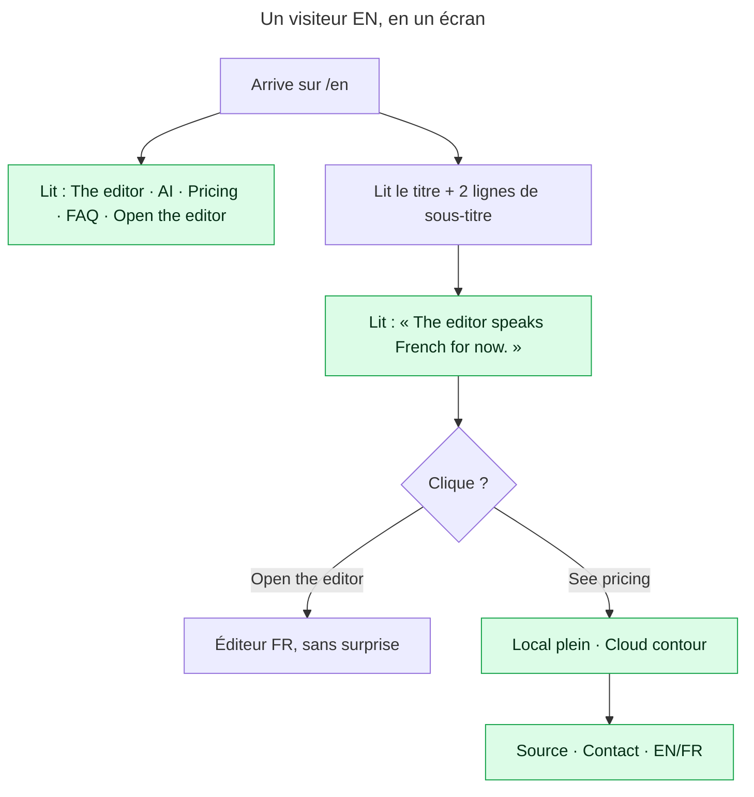

# Instruction: le premier écran dit tout ce qu’il faut, une fois

## Architecture projection

> Tree of the final files. ✅ create · ✏️ modify · ❌ delete

```txt
apps/web/src/landing/
├── copy.ts                                      ✏️ `hero.sub` raccourci EN/FR ; `hero.langNote` (EN seulement) ; `footer.contact` ; `pricing` : le CTA Cloud ne promet rien de plus que « Choisir »
├── components/
│   ├── Nav.tsx                                  ✏️ les quatre ancres rendues inline dès `md`, le burger ne reste que sous `md`
│   ├── Hero.tsx                                 ✏️ note de langue sous la rangée de CTA, rendue seulement si `t.hero.langNote`
│   ├── Pricing.tsx                              ✏️ le CTA prend le rang du plan : `CtaPrimary` pour Local, `CtaGhost` pour Cloud
│   ├── FinalCta.tsx                             ✏️ même rang (déjà le cas : vérifier, ne rien inventer)
│   └── Footer.tsx                               ✏️ lien « Contact » → issues GitHub ; emplacement commenté pour les pages légales
├── links.ts                                     ✏️ `LINKS.contact = 'https://github.com/neogenz/screenforge/issues'`
apps/web/
├── e2e/landing.spec.ts                          ✏️ ancres visibles à 1440, burger seul à 390 ; note de langue présente en EN, absente en FR ; Cloud n’est plus citron
├── src/lib/__tests__/landing-copy.test.ts       ✏️ `hero.sub` ≤ 160 caractères par langue ; `langNote` défini en EN, absent en FR
└── scripts/landing-audit.mjs                    ✏️ ajoute la paire « note de langue sur citron » à la matrice de contraste si elle sort des tokens existants
```

## User Journey



## Test Scope

```mermaid
---
title: Test scope
---
journey
  section Setup
    Ouvrir /en à 1440×900 => page prérendue, barre citron: 5: browser
  section Happy path
    Lire la barre => quatre ancres visibles et le CTA, aucun bouton Menu: 5: browser
    Lire le hero => sous-titre ≤ 2 lignes et une note de langue sous les CTA: 5: browser
    Aller à #pricing => le CTA Local est plein citron, le CTA Cloud est un contour: 5: browser
    Lire le pied de page => Source, Contact, langue: 5: browser
  section Edge case - FR
    Ouvrir /fr => aucune note de langue: 1: browser
  section Edge case - 390 px
    Ouvrir /en à 390 => bouton Menu, ancres dans le popover, CTA dans le popover: 1: browser
  section Edge case - contraste
    landing-audit => la note de langue passe 4.5:1 sur le citron: 1: system
```

## Wireframe

```txt
┌──────────────────────────────────────────────────────────────────────────┐
│ (1) ScreenForge   (2) The editor  AI  Pricing  FAQ   EN FR  [OPEN THE EDITOR] │
├──────────────────────────────────────────────────────────────────────────┤
│                                                                          │
│ (3) App Store screenshots, down to the pixel.                            │
│                                                                          │
│ (4) Compose the set once, export at Apple’s exact sizes, re-shoot        │
│     in one click at every release. Free, no account, local by default.   │
│                                                                          │
│ (5) [OPEN THE EDITOR FOR FREE]  [SEE PRICING]                            │
│ (6) The editor is in French for now. English is coming.                  │
│                                                                          │
└──────────────────────────────────────────────────────────────────────────┘
```

1. Wordmark — inchangé.
2. Ancres inline dès `md` : `anchors()` rendu dans la `nav`, `hidden md:flex` ; le bouton burger passe `md:hidden`. Le popover garde les ancres pour le mobile.
3. Titre — inchangé.
4. Sous-titre à une idée : le résultat, puis le prix. La phrase sur Claude Code / Codex part dans la section `#agent`, qui existe pour ça.
5. CTA — inchangés.
6. Note de langue, `text-sm`, encre `marker-ink`, EN seulement.

## Tasks to do

### `1)` Les ancres sortent du burger dès qu’elles tiennent

> Une landing à 1440 px qui cache « Pricing » derrière un menu hamburger perd la visite qui venait comparer.

1. `Nav.tsx` : dans la `nav`, avant le groupe de langue, rendre `<div className="hidden items-center gap-6 md:flex">{anchors()}</div>`. L’`anchorClass` existante garde ses 44 px.
2. Le bouton `popoverTarget` prend `md:hidden`. Le popover reste tel quel : sous `md` il porte ancres + CTA.
3. Sur la barre citron non défilée, les ancres héritent de `text-marker-ink` via la classe du `header` ; vérifier que `text-muted-foreground` d’`anchorClass` ne l’écrase pas (sinon conditionner comme `LangLink` l’est déjà, lignes 103-118).
4. La décision est déjà écrite dans `2026_08_13_landing-quality` ; la référencer dans le commentaire du composant plutôt que la re-justifier.

### `2)` Le hero dit une chose, et la langue de l’éditeur

> Cinq propositions en quatre lignes ne se lisent pas ; la seule information qui change l’expérience au clic est absente.

1. `copy.ts` `hero.sub` (lignes 26-27 EN, équivalent FR) : réduire à deux phrases, ≤ 160 caractères. Proposition EN : « Compose the set once in your browser, export at Apple’s exact sizes, re-shoot in one click at every release. Free, no account, local by default. » FR : même structure.
2. `copy.ts` : ajouter `hero.langNote` EN : « The editor is in French for now. » ; laisser la clé absente (`undefined`) en FR. Le type de `copy` passe `langNote?: string`.
3. `Hero.tsx` : après la rangée de CTA, `{t.hero.langNote ? <p className="mt-4 text-sm leading-5 text-marker-ink/80">{t.hero.langNote}</p> : null}`. Vérifier le contraste : `marker-ink` à 80 % sur citron ; si `landing-audit.mjs` ne connaît pas la paire, l’ajouter ou passer à 100 %.
4. La FAQ #15 garde sa réponse : la note renvoie à l’éditeur, la FAQ explique.

### `3)` Le pricing classe ses deux actions

> Deux boutons citron côte à côte, c’est zéro bouton primaire.

1. `Pricing.tsx` lignes 94-105 : remplacer l’`<a>` inline par `CtaPrimary` quand `plan.highlighted`, `CtaGhost` sinon ; les deux composants acceptent `className="w-full"`. Conserver `aria-label={`${plan.cta} (${plan.name})`}` : `e2e/landing.spec.ts` cible `'Open the editor (Local)'` et `'Choose Cloud (Cloud)'`.
2. `plan.available` ne décide plus la couleur ; il ne garde que `availabilityNote`. Vérifier qu’aucun plan n’est `available: false` aujourd’hui (`grep -n "available" Pricing.tsx copy.ts`) ; si oui, garder la note.
3. `FinalCta.tsx` lignes 46-58 : déjà plein / contour ; ne rien changer, le noter dans le commentaire de `Pricing.tsx` comme référence de rang.

### `4)` Le pied de page dit comment joindre l’auteur

> Un produit sans contact ni mention est un produit sans responsable.

1. `links.ts` : `contact: 'https://github.com/neogenz/screenforge/issues'`.
2. `copy.ts` `footer.contact` : EN « Report a problem », FR « Signaler un problème » — c’est ce que le lien fait, pas une adresse.
3. `Footer.tsx` : un second `<a>` avec la même classe que `source`, après lui. Le commentaire existant (pages légales attendues avec le paiement) reste ; y ajouter la ligne : « Contact via les issues : ne dépend pas du domaine vérifié. »
4. Ne pas créer de page « Confidentialité » ni « Conditions » : le texte est à fournir par l’utilisateur. Laisser dans le commentaire l’emplacement (`footer` après `contact`) et la contrainte (prérendu FR/EN par `scripts/prerender-landing.mjs`).

### `5)` Prouver

> La landing est prérendue ; les tests lisent le HTML final.

1. `e2e/landing.spec.ts` : à 1440, `getByRole('link', { name: 'Pricing' })` visible et `getByRole('button', { name: 'Menu' })` absent ; à 390, l’inverse. Note de langue visible sur `/en`, absente sur `/fr`.
2. `landing-copy.test.ts` : `test.each(['en','fr'])` → `hero.sub.length ≤ 160` ; `en.hero.langNote` défini, `fr.hero.langNote` undefined.
3. `pnpm run audit:landing` (ou le script équivalent nommé dans `package.json`) vert, y compris la paire de contraste de la note.

## Test acceptance criteria

| Task | Acceptance criteria                                                                                                                                 |
| ---- | --------------------------------------------------------------------------------------------------------------------------------------------------- |
| 1    | À ≥ 768 px les quatre ancres et le CTA sont dans la barre ; aucun bouton Menu. Sous 768 px le popover les porte tous.                                 |
| 2    | `hero.sub` ≤ 160 caractères dans les deux langues ; `/en` montre la note de langue sous les CTA, `/fr` ne montre rien ; contraste ≥ 4.5:1.            |
| 3    | Le CTA Local est citron plein, le CTA Cloud est contour ; les deux `aria-label` de la spec e2e tiennent toujours.                                     |
| 4    | Le pied de page porte Source · Signaler un problème · langue ; le lien ouvre les issues du dépôt ; aucune page légale inventée.                        |
| 5    | `landing.spec.ts`, `landing-copy.test.ts` et l’audit landing sont verts sur le HTML prérendu EN et FR.                                                |
