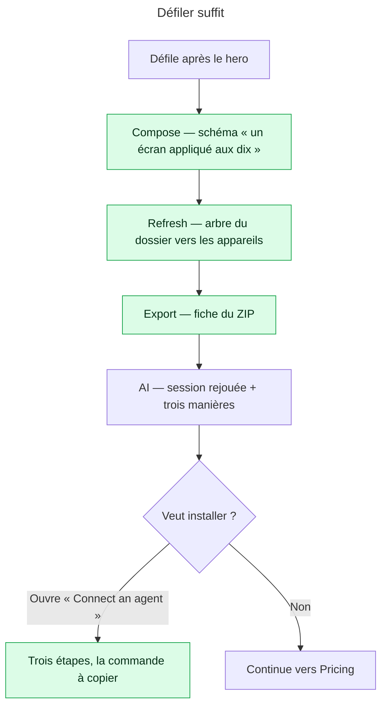

# Instruction: les sections montrent, elles ne font pas cliquer

## Architecture projection

> Tree of the final files. ✅ create · ✏️ modify · ❌ delete

```txt
apps/web/src/landing/
├── components/
│   ├── Features.tsx                             ✏️ trois blocs empilés (titre, corps, points, schéma), plus de tablist ni de panel unique
│   ├── AgentSection.tsx                         ✏️ les trois « ways » restent ; la marche à suivre passe dans un `<details>` ouvert par « Connect an agent »
│   └── SectionHeading.tsx                       — inchangé
├── copy.ts                                      ✏️ `features.*.tab` devient le libellé de rang (`eyebrow`) ; `agent.setupSummary` : une phrase qui dit où et quoi
apps/web/
├── e2e/landing.spec.ts                          ✏️ les trois schémas sont dans le DOM sans clic ; la commande MCP est présente mais repliée
└── src/lib/__tests__/landing-copy.test.ts       — inchangé : `setupSteps` cite toujours `MCP_COMMAND`
```

## User Journey



## Test Scope

```mermaid
---
title: Test scope
---
journey
  section Setup
    Ouvrir /en à 1440×900 et défiler jusqu’à #features => section visible: 5: browser
  section Happy path
    Lire #features sans cliquer => trois titres h3 et trois schémas présents dans le DOM: 5: browser
    Lire #agent => les trois manières visibles, la marche à suivre repliée: 5: browser
    Ouvrir « Connect an agent » => trois étapes et la commande pnpm visibles: 5: browser
  section Edge case - 390 px
    Même page à 390 => les blocs s’empilent schéma sous texte, aucune barre horizontale: 1: browser
  section Edge case - HTML prérendu
    Lire landing.html sans JS => les trois schémas sont dans la source ; le details est fermé: 1: system
  section Edge case - copie
    landing-copy.test => setupSteps cite toujours MCP_COMMAND: 1: system
```

## Wireframe

```txt
┌──────────────────────────────────────────────────────────────────────────┐
│ (1) Compose once. Refresh at every release. Export to the pixel.         │
│                                                                          │
│ (2) 01 COMPOSE                                                           │
│     A real editor, not a form            ┌──────────────────────┐        │
│     Layers, accurate iPhone frames…      │ (3) one → nine       │        │
│     ✓ Every current iPhone frame         │     diagram          │        │
│     ✓ Change one screen…                 └──────────────────────┘        │
│ ─────────────────────────────────────────────────────────────────────    │
│     02 REFRESH                                                           │
│     ┌──────────────────────┐             New build, new screenshots…     │
│     │ folder → devices     │             ✓ Files matched by name          │
│     └──────────────────────┘             ✓ Layout untouched               │
│ ─────────────────────────────────────────────────────────────────────    │
│     03 EXPORT                                                            │
│     Exact sizes, one ZIP…                ┌──────────────────────┐        │
│     ✓ …                                  │ ZIP spec             │        │
│                                          └──────────────────────┘        │
└──────────────────────────────────────────────────────────────────────────┘
```

1. Titre de section — inchangé.
2. Un bloc par fonction : rang mono citron (`01 COMPOSE`), titre `h3`, corps, points. Le texte et le schéma alternent de côté d’un bloc à l’autre (`lg:grid-cols-2`, ordre inversé sur le bloc pair) ; un filet `border-border/60` entre les blocs.
3. Le schéma existant (`SpreadDiagram`, `RefreshTree`, `ExportSpec`), inchangé.

## Tasks to do

### `1)` Trois blocs au lieu de trois onglets

> Deux tiers du contenu étaient derrière un clic ; une section marketing n’a pas de contenu à cacher.

1. `Features.tsx` : supprimer `useState`, `useRef`, `onKeyDown`, `PANEL_ID`, le `tablist` et le `tabpanel`. Rendre `KEYS.map` en `<article>` empilés, séparés par `divide-y divide-border/60`.
2. Chaque bloc : `<p className="font-mono text-2xs text-marker">0{i+1} {t.features[key].tab.toUpperCase()}</p>`, puis le `h3`, le corps, la liste à coches, et `<Visual />` dans la seconde colonne. Alterner l’ordre avec `lg:[&:nth-child(even)>*:first-child]:order-2` ou une classe conditionnelle sur l’index — la seconde est plus lisible.
3. Le commentaire qui justifie les onglets APG (lignes 28-41) disparaît avec eux ; le remplacer par deux lignes : pourquoi empilé (rien à cacher, le prérendu porte tout), pourquoi alterné (trois blocs identiques se lisent comme une liste, pas comme trois fonctions).
4. `copy.ts` : renommer la clé `tab` en `eyebrow` dans le type et les deux langues ; la valeur reste (« Compose », « Refresh », « Export » / FR).
5. Mesurer à 390 : chaque bloc empile texte puis schéma, `max-w-full` sur les trois schémas, aucun débordement horizontal (`document.documentElement.scrollWidth === innerWidth`).

### `2)` La section agent dit d’abord ce qu’elle fait

> La fiche d’installation se lisait comme un README au milieu d’une page de vente.

1. `AgentSection.tsx` : garder la figure collante et la liste `ways`. Remplacer le bloc `setupTitle` + `setupSteps` + `setupNote` (lignes 82-96) par `<details className="mt-8 group">` avec `<summary className="…">{a.setupTitle}</summary>` suivi de la même `ol` et de la même note.
2. Le `summary` prend le style d’une ligne d’action secondaire : `font-mono text-[13px] uppercase`, chevron Lucide `ChevronRight` tourné à `group-open:rotate-90`, `cursor: pointer` déjà fourni par la règle globale `summary`.
3. `copy.ts` `agent.setupSummary` (EN « Three steps, one command. » / FR « Trois étapes, une commande. ») rendu en `text-xs text-muted-foreground` à côté du `summary`, pour qu’un visiteur sache ce qu’il ouvre.
4. `setupSteps` ne change pas : `landing-copy.test.ts:35` vérifie que la commande MCP y figure. Le `<details>` la garde dans le DOM prérendu, fermée.
5. Vérifier qu’aucun `h3` ne disparaît de la hiérarchie lue par `scripts/landing-audit.mjs` (il contrôle le `h1` prérendu ; contrôler qu’il ne compte pas les `h3`).

### `3)` Prouver

> Le prérendu est le livrable ; c’est lui qui est testé.

1. `e2e/landing.spec.ts` : sur `/landing.html`, `page.locator('#features h3')` compte 3 ; `page.locator('#features svg')` ou les libellés `diagramLabel` / `figureFolder` des trois schémas visibles sans clic.
2. `page.locator('#agent details')` fermé au chargement ; après clic sur le `summary`, le texte `pnpm --filter mcp run start` visible.
3. Aucun `role="tab"` dans la page : `expect(page.getByRole('tab')).toHaveCount(0)`.

## Test acceptance criteria

| Task | Acceptance criteria                                                                                                                            |
| ---- | ---------------------------------------------------------------------------------------------------------------------------------------------- |
| 1    | `#features` montre trois blocs avec leurs trois schémas sans aucun clic, à 1440 et à 390 ; aucun rôle `tab`/`tabpanel` ne subsiste.             |
| 1    | La page ne déborde pas horizontalement à 390 px.                                                                                                |
| 2    | `#agent` montre la figure et les trois manières ; la marche à suivre est un `<details>` fermé au chargement, ouvert en un clic, commande incluse. |
| 2    | `landing-copy.test.ts` reste vert (la commande MCP est toujours citée dans `setupSteps` et la FAQ).                                             |
| 3    | `landing.spec.ts` couvre les trois assertions ; `pnpm run audit:landing` est vert sur le HTML prérendu EN et FR.                                |
