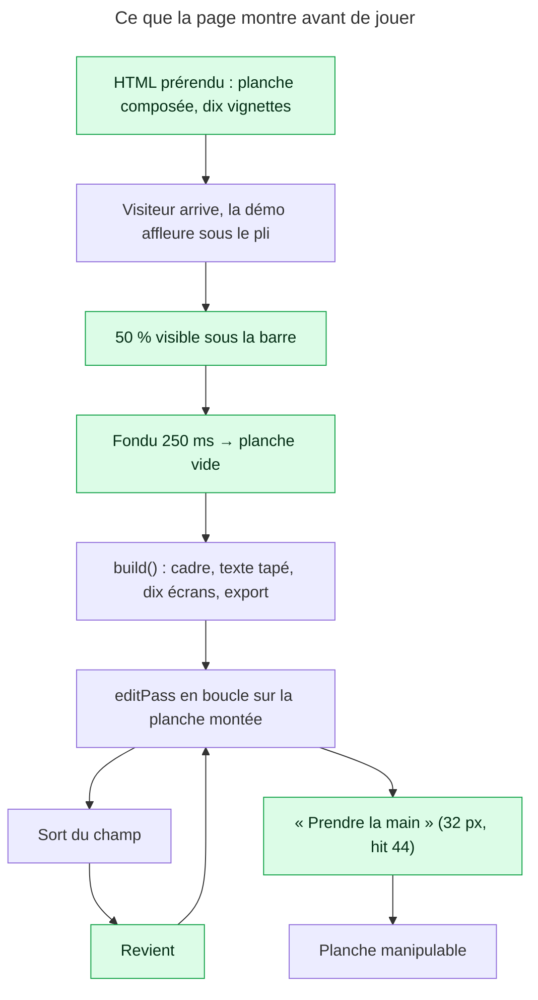
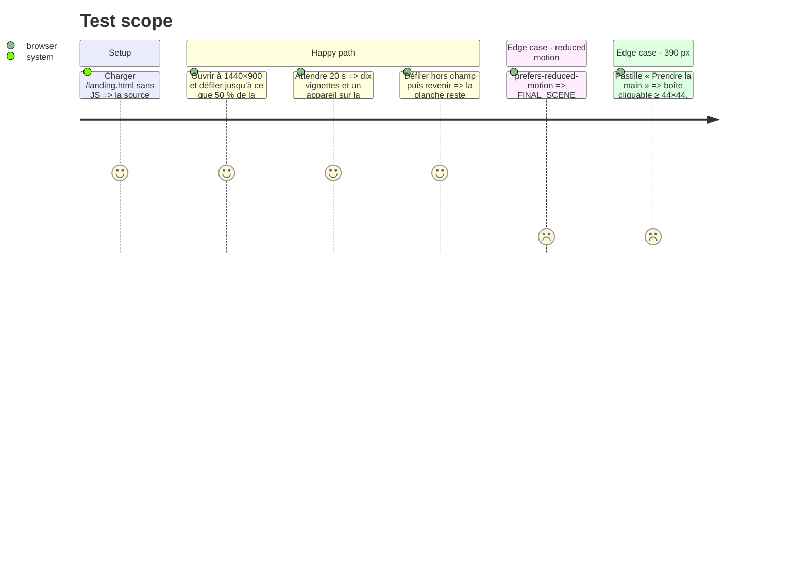

# Instruction: la démo ne commence jamais par du vide

## Architecture projection

> Tree of the final files. ✅ create · ✏️ modify · ❌ delete

```txt
apps/web/src/landing/demo/
├── DemoEditor.tsx                               ✏️ état initial `FINAL_SCENE` (prérendu composé) ; `build()` ne joue qu’une fois par visite, un retour dans le champ reprend les `editPass` ; observer `threshold: 0.5` + `rootMargin` de la barre fixe ; pastille « Prendre la main » à 32 px avec zone tactile 44
├── demo-script.ts                               — inchangé : `EMPTY_SCENE` reste le point de départ de `build()`
apps/web/
├── src/landing/landing.css                      ✏️ fondu de 250 ms sur `[data-resetting]` de la planche, coupé sous reduced-motion
└── e2e/landing.spec.ts                          ✏️ le HTML prérendu contient dix vignettes et un appareil ; la démo démarre à 50 % ; la pastille mesure ≥ 44 px de zone cliquable
```

## User Journey



## Test Scope



## Tasks to do

### `1)` Le premier état est la planche finie

> Le HTML servi et le premier écran sous le pli montraient un éditeur vide : l’image qui ne vend rien.

1. `DemoEditor.tsx:215` : `useState<DemoSceneState>(FINAL_SCENE)`. Le prérendu (`entry-server.tsx` → `ProductShowcase` → `DemoEditor`) sert alors la composition.
2. `build()` (`:336`) commence par `setScene(EMPTY_SCENE)` : poser `data-resetting` sur la planche 250 ms avant, retirer après. `landing.css` : `[data-resetting] .demo-board-content { opacity: 0; transition: opacity 250ms var(--ease-out) }`, `transition: none` sous `prefers-reduced-motion` (sans objet : la démo ne joue pas, mais la règle reste cohérente).
3. Un `useRef(false)` `built` : `run()` n’appelle `build()` que s’il est faux, puis le passe à vrai. Un `visible` qui rebascule (sortie puis retour dans le champ) reprend à `editPass(step)` sur la planche montée au lieu de la vider — aujourd’hui chaque retour rejoue `build()` depuis `EMPTY_SCENE`.
4. `takeOver` et « Rejouer » (`:889-893`) : « Rejouer » remet `EMPTY_SCENE` puis `autoplay` ; remettre aussi `built.current = false` pour que la boucle reconstruise. `takeOver` en reduced-motion copie déjà `FINAL_SCENE` ; avec l’état initial composé, la branche `reduced && !touched` de `manual` peut lire `rawScene` directement — simplifier si les deux sont identiques, sinon laisser.

### `2)` La démo démarre quand on la regarde, pas quand on l’a dépassée

> À 70 % sans marge, sur 1440×900 la démo attendait qu’on ait défilé plus loin que la section.

1. `DemoEditor.tsx:255-257` : `threshold: 0.5, rootMargin: '-72px 0px 0px 0px'` (hauteur de la barre fixe, `Nav.tsx:85` `h-[72px]` ; lire la constante si `landing.css` ou `Nav.tsx` l’exposent, sinon la déclarer une fois dans `demo-script.ts` et l’importer des deux côtés).
2. Le commentaire des lignes 250-254 explique pourquoi 0.7 : le remplacer par la mesure qui justifie 0.5 + marge (à 1440×900, à 1280×720 et à 390×844 : temps entre l’arrivée de la section et le premier mouvement du curseur).
3. Ne pas descendre sous 0.5 : avec l’état initial composé, une démo qui commence hors champ n’est plus un écran vide, mais le fondu de reset le serait si personne ne le voit.

### `3)` Une pastille qu’on peut viser

> 24 px de haut et 10 px de texte pour la seule commande de la démo.

1. `DemoEditor.tsx:894` : `h-6 … text-[10px]` → `h-8 px-3 text-xs` et la classe `hit-44` (`index.css`, déjà utilisée par l’éditeur ; vérifier qu’elle est importée côté landing, sinon la recopier dans `landing.css` sous le même nom).
2. Le positionnement `top-14 left-3 md:top-auto md:bottom-3` est justifié par le commentaire (filmstrip en bas sous `md`) ; ne pas le changer. Vérifier à 390 qu’avec 32 px + hit 44 la pastille ne couvre pas le premier `layer-row`.
3. Le libellé reste `t.demo.hint` / `t.demo.replay` ; pas de nouvelle copie.

### `4)` Prouver

> Le premier état est dans la source, le reste se chronomètre.

1. `e2e/landing.spec.ts` : `page.goto('/landing.html')` avec JS désactivé (`javaScriptEnabled: false` dans un `test.use`) → `#demo` (ou le conteneur de `ProductShowcase`) contient 10 vignettes et un `data-cursor-target="layer-row-device"` présent.
2. JS activé, 1440×900 : défiler jusqu’à `demo.boundingBox().y + height * 0.5 <= innerHeight` ; attendre le curseur (`[data-demo-cursor]` ou l’élément existant) visible en ≤ 1 500 ms.
3. Défiler hors champ, revenir, vérifier que le nombre de vignettes ne redescend jamais à 0 (`poll` sur 3 s).
4. `boundingBox` de la pastille : hauteur ≥ 32 ; zone `::after` non mesurable par Playwright — vérifier par un clic à 20 px au-dessus du bord qui déclenche `takeOver` (`touched` → la planche devient manipulable).

## Test acceptance criteria

| Task | Acceptance criteria                                                                                                                              |
| ---- | ------------------------------------------------------------------------------------------------------------------------------------------------ |
| 1    | Le HTML prérendu montre la planche composée avec dix vignettes ; le premier `build()` est précédé d’un fondu de 250 ms ; un retour dans le champ ne vide pas la planche. |
| 1    | « Rejouer » reconstruit depuis zéro ; en reduced-motion la composition figée est servie et aucune pastille ne s’affiche.                          |
| 2    | À 1440×900 le curseur apparaît moins de 1,5 s après que la moitié de la démo est passée sous la barre ; le commentaire porte les trois mesures.    |
| 3    | La pastille fait 32 px de haut, 12 px de texte, zone cliquable 44 px ; elle ne couvre aucune rangée de calque à 390.                              |
| 4    | Les quatre assertions de `landing.spec.ts` passent ; `pnpm run build` prérend sans erreur et `audit:landing` reste vert.                         |
