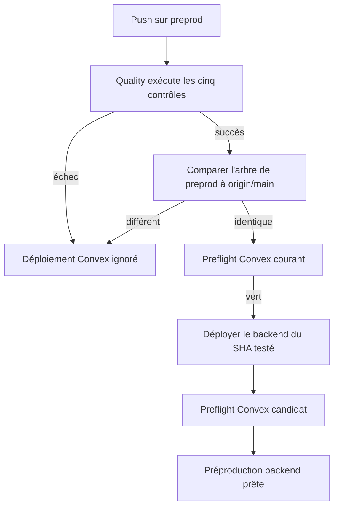
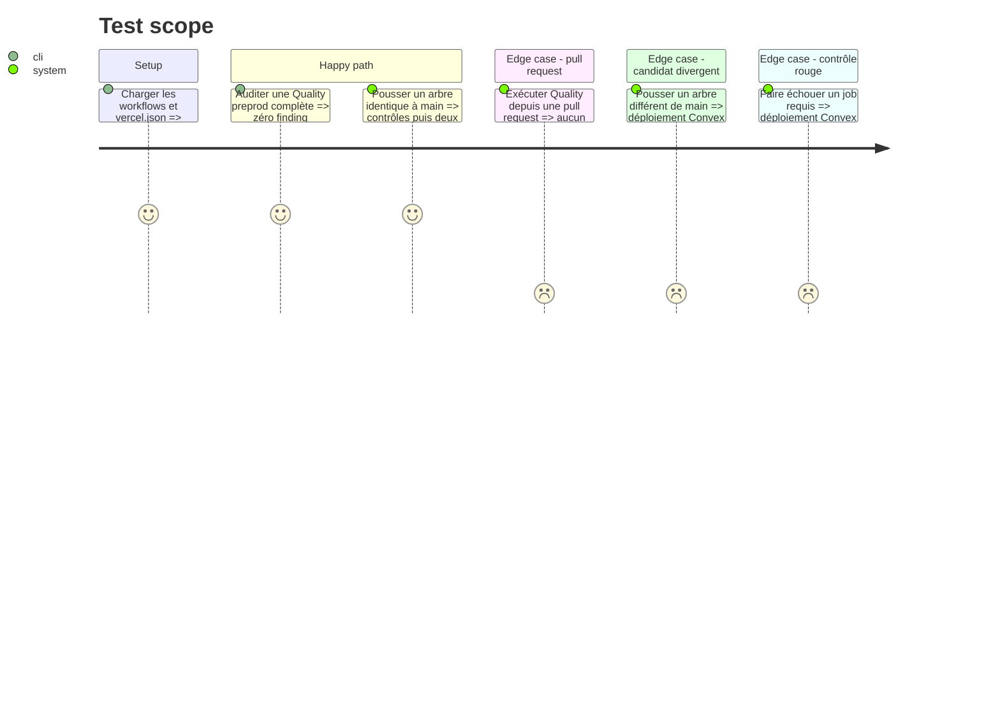

# Instruction: Verrouiller et automatiser le déploiement Convex

## Architecture projection

> Tree of the final files. ✅ create · ✏️ modify · ❌ delete

```txt
.
├── .github/
│   └── workflows/
│       └── quality.yml                  ✏️ déclencher preprod et déployer Convex après tous les contrôles
└── scripts/
    └── deployment-config-audit.mjs      ✏️ figer le contrat de sécurité et l'ordre du pipeline preprod
```

## User Journey



## Test Scope



## Tasks to do

### `1)` Étendre le déclencheur de Quality

> Exécuter le pipeline complet sur les pushes `main` et `preprod`, tout en conservant son déclenchement sur les pull requests.

1. Ajouter `preprod` au filtre `push.branches` existant.
2. Conserver la concurrence par workflow et référence afin qu'un push obsolète soit annulé.
3. Ne rendre aucun secret disponible aux jobs existants ni aux pull requests.

### `2)` Ajouter le job de déploiement préproduction

> Déployer Convex uniquement pour un push `preprod` dont tous les contrôles sont verts et dont le contenu correspond à `main`.

1. Faire dépendre le job de `actionlint`, `security`, `backend`, `web` et `e2e`.
2. Le limiter à `github.event_name == 'push'` et `refs/heads/preprod`.
3. Utiliser l'Environment GitHub `preproduction` et injecter `CONVEX_DEPLOY_KEY` seulement dans les étapes Convex.
4. Récupérer `origin/main` sans tags et comparer les arbres Git avant toute commande distante.
5. Exécuter le preflight `preproduction` courant, `pnpm run deploy:ci --message "$GITHUB_SHA"`, puis le même preflight sur le candidat.
6. Garder Vercel hors de ce job : son intégration Git reste l'unique producteur du frontend et de l'alias de branche.

### `3)` Étendre l'audit de configuration

> Faire échouer localement et en CI toute régression qui élargirait ou contournerait le déploiement préproduction.

1. Vérifier le déclencheur push `preprod`, le filtre push-only du job et son Environment exact.
2. Vérifier les cinq dépendances, la garde d'égalité des arbres et l'ordre preflight → deploy → preflight.
3. Vérifier que la clé Convex reste au niveau des seules étapes qui l'utilisent et qu'aucun secret Vercel n'entre dans un chemin de pull request.
4. Étendre le self-test avec une mutation négative par invariant nouveau.
5. Valider avec le self-test de l'audit, `actionlint`, le formatage et le typecheck concernés.

## Test acceptance criteria

| Task | Acceptance criteria |
| ---- | ------------------- |
| 1 | Un push `preprod` et un push `main` créent chacun un run Quality ; une pull request conserve les mêmes cinq contrôles. |
| 2 | Le job Convex n'existe effectivement que pour un push `preprod`, attend les cinq jobs, refuse un arbre divergent et termine uniquement lorsque les deux preflights sont verts. |
| 2 | Aucun secret de préproduction n'est disponible pendant une pull request, l'installation, les tests ou le build frontend. |
| 3 | Le self-test accepte le pipeline conforme et détecte séparément chaque retrait de déclencheur, dépendance, garde, Environment, portée de secret ou étape de preflight. |
