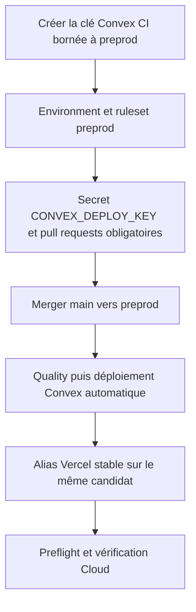
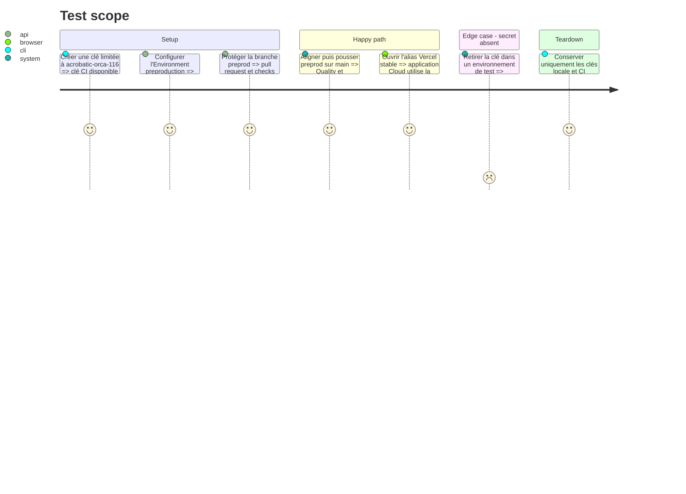

# Instruction: Borner les accès et prouver le parcours hébergé

## Architecture projection

> Tree of the final files. ✅ create · ✏️ modify · ❌ delete

```txt
.
├── CLOUD.md                         ✏️ documenter la clé CI, le déploiement automatique et le secours manuel
├── RELEASING.md                     ✏️ définir la promotion main vers preprod et ses preuves attendues
└── aidd_docs/
    └── memory/
        ├── testing.md               ✏️ enregistrer le nouveau gate hébergé
        └── vcs.md                   ✏️ enregistrer le rôle durable de la branche preprod
```

## User Journey



## Test Scope



## Tasks to do

### `1)` Configurer la frontière GitHub et Convex

> Donner au job le minimum d'autorité nécessaire sur le seul déploiement préproduction.

1. Créer une clé `screenforge-preprod-ci` limitée à `acrobatic-orca-116` et aux capacités nécessaires au déploiement et au preflight.
2. Créer l'Environment GitHub `preproduction` avec une policy limitée à la branche `preprod`.
3. Autoriser les merge commits au niveau du dépôt si nécessaire ; le ruleset existant continue d'imposer le squash sur `main`.
4. Créer un ruleset actif pour `preprod` : pull request requise, checks `actionlint`, `security`, `backend`, `web` et `e2e` stricts, discussions résolues, merge commit uniquement, suppression et force-push interdits, zéro approbation obligatoire et aucun bypass.
5. Enregistrer uniquement la clé sous `CONVEX_DEPLOY_KEY`; ne copier aucune variable Resend, Polar, Auth ou Vercel dans GitHub.
6. Conserver la clé locale `screenforge-preprod-local` comme chemin de secours documenté, sans la partager ni l'injecter en CI.

### `2)` Documenter le chemin opérateur minimal

> Rendre explicite ce qui est automatique et ce qui reste une décision humaine.

1. Documenter que Vercel redéploie l'alias stable à chaque push `preprod` via son intégration Git.
2. Documenter que Quality déploie Convex seulement après ses cinq contrôles, l'égalité avec `main` et le preflight courant.
3. Décrire la pull request `main` vers `preprod` avec merge commit, le suivi du run post-merge et le secours manuel `pnpm run deploy:preprod`.
4. Noter l'absence d'atomicité stricte entre Vercel et Convex : les changements doivent rester expand/contract compatibles.
5. Aligner la mémoire Testing et VCS sur ce contrat durable.

### `3)` Exécuter la preuve hébergée

> Vérifier le premier parcours automatique sans toucher à la production.

1. Ouvrir puis merger une pull request de `main` vers `preprod` après ses checks stricts.
2. Vérifier que Quality est vert et que le job préproduction référence ce même SHA.
3. Vérifier que le déploiement Convex `acrobatic-orca-116` porte le message du SHA et que `preflight:check` rend `ready: true` sans diagnostic.
4. Vérifier que l'alias `screenforge-git-preprod-maximes-projects-56d66b35.vercel.app` sert le dernier déploiement réussi de `preprod` et expose le parcours de connexion Cloud.
5. Confirmer que ni `main`, ni le déploiement Convex production, ni le domaine production n'ont été modifiés.

## Test acceptance criteria

| Task | Acceptance criteria |
| ---- | ------------------- |
| 1 | L'Environment `preproduction` n'accepte que `preprod`, ne contient qu'une clé Convex incapable de viser la production et le ruleset interdit tout push direct ou candidat rouge. |
| 2 | Un mainteneur peut déterminer depuis les runbooks quel événement redéploie Vercel, quel gate déploie Convex et comment reprendre manuellement sans valeur secrète documentée. |
| 3 | Un push conforme produit un run entièrement vert, un backend Convex marqué du même SHA, un preflight prêt et un alias Vercel fonctionnel, sans changement de production. |
