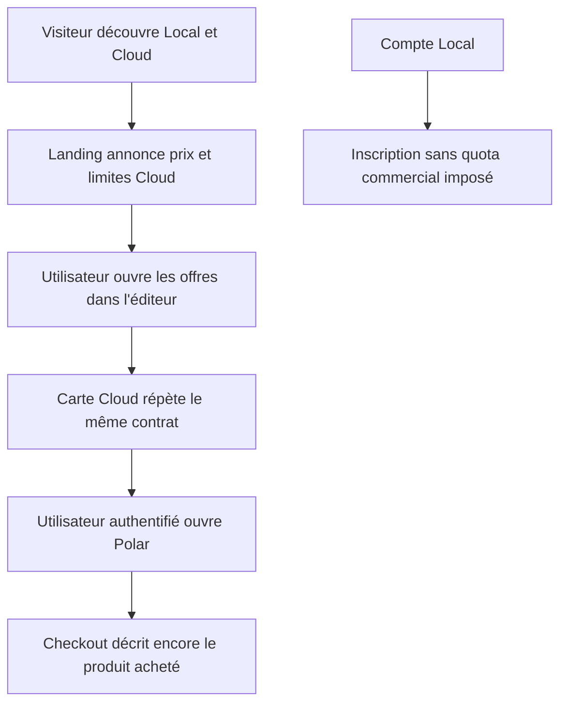
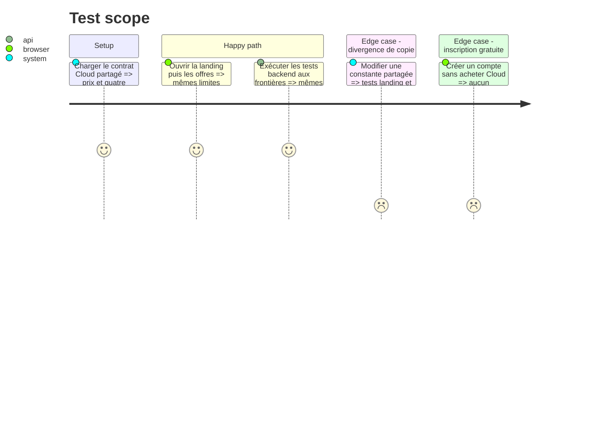

# Instruction: unifier le contrat commercial des quotas

## Architecture projection

> Tree of the final files. ✅ create · ✏️ modify · ❌ delete

```txt
.
├── ✏️ CLOUD.md
├── packages/project-format/src/
│   ├── ✅ cloud-offer.ts
│   └── ✏️ index.ts
├── apps/backend/convex/
│   ├── ✏️ limits.ts
│   ├── ✏️ assets.test.ts
│   └── ✏️ projects.test.ts
└── apps/web/
    ├── e2e/
    │   └── ✏️ landing.spec.ts
    └── src/
        ├── landing/
        │   └── ✏️ copy.ts
        ├── lib/
        │   ├── ✏️ plans.ts
        │   └── __tests__/
        │       └── ✏️ landing-copy.test.ts
        └── components/pricing-dialog/
            └── ✏️ PricingDialog.tsx

❌ Aucun fichier supprimé.
```

## User Journey



## Test Scope



## Wireframe

```txt
┌──────────────────────────────────────────────┐
│ (1) Offre Cloud · prix · bénéfice principal  │
│     Limites incluses · détail contractuel    │
│                              [Acheter Cloud]  │
└──────────────────────────────────────────────┘
```

1. Offre Cloud : le prix, les bénéfices et les plafonds sont visibles ensemble avant le paiement.

## Tasks to do

### `1)` Écrire le contrat Cloud une seule fois

> Faire des limites réellement appliquées la source des projections produit.

1. Créer `cloud-offer.ts` avec l'identifiant de l'offre annuelle, son prix public de 39 USD et les plafonds de 100 projets, 128 Mio de blobs projet, 500 images et 512 Mio d'images.
2. Exporter le contrat depuis `@screenforge/project-format` et remplacer les littéraux équivalents de `convex/limits.ts` par ses valeurs.
3. Conserver les limites de débit applicatives dans `limits.ts`; elles protègent les routes et ne font pas partie du produit vendu.
4. Faire continuer les tests de quota backend à franchir exactement chaque frontière partagée.

### `2)` Corriger les surfaces de vente

> Ne plus promettre une absence de limite que le serveur refuse réellement.

1. Retirer « sans limite artificielle » de la carte Cloud de l'éditeur.
2. Ajouter un résumé compact des limites dans la carte Cloud de la landing française/anglaise et dans `PricingDialog`.
3. Garder Local explicitement illimité pour les exports et entièrement utilisable sans compte; ne jamais présenter les quotas Cloud comme un paywall Local.
4. Ajouter dans la FAQ le détail des quatre limites et le comportement lorsque l'une est atteinte.
5. Aligner `CLOUD.md` sur le contrat public sans y inscrire de consommation, seuil opérateur ou état fournisseur vivant.

### `3)` Aligner Polar au point de vente

> Le dernier écran avant paiement doit décrire le même service que ScreenForge.

1. Vérifier en Sandbox que le produit configuré est l'abonnement annuel Cloud à 39 USD et relever son comportement fiscal visible au checkout.
2. Mettre sa description client en phase avec le résumé des quotas et la conservation des copies locales.
3. Corriger la mention de taxes de la landing si le réglage Polar ne garantit pas réellement un prix TTC dans tous les pays servis.
4. Ne pas utiliser les métadonnées Polar comme communication client puisqu'elles ne sont pas affichées au checkout.
5. Consigner uniquement la conformité du produit dans la preuve finale; ne versionner aucun product ID, client ID ou secret.

## Test acceptance criteria

| Task | Acceptance criteria |
| --- | --- |
| 1 | Backend, landing et éditeur importent les mêmes quatre plafonds; aucune copie numérique équivalente ne subsiste dans les messages produit. |
| 1 | Les tests refusent le 101e projet, la 501e image et le premier octet au-delà de chaque plafond de stockage. |
| 2 | Landing, boîte des offres et FAQ annoncent les limites Cloud sans modifier la promesse Local gratuite et illimitée pour les exports. |
| 2 | Le texte « sans limite artificielle » ne qualifie plus le stockage ou la synchronisation Cloud. |
| 3 | Le checkout Polar Sandbox affiche 39 USD par an, sa fiscalité correspond à la promesse publiée et sa description reprend les limites appliquées, sans valeur fournisseur ajoutée au dépôt. |
