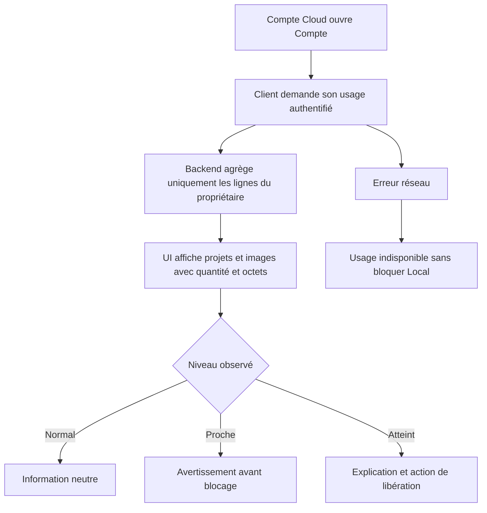
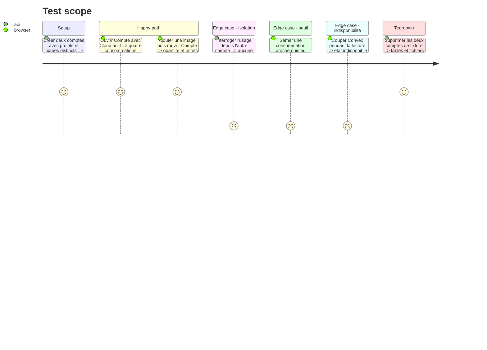

# Instruction: mesurer et afficher l'utilisation Cloud

## Architecture projection

> Tree of the final files. ✅ create · ✏️ modify · ❌ delete

```txt
.
├── apps/backend/convex/
│   ├── ✅ cloudData.ts
│   └── ✅ cloudData.test.ts
└── apps/web/
    ├── e2e/
    │   └── ✏️ sync.spec.ts
    └── src/
        ├── components/account-dialog/
        │   └── ✏️ AccountDialog.tsx
        └── lib/
            ├── ✏️ cloud.ts
            ├── ✅ cloud-usage.ts
            └── __tests__/
                └── ✅ cloud-usage.test.ts

❌ Aucun fichier supprimé.
```

## User Journey



## Test Scope



## Wireframe

```txt
┌──────────────────────────────────────────────┐
│ (1) Compte · plan Cloud · échéance           │
├──────────────────────────────────────────────┤
│ (2) Utilisation Cloud                        │
│     Projets      quantité · données          │
│     Images       quantité · stockage         │
│     état normal / proche / atteint           │
├──────────────────────────────────────────────┤
│ (3) Facturation                              │
│ (4) Gestion de la copie Cloud                │
└──────────────────────────────────────────────┘
```

1. Compte : identité commerciale actuelle et échéance déjà existantes.
2. Utilisation Cloud : les quatre mesures appliquées par le serveur, groupées en deux lignes.
3. Facturation : le portail Polar reste séparé des données.
4. Gestion : l'action de récupération appartient aux données, pas à la facturation.

## Tasks to do

### `1)` Exposer une mesure propriétaire bornée

> Compter ce que le serveur limite déjà, sans nouveau compteur persistant.

1. Ajouter une query `myUsage` authentifiée dans `cloudData.ts`.
2. Lire les indexes `projects.by_user` et `assets.by_user`, sommer `byteLength` et rendre quantité, octets et limites partagées.
3. Refuser l'anonyme et prouver qu'un compte ne peut jamais inclure les lignes d'un autre.
4. Garder cette lecture ponctuelle : aucune souscription temps réel et aucune table d'agrégats.

### `2)` Traduire l'usage en états UX stables

> Donner une information utile avant le refus, pas seulement après.

1. Ajouter un helper pur qui formate les octets et classe chaque mesure en `normal`, `proche` ou `atteint`.
2. Utiliser 80 % comme début de l'état proche et 100 % comme état atteint; ne pas afficher de décimales trompeuses.
3. Couvrir zéro, arrondis, limite exacte, dépassement historique et valeur indisponible.
4. Ne jamais appeler un seuil utilisateur « plafond Convex » : ce dernier est un coupe-circuit opérateur distinct.

### `3)` Enrichir Compte sans créer un tableau de bord

> Mettre l'information au seul endroit où l'utilisateur gère déjà son service.

1. Charger l'usage à l'ouverture de `AccountDialog` pour un compte Cloud, avec état de chargement compact.
2. Afficher projets et images en deux lignes, chacune portant quantité et stockage utilisés/accordés.
3. Employer les tokens existants pour les états proche et atteint; conserver contraste, lecture clavier et annonce accessible.
4. En cas d'échec, indiquer que la mesure est indisponible et laisser facturation, déconnexion, édition locale et export fonctionnels.
5. Ajouter les scénarios E2E aux tests Cloud existants plutôt que créer une deuxième suite d'authentification.

## Test acceptance criteria

| Task | Acceptance criteria |
| --- | --- |
| 1 | `myUsage` rend exactement les quantités et octets du compte authentifié et refuse l'anonyme sans fuite inter-compte. |
| 1 | La lecture reste bornée par les quotas existants et n'ajoute aucune table ou écriture de compteur. |
| 2 | Chaque mesure passe à l'état proche à 80 %, à atteint à 100 %, et les octets sont formatés de façon stable. |
| 3 | Un client Cloud voit les quatre mesures dans Compte; un compte Local ne voit pas une consommation Cloud inexistante. |
| 3 | Une panne Convex masque seulement la mesure et ne bloque ni Local, ni les exports, ni les autres actions de Compte. |
