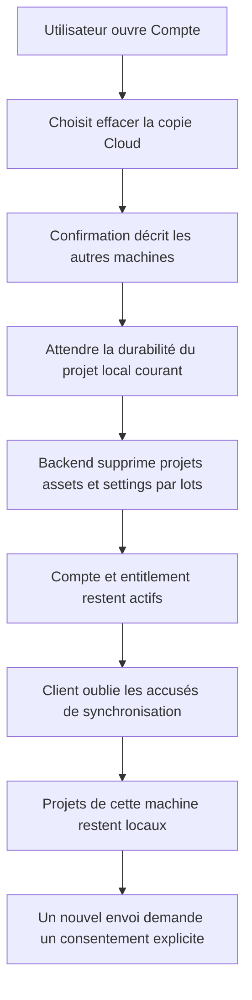
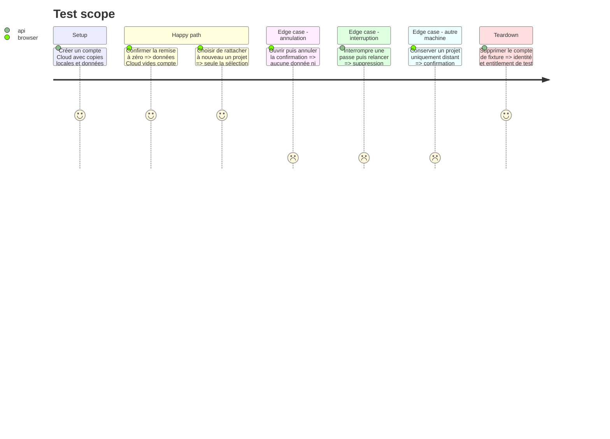

# Instruction: libérer la copie Cloud sans perdre le local

## Architecture projection

> Tree of the final files. ✅ create · ✏️ modify · ❌ delete

```txt
.
├── apps/backend/convex/
│   ├── ✏️ cloudData.ts
│   ├── ✏️ cloudData.test.ts
│   └── ✏️ limits.ts
└── apps/web/
    ├── e2e/
    │   └── ✏️ sync.spec.ts
    └── src/
        ├── components/account-dialog/
        │   └── ✏️ AccountDialog.tsx
        └── lib/
            ├── ✏️ account.ts
            ├── ✏️ sync.ts
            └── __tests__/
                ├── ✏️ account.test.ts
                └── ✏️ sync.test.ts

❌ Aucun fichier supprimé.
```

## User Journey



## Test Scope



## Wireframe

```txt
┌──────────────────────────────────────────────┐
│ (1) Confirmation de remise à zéro            │
│     conséquences locales et autres machines  │
│              [Annuler] [Effacer la copie]    │
└──────────────────────────────────────────────┘
```

1. Confirmation : distingue clairement copie Cloud, copies locales, compte et abonnement.

## Tasks to do

### `1)` Ajouter une purge Cloud bornée et réexécutable

> Effacer seulement les données synchronisées du propriétaire.

1. Ajouter une action authentifiée `clearMyCloudData`, limitée par compte, qui appelle des mutations internes par lots bornés.
2. Supprimer fichiers et lignes `assets`, puis blobs et lignes `projects`, puis `userSettings`; conserver utilisateur, sessions, entitlement et historique Polar.
3. Rendre l'opération idempotente : une interruption ou un fichier déjà absent ne doit jamais transformer la reprise en suppression de compte.
4. Rendre un résultat `cleared` ou `incomplete` explicite afin que l'interface puisse proposer une reprise.
5. Tester un compte plein, des fichiers absents, une interruption simulée, l'isolation et la conservation du droit Cloud.

### `2)` Préserver la vérité local-first

> Une suppression distante ne doit ni effacer ni renvoyer automatiquement le projet courant.

1. Attendre la sauvegarde IndexedDB en cours avant d'appeler le backend.
2. Après succès, supprimer les accusés de sync du compte, vider la file mémoire et reconstruire la barrière de consentement avec tous les projets locaux déjà touchés.
3. Laisser `syncStatus` hors erreur après le reset; aucun cycle ne doit recréer un record tant que l'utilisateur n'a pas choisi « Ajouter … au Cloud ».
4. Si la réponse est inconnue ou incomplète, garder les copies locales, actualiser l'usage et offrir une reprise sans supposer le succès.

### `3)` Donner une sortie UX honnête

> Séparer données, abonnement et compte dans le même dialogue.

1. Ajouter l'action « Effacer la copie Cloud… » sous l'utilisation, avec le style danger existant mais secondaire à la gestion du compte.
2. Utiliser une confirmation en deux temps qui avertit que les projets uniquement présents sur d'autres machines seront perdus du Cloud.
3. Dire explicitement que les projets de cet appareil, le compte et l'abonnement restent en place.
4. Après succès, afficher zéro usage et reproposer le rattachement explicite; ne pas ouvrir Polar et ne pas déconnecter.
5. Remplacer l'action de toast de quota par l'ouverture directe de cette section utile de Compte.

## Test acceptance criteria

| Task | Acceptance criteria |
| --- | --- |
| 1 | La purge retire toutes les lignes et tous les fichiers Cloud du propriétaire sans supprimer son utilisateur, ses sessions ou son entitlement. |
| 1 | Une reprise après interruption termine le nettoyage sans toucher aux données d'un autre compte. |
| 2 | Tous les projets de l'appareil restent ouvrables et exportables après la purge, et aucun n'est réenvoyé automatiquement. |
| 2 | Le prochain upload d'un projet antérieur exige le même consentement explicite que lors d'une première activation Cloud. |
| 3 | Annuler ne change rien; confirmer distingue sans ambiguïté copie Cloud, copies locales, abonnement et compte. |
| 3 | Après succès, Compte affiche une utilisation nulle et Cloud reste actif. |
