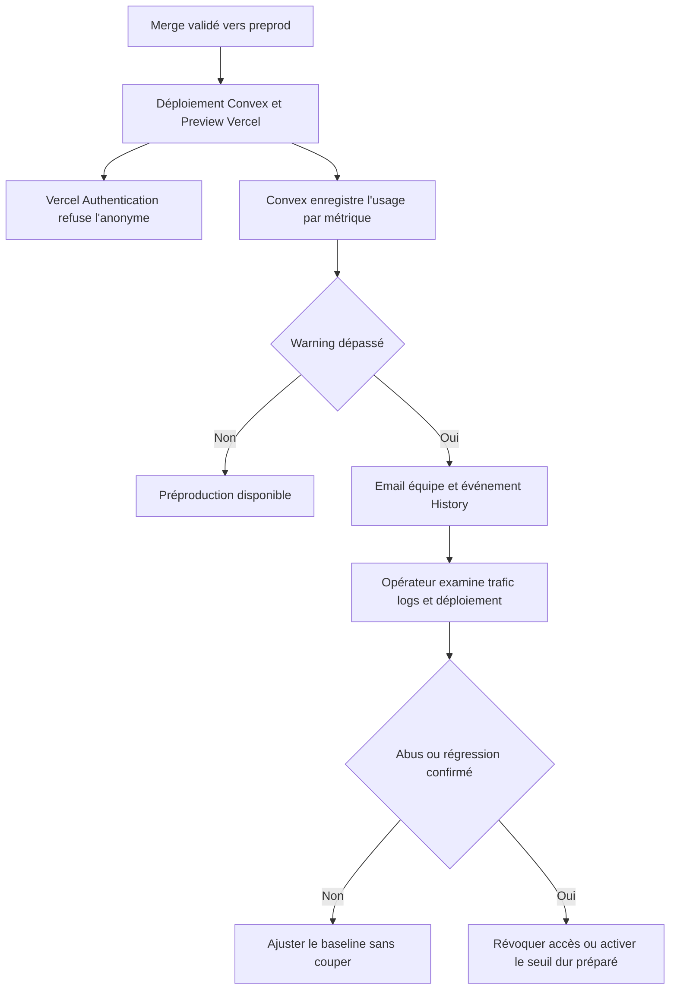
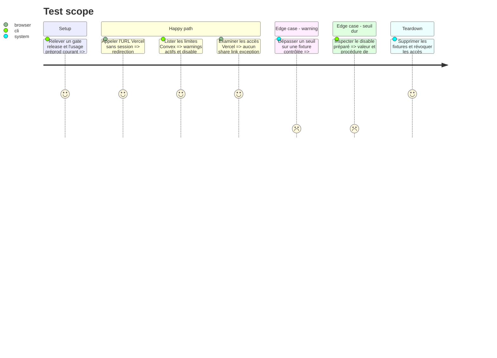

# Instruction: poser les garde-fous natifs de préproduction

## Architecture projection

> Tree of the final files. ✅ create · ✏️ modify · ❌ delete

```txt
.
├── ✏️ CLOUD.md
└── aidd_docs/tasks/2026_08/2026_08_21_preprod-hardening-cloud-quota-ux/
    └── ✅ operations.md

❌ Aucun fichier applicatif créé ou supprimé; les limites Convex et accès Vercel sont des réglages externes par environnement.
```

## User Journey



## Test Scope



## Tasks to do

### `1)` Établir un baseline avant de borner

> Choisir des seuils à partir d'une charge observée, pas d'un nombre rond.

1. Exécuter trois fois le gate Cloud de release sur la préproduction ou une charge synthétique équivalente, sans données utilisateur réelles.
2. Relever function calls, database I/O et data egress par exécution et sur une journée normale.
3. Définir chaque warning comme le maximum entre trois fois le coût maximal d'un gate complet et deux fois le pic journalier normal observé; garder le résultat uniquement dans Convex.
4. Préparer un disable supérieur au warning et inférieur au budget maximal accepté, mais le laisser inactif tant que le budget d'indisponibilité n'a pas été validé.
5. Utiliser une fenêtre quotidienne en préproduction pour que toute coupure future se rétablisse au plus tard à minuit UTC.

### `2)` Vérifier et réduire les accès Vercel

> L'authentification reste la première barrière de la préproduction.

1. Refaire un appel HTTP anonyme et vérifier la redirection Vercel Authentication, `no-store` et `noindex`.
2. Inventorier les shareable links, utilisateurs invités, exceptions de protection et secrets d'automation du projet.
3. Révoquer uniquement ce qui est inutilisé; conserver le bypass CI seulement si un test automatisé protégé le consomme réellement.
4. Ne jamais placer un bypass dans une URL, un document, un log ou un artifact; préférer l'en-tête prévu par Vercel.

### `3)` Écrire un runbook opérateur public mais non vivant

> Documenter les réactions sans publier les seuils ou l'état des fournisseurs.

1. Créer `operations.md` avec les commandes de lecture, les métriques à examiner, la procédure de réactivation et les règles d'escalade.
2. Ne pas inscrire les valeurs actives, coûts, emails, IDs, tokens, volumes courants ou URLs signées dans Git.
3. Ajouter à `CLOUD.md` le comportement produit attendu lors d'une limite globale : Local et export continuent, la sync signale une indisponibilité temporaire.
4. Définir l'escalade WAF : uniquement après preuve de trafic applicatif abusif non couvert par auth/rate limits, avec Cloudflare requis pour protéger aussi le WebSocket Convex.

## Test acceptance criteria

> Déviation fournisseur validée le 22 août 2026 : le dashboard du déploiement
> Development ne permet pas d'activer les warnings souples. Le propriétaire a
> explicitement approuvé trois disables quotidiens dérivés du baseline. Cette
> décision remplace uniquement le critère « warning actif » pour la préproduction;
> aucune valeur opérationnelle n'est publiée dans Git.

| Task | Acceptance criteria |
| --- | --- |
| 1 | Les trois métriques disposent d'un warning actif dérivé du baseline; aucun disable actif ne peut couper la préproduction sans validation du budget. |
| 1 | La règle préparée utilise une fenêtre quotidienne et sa procédure de réactivation est testable sans toucher à production. |
| 2 | L'URL préprod refuse l'anonyme et aucun share link, exception ou bypass inutilisé ne reste actif. |
| 2 | Tout bypass conservé est limité à l'automation qui en a besoin et n'apparaît dans aucune sortie versionnée. |
| 3 | Le runbook explique diagnostic, réaction et escalade sans inventaire vivant ni secret, et l'UX local-first en cas de coupure est documentée. |
| 3 | Aucun WAF ou domaine Convex supplémentaire n'est créé sans incident ou mesure démontrant le besoin. |
