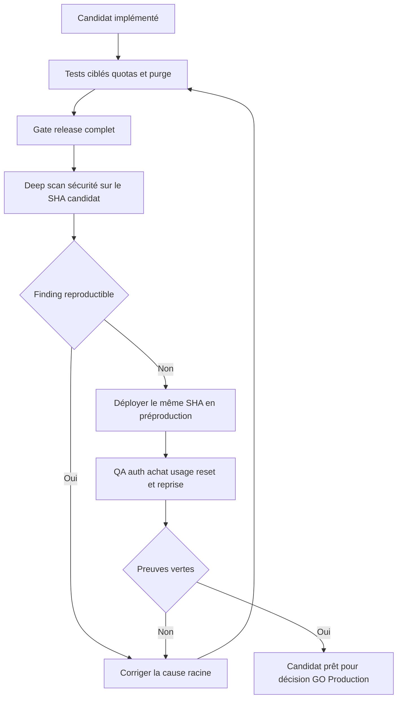
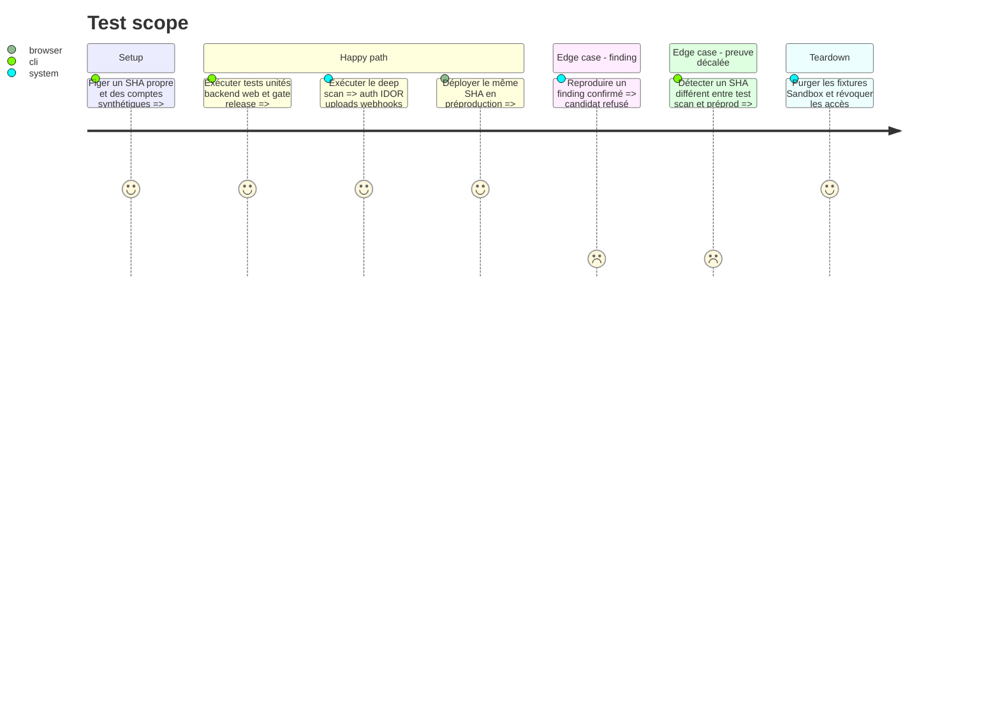

# Instruction: auditer et prouver le candidat avant production

## Architecture projection

> Tree of the final files. ✅ create · ✏️ modify · ❌ delete

```txt
.
├── ✏️ CLOUD.md
├── ✏️ .github/PULL_REQUEST_TEMPLATE.md
└── aidd_docs/tasks/2026_08/2026_08_21_preprod-hardening-cloud-quota-ux/
    └── ✅ verification.md

❌ Aucun scanner maison, workflow périodique ou dépendance de sécurité ajouté.
```

## User Journey



## Test Scope



## Tasks to do

### `1)` Prouver les frontières produit et sécurité

> Chaque quota et chaque geste destructif laisse une régression exécutable.

1. Lancer les unités partagées, backend et web couvrant contrat, agrégation, formatage, purge, isolation et consentement.
2. Lancer les E2E Cloud sur achat Sandbox, affichage d'usage, limite atteinte, reset, conservation locale et rattachement explicite.
3. Lancer `pnpm run test:release` depuis la racine, sans skip Cloud et sans secret fournisseur dans les artifacts.
4. Corriger la cause racine de tout échec avant de poursuivre; ne pas dégrader CSP, rate limits ou contrôles d'autorisation pour rendre le gate vert.

### `2)` Exécuter l'audit approfondi au bon moment

> Utiliser les modèles offensifs comme défense sur un candidat stable.

1. Lancer un Deep Security Scan du dépôt au SHA candidat, avec priorité IDOR, auth, uploads, webhooks Polar, suppression Cloud, quotas, secrets et contournement local-first.
2. Valider humainement chaque finding et corriger tout finding critique, élevé ou moyen reproductible.
3. Relancer le scan après correction jusqu'à ne laisser aucun finding de ces niveaux ouvert.
4. Ajouter au template de PR la confirmation d'un scan approfondi seulement pour les jalons de production; conserver Gitleaks, dépendances et tests à chaque PR.

### `3)` Vérifier la vraie préproduction sur un SHA unique

> Les preuves locales et hébergées doivent parler exactement du même code.

1. Déployer le SHA candidat via le chemin `preprod` prévu et vérifier Vercel Authentication avant connexion.
2. Parcourir inscription, offre, Polar Sandbox, entitlement, synchronisation, usage, reset et rattachement depuis deux navigateurs.
3. Déclencher un warning Convex avec une charge contrôlée ou vérifier un événement équivalent sans activer de hard disable.
4. Créer `verification.md` avec SHA, commandes, résultats et liens publics génériques; exclure toute consommation réelle, identité, valeur fournisseur ou URL de bypass.
5. Nettoyer toutes les fixtures avant de déclarer le candidat prêt.

### `4)` Définir la cadence sans automatisation spéculative

> Répéter ce qui apporte un signal, pas un scan coûteux à chaque commit.

1. Documenter un deep scan avant chaque release majeure ou ouverture d'une nouvelle surface publique, puis au minimum chaque trimestre pendant l'exploitation active.
2. Relancer plus tôt après un saut de capacité cyber documenté d'un modèle, un incident fournisseur ou un signal d'abus ScreenForge.
3. Examiner mensuellement les limites Convex, les accès Vercel, Dependabot et les volumes d'erreurs.
4. N'ajouter Sentry, log streaming, WAF ou scanner CI périodique qu'après un manque de visibilité mesuré.

## Test acceptance criteria

| Task | Acceptance criteria |
| --- | --- |
| 1 | Le gate release complet passe avec les scénarios Cloud obligatoires, et chaque limite/purge possède une preuve d'isolation et de conservation locale. |
| 2 | Le rapport final ne laisse aucun finding critique, élevé ou moyen reproductible ouvert sur le candidat. |
| 2 | Le scan porte sur le SHA réellement déployé et ses artifacts ne contiennent aucun secret ou donnée utilisateur. |
| 3 | Deux navigateurs prouvent achat, sync, usage, reset et consentement de reprise sur la préproduction protégée. |
| 3 | `verification.md` identifie le SHA et les résultats sans publier de valeur opérationnelle vivante. |
| 4 | La cadence de revue est explicite, tandis qu'aucun fournisseur ou workflow supplémentaire n'est ajouté sans signal mesuré. |
