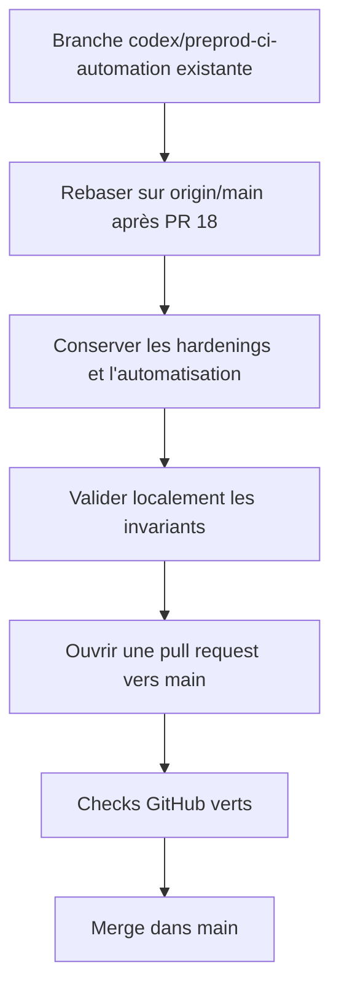
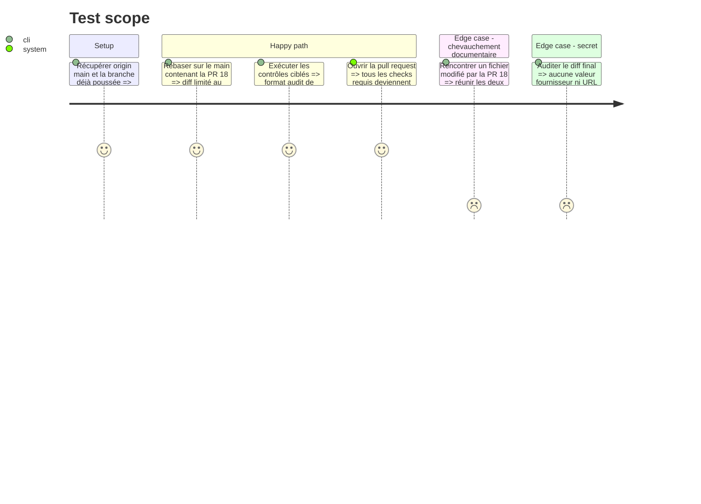

# Instruction: Intégrer l'automatisation préproduction

## Architecture projection

> Tree of the final files. ✅ create · ✏️ modify · ❌ delete

```txt
.
├── .github/
│   └── workflows/
│       └── quality.yml                         ✏️ conserver les gates de main et ajouter le déploiement Convex de preprod
├── scripts/
│   └── deployment-config-audit.mjs             ✏️ vérifier les invariants du pipeline préproduction
├── CLOUD.md                                     ✏️ documenter le chemin hébergé et son secours manuel
├── RELEASING.md                                 ✏️ documenter la promotion main vers preprod
└── aidd_docs/
    └── memory/
        ├── testing.md                           ✏️ enregistrer le gate hébergé
        └── vcs.md                               ✏️ enregistrer le rôle durable de preprod
```

## User Journey



## Test Scope



## Tasks to do

### `1)` Recaler la branche existante

> Réutiliser les deux commits déjà poussés et les replacer sur le `origin/main` issu de la PR #18.

1. Travailler uniquement dans le worktree `/private/tmp/screenforge-preprod-ci` sur `codex/preprod-ci-automation`.
2. Récupérer `origin/main`, vérifier l'état propre puis rebaser sans toucher aux autres branches ou worktrees.
3. Résoudre les chevauchements de `quality.yml`, `CLOUD.md` et `RELEASING.md` en conservant à la fois le hardening Cloud et l'automatisation préproduction.
4. Confirmer que le diff ne contient que les fichiers de la projection et les documents AIDD associés.

### `2)` Valider le candidat intégré

> Prouver le contrat du workflow sans répéter inutilement le gate E2E déjà exécuté localement pour la PR #18.

1. Exécuter `pnpm run format:check`, `pnpm run test:deployment-config`, `pnpm run typecheck` et `pnpm run lint` sous Node 24.
2. Vérifier que `deploy-preproduction` reste push-only sur `preprod`, dépend des cinq jobs et borne le secret aux trois étapes Convex.
3. Vérifier que le garde d'égalité compare les arbres de `preprod` et `origin/main` avant toute mutation distante.
4. Laisser la CI de pull request exécuter le gate complet, dont `test:e2e:release`.

### `3)` Publier la pull request d'automatisation

> Obtenir un diff revu et vert dans `main` avant toute promotion préproduction.

1. Pousser la branche réécrite avec `--force-with-lease` uniquement si le rebase l'exige.
2. Créer une pull request vers `main` avec le chemin de déploiement, les limites d'autorité et le rollback documentaire.
3. Suivre tous les checks et les commentaires pertinents jusqu'à un état mergeable et clean.
4. Merger uniquement lorsque la CI est verte et qu'aucun commentaire bloquant ne reste ouvert.

## Test acceptance criteria

| Task | Acceptance criteria |
| ---- | ------------------- |
| 1 | `codex/preprod-ci-automation` repose sur le `main` contenant la PR #18 et ne perd aucun hardening Cloud ou changement extérieur à son périmètre. |
| 2 | Les contrôles ciblés sont verts et l'audit échoue si le déclencheur, les dépendances, le garde d'arbre, l'Environment, la portée du secret ou l'ordre preflight/deploy sont affaiblis. |
| 3 | La pull request est mergeable, tous ses checks sont verts, aucun secret n'apparaît dans le diff ou les logs et le merge dans `main` est traçable. |
