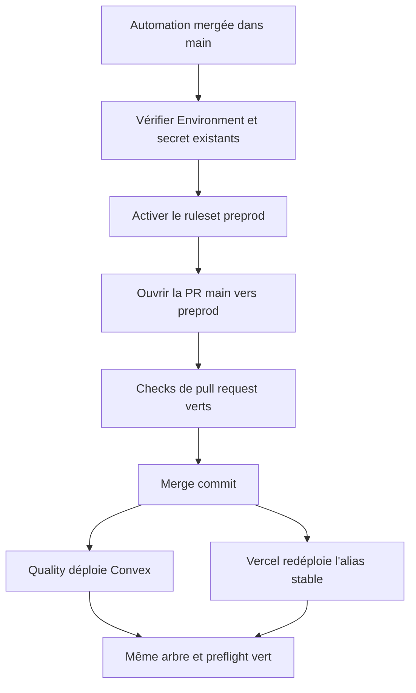
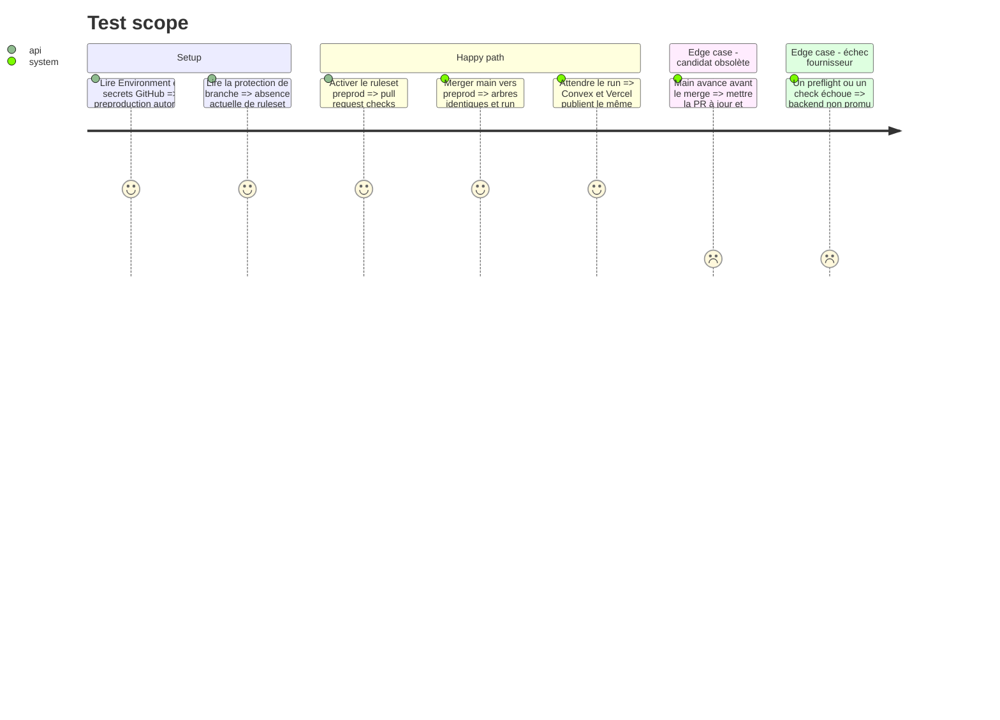

# Instruction: Protéger et promouvoir la branche preprod

## Architecture projection

> Tree of the final files. ✅ create · ✏️ modify · ❌ delete

```txt
.
└── Aucun fichier applicatif : cette phase configure GitHub puis promeut un SHA déjà validé.
```

## User Journey



## Test Scope



## Tasks to do

### `1)` Fermer la frontière GitHub

> Conserver les réglages déjà présents et ajouter uniquement la protection de branche manquante.

1. Confirmer que l'Environment `preproduction` autorise seulement `preprod` et expose uniquement le nom `CONVEX_DEPLOY_KEY` au job concerné.
2. Ne pas lire, recopier ou faire tourner la valeur du secret si le preflight prouve qu'elle cible le bon déploiement.
3. Créer un ruleset actif sur `preprod` : pull request requise, checks `actionlint`, `security`, `backend`, `web` et `e2e` à jour, discussions résolues, force-push et suppression interdits.
4. Autoriser uniquement le merge commit sur cette branche et n'ajouter aucune approbation humaine obligatoire pour ce dépôt indie mono-mainteneur.

### `2)` Promouvoir main vers preprod

> Faire de la branche longue durée la copie exacte du candidat courant.

1. Ouvrir une pull request de `main` vers `preprod` après le merge de l'automatisation.
2. Vérifier que la PR ne contient aucun changement propre à `preprod` et que son arbre final égale celui de `main`.
3. Attendre les cinq checks puis merger avec un merge commit.
4. Ne pousser directement ni sur `preprod`, ni sur un tag de release.

### `3)` Suivre le premier déploiement automatique

> Établir que le frontend et le backend exposent le même candidat sans production parallèle dans Actions.

1. Suivre le run Quality du push `preprod` jusqu'au job `deploy-preproduction`.
2. Vérifier preflight courant, déploiement Convex et preflight candidat dans cet ordre, sans diagnostic sensible.
3. Vérifier que le message Convex et le run GitHub référencent le commit de promotion attendu.
4. Vérifier que l'URL de branche Vercel stable pointe vers le dernier déploiement réussi de `preprod` et refuse une requête anonyme.
5. Confirmer que le déploiement Convex production, les tags et tout domaine de production restent inchangés.

## Test acceptance criteria

| Task | Acceptance criteria |
| ---- | ------------------- |
| 1 | `preprod` est protégée sans bypass, l'Environment n'autorise que cette branche et le secret Convex reste inaccessible aux pull requests et aux jobs sans besoin. |
| 2 | La promotion passe par une pull request à jour et produit un merge commit dont l'arbre est identique à `main`. |
| 3 | Quality est entièrement vert, le backend Convex et l'alias Vercel correspondent au candidat promu, l'accès anonyme est refusé et aucune ressource production n'a changé. |
