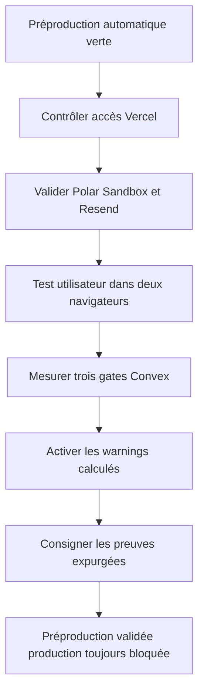
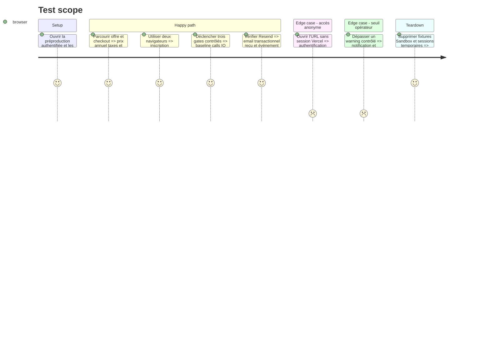

# Instruction: Prouver les parcours Cloud et les limites opérateur

## Architecture projection

> Tree of the final files. ✅ create · ✏️ modify · ❌ delete

```txt
.
└── aidd_docs/
    └── tasks/
        └── 2026_08/
            └── 2026_08_21_preprod-rollout/
                └── verification.md             ✅ consigner les preuves non sensibles et les gates restants
```

## User Journey



## Test Scope



## Tasks to do

### `1)` Vérifier la surface Vercel

> Confirmer la barrière actuelle sans ajouter un WAF spéculatif.

1. Tester l'URL stable sans session et constater Vercel Authentication, `no-store` et `noindex`.
2. Inventorier les invités, share links, exceptions et bypass d'automation depuis le dashboard.
3. Confirmer le propriétaire et le consommateur de tout bypass conservé ; révoquer seulement les accès démontrés inutiles.
4. Ne jamais consigner un secret, un paramètre de share link ou une URL de bypass.

### `2)` Valider la vente et l'email en Sandbox

> Prouver ce que l'utilisateur voit et reçoit avant tout paiement réel.

1. Vérifier que Polar Sandbox affiche 39 USD par an, la fiscalité réellement appliquée et le résumé des quatre quotas Cloud.
2. Terminer un checkout Sandbox puis vérifier la création et la révocation de l'entitlement via le parcours prévu.
3. Déclencher l'email transactionnel attendu, vérifier sa réception et son état de livraison Resend.
4. Nettoyer uniquement les fixtures Sandbox créées pour la preuve.

### `3)` Exécuter le parcours Cloud hébergé

> Vérifier les frontières local-first et managed Cloud depuis deux clients indépendants.

1. Couvrir inscription, connexion, achat Sandbox, rattachement explicite, sync et affichage de l'usage.
2. Atteindre un quota contrôlé et vérifier un message compréhensible sans bloquer l'édition ou l'export local.
3. Remettre à zéro la copie Cloud et vérifier que compte, entitlement et projets locaux restent disponibles.
4. Vérifier qu'un second navigateur ne reçoit que les données autorisées et qu'aucun projet local n'est envoyé sans consentement.

### `4)` Calibrer les warnings Convex

> Ajouter une alerte mesurée sans créer de panne automatique.

1. Exécuter trois gates synthétiques comparables sur la préproduction et relever Function calls, Database I/O et Data egress.
2. Calculer chaque warning quotidien comme le maximum entre trois fois le coût maximal d'un gate et deux fois le pic journalier normal observé.
3. Activer uniquement les warnings, vérifier History et la notification puis laisser tous les disables inactifs.
4. Conserver les valeurs actives dans Convex uniquement ; documenter la méthode, pas les consommations ni les seuils opérationnels.

### `5)` Fermer la preuve préproduction

> Produire un verdict exploitable sans prétendre que la production est prête.

1. Créer `verification.md` avec SHA, URLs génériques, checks, résultats, anomalies et captures expurgées nécessaires.
2. Marquer la préproduction validée seulement si toutes les preuves précédentes sont reproductibles.
3. En cas de défaut applicatif, ouvrir une correction ciblée et refaire uniquement le parcours affecté plus ses gates dépendants.
4. Maintenir le GO production bloqué jusqu'au domaine final, aux secrets production distincts et à une validation sans Sandbox.

## Test acceptance criteria

| Task | Acceptance criteria |
| ---- | ------------------- |
| 1 | L'URL refuse l'anonyme et aucun invité, lien, exception ou bypass inutile ne reste actif ou documenté avec sa valeur. |
| 2 | Polar Sandbox affiche l'offre attendue, l'entitlement suit le cycle checkout/révocation et Resend prouve une livraison réelle sans paiement réel. |
| 3 | Deux navigateurs prouvent sync, quotas, reset et isolation tout en conservant l'éditeur, les exports et les projets locaux. |
| 4 | Les trois warnings mesurés sont actifs et observables ; aucun disable ne peut couper la préproduction. |
| 5 | `verification.md` relie le même candidat aux preuves GitHub, Vercel, Convex, Polar et Resend sans donnée sensible et indique explicitement que la production reste bloquée. |
