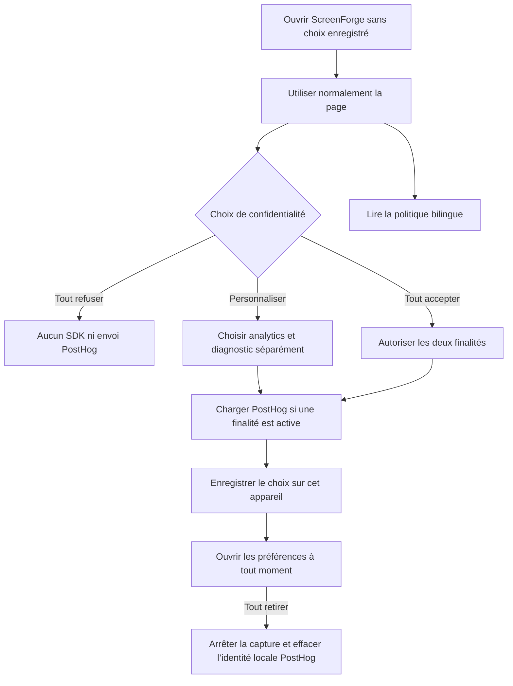
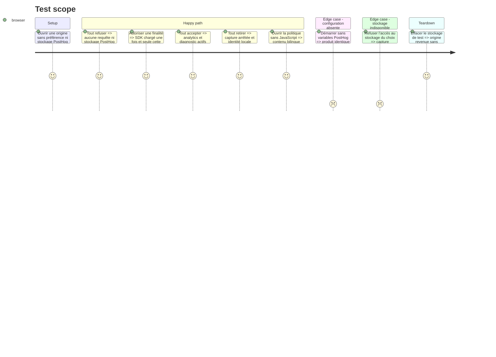

# Instruction: Poser le projet EU et la frontière de consentement

## Architecture projection

> Tree of the final files. ✅ create · ✏️ modify · ❌ delete

```txt
.
├── .env.example                                      ✏️ documenter les variables publiques PostHog
├── apps/web/
│   ├── package.json                                  ✏️ ajouter uniquement posthog-js
│   ├── privacy.html                                  ✅ publier la politique bilingue sans JavaScript
│   ├── vite.config.ts                                ✏️ produire le document de confidentialité
│   ├── e2e/
│   │   └── privacy-consent.spec.ts                   ✅ prouver zéro capture avant consentement et le retrait
│   └── src/
│       ├── App.tsx                                   ✏️ monter la préférence sans bloquer l’éditeur
│       ├── vite-env.d.ts                             ✏️ typer le token et l’hôte publics
│       ├── components/
│       │   ├── privacy/
│       │   │   └── PrivacyConsent.tsx                ✅ partager bandeau et préférences entre les deux entrées
│       │   └── toolbar/
│       │       └── TopBar.tsx                        ✏️ rendre le retrait accessible depuis l’éditeur
│       ├── landing/
│       │   ├── Landing.tsx                           ✏️ monter le même choix sur la vitrine
│       │   ├── copy.ts                               ✏️ ajouter le texte EN et FR du consentement
│       │   └── components/
│       │       └── Footer.tsx                        ✏️ lier politique et préférences
│       ├── lib/
│       │   ├── analytics.ts                          ✅ posséder le choix, le chargement tardif et l’arrêt du SDK
│       │   └── __tests__/
│       │       └── analytics.test.ts                 ✅ verrouiller le contrat sans réseau avant acceptation
│       └── stores/
│           └── ui.store.ts                           ✏️ ouvrir une seule modale de préférences à la fois
├── pnpm-lock.yaml                                    ✏️ verrouiller la dépendance officielle
├── scripts/
│   └── security-headers-audit.mjs                    ✏️ inclure privacy.html dans les documents contrôlés
└── vercel.json                                       ✏️ autoriser l’ingestion, les assets et le worker PostHog EU
```

## User Journey



## Test Scope



## Wireframe

```txt
┌──────────────────────────────────────────────────────────────┐
│ (1) Page ScreenForge existante                               │
│                                                              │
│                                                              │
├──────────────────────────────────────────────────────────────┤
│ (2) Information analytics et confidentialité                 │
│     [politique]       [tout refuser] [choisir] [tout accepter]│
└──────────────────────────────────────────────────────────────┘

1. Contenu existant : landing ou éditeur, toujours utilisable sans consentement.
2. Bandeau : finalités résumées, politique accessible, refus et acceptation globale au même niveau, personnalisation disponible.

┌──────────────────────────────────────────────┐
│ (1) Préférences de confidentialité       [×] │
├──────────────────────────────────────────────┤
│ (2) Analytics produit        [off / on]       │
│     mesure d’usage · données exclues · durée  │
│                                              │
│ (3) Diagnostic               [off / on]       │
│     replay · erreurs · logs · durée           │
├──────────────────────────────────────────────┤
│ (4) Politique complète          [enregistrer] │
└──────────────────────────────────────────────┘

1. Dialogue accessible depuis la landing et le menu de l’éditeur.
2. Finalité analytics : événements produit et performance, contrôlables seuls.
3. Finalité diagnostic : replay, erreurs et logs, contrôlables seuls.
4. Lien légal et validation des choix spécifiques.

┌──────────────────────────────────────────────┐
│ (1) ScreenForge · langue · retour            │
├──────────────────────────────────────────────┤
│ (2) Politique de confidentialité             │
│     responsable · finalités · données        │
│     base légale · destinataires · durées     │
│     droits · contact                         │
└──────────────────────────────────────────────┘

1. En-tête minimal reliant la politique au produit.
2. Document bilingue autonome et lisible sans JavaScript.
```

## Tasks to do

### `1)` Créer le projet PostHog ScreenForge dans Cloud EU

> Isoler ScreenForge des deux projets Pulpe sans déplacer l’organisation existante.

1. Créer manuellement le projet `ScreenForge` dans l’organisation EU `neogenz` ; le connecteur disponible sait lire et configurer un projet, mais pas en créer un.
2. Régler le fuseau sur `Europe/Zurich`, la devise sur `CHF` et l’URL applicative sur `https://screenforge.app`.
3. Vérifier explicitement que la capture d’IP est désactivée, même si les nouveaux projets EU l’héritent normalement.
4. Créer un filtre de comptes de test pour les environnements non production et une cohorte d’utilisateurs internes.
5. Placer le token projet public et l’hôte d’ingestion EU dans les environnements Vercel ; ne jamais copier un token Pulpe ni une clé personnelle dans le dépôt.

### `2)` Poser un client PostHog strictement conditionné

> Faire de l’absence de consentement l’état technique par défaut, pas une convention d’appel.

1. Stocker une préférence locale versionnée avec deux finalités indépendantes, `analytics` et `diagnostic`, propre à cet appareil et indépendante de la session Cloud.
2. Importer dynamiquement `posthog-js` seulement si au moins une finalité est active et sortir immédiatement si les variables publiques manquent.
3. N’exposer depuis `analytics.ts` que des fonctions sûres qui vérifient leur finalité et deviennent des no-op lorsqu’elle est inactive.
4. À la désactivation d’une finalité, arrêter sa capture ; lorsque les deux sont refusées, réinitialiser l’identité et retirer les artefacts PostHog du navigateur.
5. Ne pas synchroniser le consentement par Convex : un choix effectué sur un autre appareil ne vaut pas accord sur celui-ci.

### `3)` Rendre le choix visible, symétrique et révocable

> Laisser ScreenForge entièrement utilisable tout en rendant acceptation et refus également simples.

1. Composer le bandeau et le dialogue avec les primitives `Button`, `Switch` et `Dialog`, labels accessibles, focus restauré et motion réduite respectée.
2. Monter le bandeau dans la landing et l’éditeur sans couvrir leur action principale ni bloquer les fonctionnalités locales.
3. Ajouter `Confidentialité` au footer de la landing et aux actions secondaires de la TopBar.
4. Publier une page `privacy.html` bilingue avec responsable, finalités, catégories de données, base légale, PostHog EU, durées, destinataires, droits et moyen de contact réel.
5. Présenter `tout refuser` et `tout accepter` avec la même simplicité, puis permettre de choisir analytics et diagnostic séparément sans perte de fonctionnalités.

### `4)` Verrouiller le démarrage et la politique réseau

> Échouer en test si un futur changement recommence à tracer avant le choix.

1. Autoriser dans la CSP les domaines PostHog nécessaires à l’ingestion et aux bundles tardifs, plus le worker replay, sans ouvrir les autres directives.
2. Ajouter `privacy.html` aux entrées Vite, à l’audit des headers et au smoke test de build.
3. Tester le refus global, chaque finalité isolée, l’acceptation globale, le retrait, la persistance et le mode sans configuration avec interception des requêtes.
4. Vérifier que le bundle initial de l’éditeur ne charge pas le SDK ni le recorder avant accord.
5. Exécuter les tests unitaires ciblés, le typecheck, le build et le scénario E2E de consentement.

## Test acceptance criteria

| Task | Acceptance criteria |
| ---- | ------------------- |
| 1 | Le projet PostHog actif s’appelle `ScreenForge`, appartient à l’organisation EU `neogenz`, n’utilise aucun token Pulpe et rejette les IP. |
| 2 | Sans choix ou après refus global, aucun script, cookie, stockage ni appel réseau PostHog n’apparaît ; avec une finalité active, une seule instance EU démarre. |
| 2 | Désactiver analytics ou diagnostic arrête seulement cette finalité ; tout retirer arrête les envois et sépare l’identité locale avant un autre compte. |
| 3 | Tout accepter et tout refuser sont atteignables au même niveau, les deux finalités restent réglables séparément et le produit fonctionne dans tous les cas. |
| 3 | `privacy.html` expose le contenu légal EN et FR sans dépendre de JavaScript. |
| 4 | La CSP autorise les seuls besoins PostHog ajoutés, le build contient la politique et l’E2E échoue dès qu’une requête PostHog précède l’accord. |
