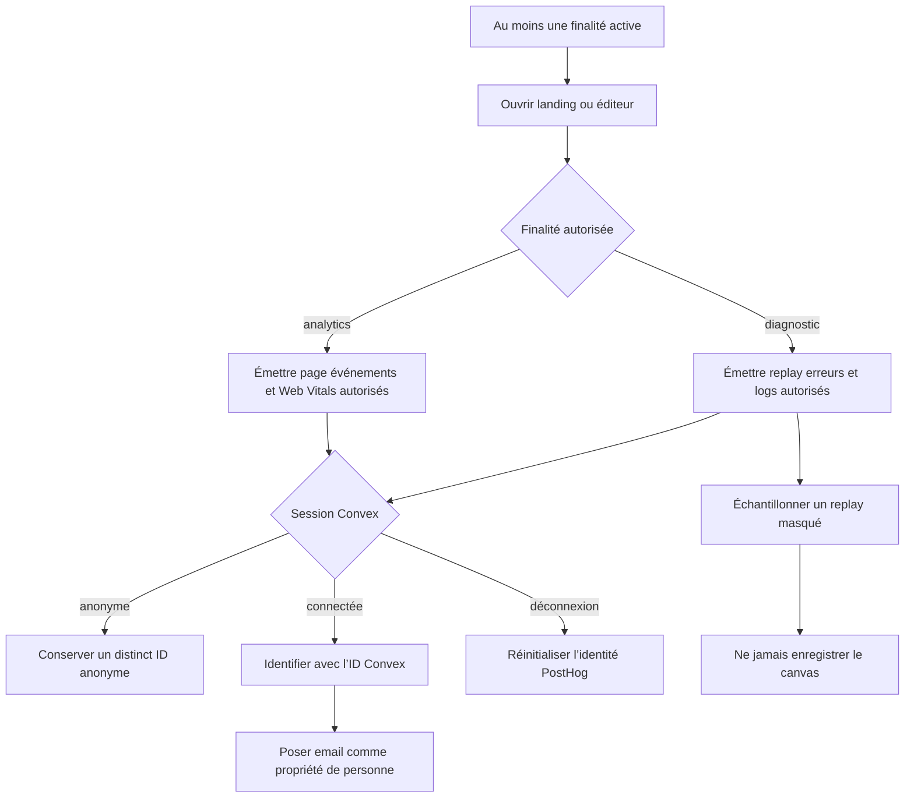
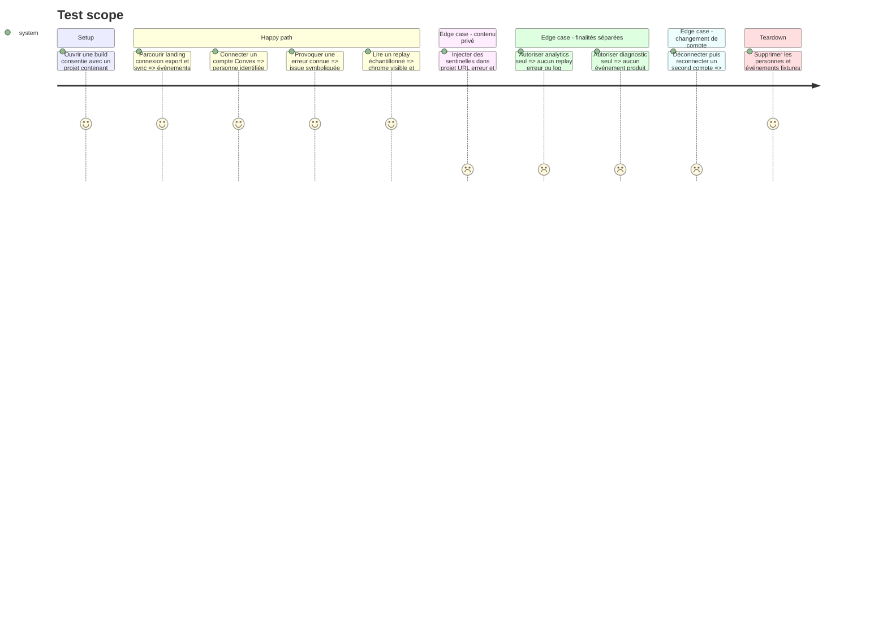

# Instruction: Instrumenter l’usage et l’observabilité utile

## Architecture projection

> Tree of the final files. ✅ create · ✏️ modify · ❌ delete

```txt
.
├── .env.example                                      ✏️ documenter version, environnement et clé de source maps
├── .github/
│   └── workflows/
│       └── deploy-production.yml                     ✏️ téléverser les source maps du seul candidat immuable
├── apps/web/
│   ├── package.json                                  ✏️ ajouter le plugin Rollup PostHog en développement
│   ├── vite.config.ts                                ✏️ injecter la release et téléverser les source maps si la clé existe
│   ├── e2e/
│   │   └── posthog-observability.spec.ts             ✅ contrôler événements, identité, replay et redaction
│   └── src/
│       ├── components/
│       │   └── error-boundary.tsx                    ✏️ reporter les erreurs React avec un contexte autorisé
│       ├── hooks/
│       │   └── use-export.ts                         ✏️ mesurer le résultat du chemin produit critique
│       ├── landing/
│       │   └── components/
│       │       └── cta.tsx                           ✏️ mesurer le passage de la vitrine à l’éditeur
│       └── lib/
│           ├── account.ts                            ✏️ mesurer le départ vers checkout sans donnée de paiement
│           ├── analytics.ts                          ✏️ porter événements, identité, logs, replay et redaction
│           ├── sync.ts                               ✏️ journaliser seulement les issues de sync autorisées
│           └── __tests__/
│               └── analytics.test.ts                 ✏️ prouver schéma fermé, reset et filtrage
├── pnpm-lock.yaml                                    ✏️ verrouiller le plugin officiel
└── scripts/
    └── deployment-config-audit.mjs                   ✏️ borner la clé source-map à l’étape de build production
```

## User Journey



## Test Scope



## Tasks to do

### `1)` Fermer le vocabulaire d’événements et de logs

> Mesurer quelques résultats produit sans transformer le DOM ni les erreurs brutes en schéma implicite.

1. Déclarer sous la finalité `analytics` les événements initiaux : ouverture éditeur, clic CTA landing, connexion réussie, départ checkout, export terminé ou échoué, sync terminée ou échouée.
2. Autoriser seulement des propriétés scalaires stables : environnement, version, durée, dimension, nombre d’écrans, issue et type de fournisseur.
3. Refuser noms de projet, d’écran ou de calque, texte, prompt, image, asset ID, contenu d’erreur, email dans les événements et URL avec query ou fragment.
4. Sous la finalité `diagnostic`, utiliser `posthog.logger` pour les seuls résultats système utiles, avec `serviceName=screenforge-web`, environnement, version et `logs.beforeSend` qui retire toute propriété hors contrat.
5. Laisser `captureConsoleLogs` désactivé ; les appels `console.*` existants restent locaux au navigateur.

### `2)` Brancher l’identité sur la session Convex

> Faire converger analytics, replay, logs et futurs joins sur la seule clé déjà commune.

1. À l’état `signed-in`, appeler `identify` avec `CloudUser.id` comme `distinct_id` et l’email comme propriété de personne.
2. Ne jamais faire de l’email un alias ou un distinct ID ; une correction ou un changement d’adresse met seulement la propriété à jour.
3. Reprendre l’identité courante si le SDK démarre après une session déjà restaurée.
4. Appeler `reset` lors du passage à `signed-out`, du changement de compte et du retrait de consentement.
5. Tester deux comptes successifs dans le même navigateur pour empêcher toute fusion croisée.

### `3)` Activer replay, erreurs et performance en mode privé

> Obtenir le contexte de diagnostic sans envoyer les créations ScreenForge.

1. Activer replay, erreurs et logs uniquement lorsque la finalité `diagnostic` est active, à 20 % des sessions pour le replay et avec une rétention visée à 30 jours.
2. Garder la capture canvas désactivée ; masquer tous les inputs et tout texte par défaut, puis démasquer seulement les libellés statiques explicitement marqués.
3. Exclure corps et en-têtes réseau ; ne garder que méthode, hôte autorisé, durée et statut après nettoyage de l’URL.
4. Activer Web Vitals sous `analytics`, puis l’error tracking automatique et les erreurs React de `ErrorBoundary` sous `diagnostic`.
5. Appliquer un `before_send` qui supprime les propriétés inconnues et les fragments potentiellement personnels avant ingestion.
6. Vérifier dans PostHog que la replay, l’exception et le log d’une même session sont reliés.

### `4)` Symboliquer le candidat réellement déployé

> Faire correspondre une stack production à la version immuable que Vercel promeut.

1. Ajouter le plugin Rollup officiel, désactivé quand les variables privées de build sont absentes.
2. Utiliser le SemVer du paquet et le SHA Git comme version de service et release d’error tracking.
3. Créer une clé PostHog dédiée avec le seul scope d’écriture error tracking ; l’exposer uniquement à l’étape `vercel build` du job production.
4. Générer et téléverser les source maps pendant le build, puis les retirer du dossier livré.
5. Étendre l’audit de déploiement afin qu’une clé source-map accessible aux tests, pull requests ou bundles publics fasse échouer le gate.

## Test acceptance criteria

| Task | Acceptance criteria |
| ---- | ------------------- |
| 1 | Chaque événement et log initial possède un nom stable, la bonne finalité et uniquement les propriétés autorisées ; la console brute n’est jamais transférée. |
| 1 | Une sentinelle placée dans un nom, un texte, une URL, une image ou un objet d’erreur n’apparaît dans aucune charge PostHog. |
| 2 | Une personne connectée a pour distinct ID exact son ID Convex, son email reste une propriété modifiable et deux comptes successifs ne fusionnent pas. |
| 3 | Analytics désactivé bloque événements et Web Vitals ; diagnostic désactivé bloque replay, erreurs et logs sans affecter l’autre finalité. |
| 3 | Les replays autorisés conservent la structure utile, masquent les textes et inputs, excluent le réseau sensible et ne contiennent aucun pixel du canvas Fabric. |
| 3 | Une erreur fixture apparaît avec son événement, son log structuré et, lorsqu’il est échantillonné, son replay de session. |
| 4 | Une stack du candidat déployé est symboliquée avec le bon SemVer et SHA, tandis qu’aucune source map ni clé personnelle n’est servie au navigateur. |
