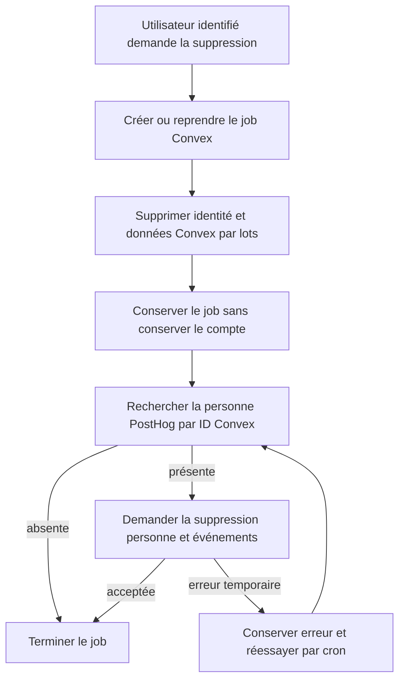
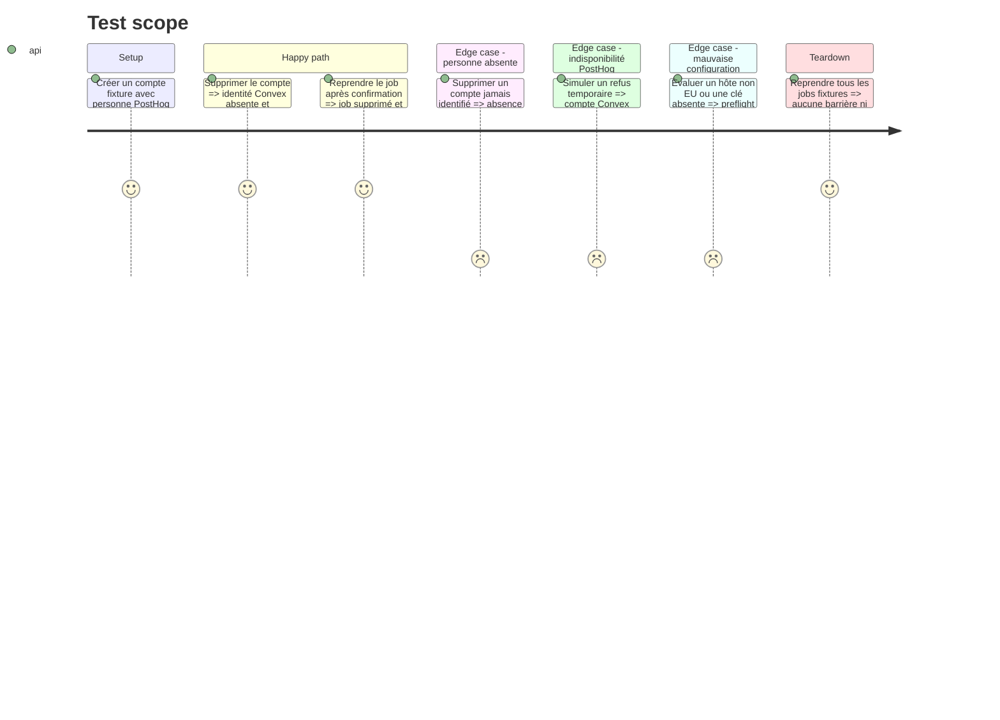

# Instruction: Rendre l’effacement et la rétention durables

## Architecture projection

> Tree of the final files. ✅ create · ✏️ modify · ❌ delete

```txt
.
├── .env.example                                      ✏️ documenter les variables serveur d’effacement PostHog
├── apps/backend/convex/
│   ├── accountDeletion.ts                            ✏️ prolonger le job jusqu’au résultat externe idempotent
│   ├── accountDeletion.test.ts                       ✏️ couvrir succès absence et reprise après panne
│   ├── posthog.ts                                    ✅ isoler recherche et suppression de personne côté serveur
│   ├── preflight_evaluation.ts                       ✏️ exiger une configuration EU cohérente en déploiement
│   ├── preflight.test.ts                             ✏️ refuser clé ou projet manquant et hôte non EU
│   └── schema.ts                                     ✏️ représenter l’étape externe durable du job
├── apps/web/
│   └── src/
│       └── components/
│           └── privacy/
│               └── PrivacyConsent.tsx                ✏️ expliquer retrait, suppression de compte et demande manuelle
└── scripts/
    ├── convex-production-config-gate.mjs             ✏️ reconnaître les variables PostHog privées sans les afficher
    └── deployment-config-audit.mjs                   ✏️ vérifier leur présence et leur portée serveur
```

## User Journey



## Test Scope



## Tasks to do

### `1)` Borner les pouvoirs serveur PostHog

> Permettre l’effacement sans faire entrer une clé personnelle dans le navigateur ou les logs.

1. Créer une clé personnelle distincte de la clé source-map, limitée aux scopes `person:read` et `person:write` du projet ScreenForge.
2. Stocker `POSTHOG_HOST`, `POSTHOG_PROJECT_ID` et `POSTHOG_PERSON_API_KEY` uniquement dans les environnements Convex préproduction et production.
3. Exiger `https://eu.posthog.com` dans le preflight et ne rendre dans les diagnostics que les noms de variables ou de règles.
4. Centraliser les appels dans un `internalAction` inaccessible au client ; ne jamais accepter email, project ID ou host depuis un argument public.
5. Rechercher la personne par distinct ID Convex, puis demander la suppression avec l’identifiant interne rendu par PostHog.

### `2)` Étendre la machine de suppression existante

> Conserver le modèle idempotent et reprenable déjà utilisé pour le stockage Convex.

1. Ajouter au job un état de nettoyage télémétrie qui survit à l’identité supprimée.
2. Une fois les tables et fichiers Convex vidés, planifier l’action PostHog et garder le job comme preuve de travail restant.
3. Considérer une personne absente ou déjà supprimée comme un succès ; considérer timeout, 429 et 5xx comme temporaires.
4. Enregistrer une erreur bornée sans corps de réponse ni PII, incrémenter les tentatives et laisser le cron existant reprendre.
5. Supprimer le job seulement après succès PostHog, tout en conservant les issues client actuelles `deleted` et `cleanup-pending`.
6. Prouver que deux reprises concurrentes ne suppriment ni un autre utilisateur ni une nouvelle personne portant un distinct ID différent.

### `3)` Fixer rétention, accès et procédure de droits

> Réduire ce qui reste stocké et rendre les demandes opérables avant le lancement.

1. Régler les événements et personnes sur 13 mois, puis replay, erreurs et logs sur 30 jours ou la plus courte durée offerte si le plan impose davantage.
2. Confirmer la suppression d’IP, la résidence EU, les membres autorisés, le DPA et la liste de sous-traitants dans le registre de traitement.
3. Documenter que retirer le consentement arrête les futures captures, tandis que supprimer le compte efface aussi l’historique PostHog identifié.
4. Prévoir une procédure opérateur pour une demande manuelle par email : retrouver la personne, vérifier l’identité, supprimer par l’API et consigner uniquement l’issue.
5. Ne pas promettre la suppression des pièces Polar légalement conservées pour la facturation ; documenter séparément leur base et leur durée de conservation.

### `4)` Tester la reprise plutôt que le seul succès

> Laisser une preuve qui échoue si une panne tierce transforme l’effacement en meilleur effort.

1. Simuler réponses PostHog succès, personne absente, 429, 5xx et réponse invalide sans réseau réel.
2. Vérifier que la suppression Convex reste atomique et que le job externe reste après chaque erreur temporaire.
3. Vérifier qu’un tour ultérieur termine le même job sans dupliquer la suppression.
4. Étendre les audits de configuration afin qu’aucune valeur secrète n’apparaisse dans les sorties, fixtures de publication ou variables Vite.
5. Exécuter tests backend ciblés, preflight, publication audit, typecheck et lint.

## Test acceptance criteria

| Task | Acceptance criteria |
| ---- | ------------------- |
| 1 | Seul le backend Convex connaît la clé personne, l’hôte EU et le project ID ScreenForge ; ni le navigateur ni les diagnostics ne révèlent leur valeur. |
| 2 | Une suppression de compte retire immédiatement l’identité Convex et garde un job durable jusqu’au succès ou à l’absence confirmée de la personne PostHog correspondante. |
| 2 | Une panne, un rate limit ou une relivraison ne perd pas le travail, ne vise jamais un autre distinct ID et finit après reprise. |
| 3 | Les réglages PostHog affichent les durées décidées, la capture d’IP désactivée et un accès limité aux opérateurs autorisés. |
| 3 | Le retrait de consentement, la suppression de compte et la demande manuelle sont décrits comme trois gestes distincts avec une issue vérifiable. |
| 4 | La suite automatisée échoue si le job disparaît avant PostHog, si une clé entre dans Vite ou si un diagnostic contient une valeur sensible. |
