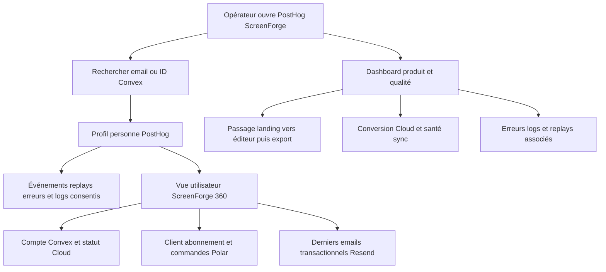
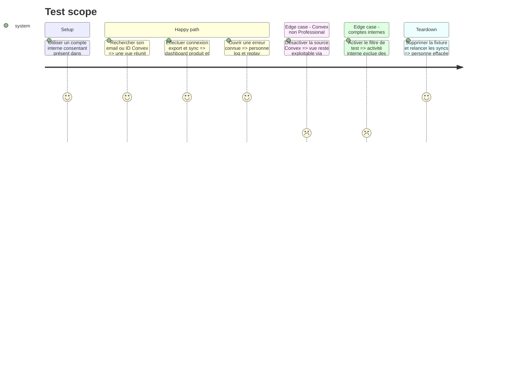

# Instruction: Relier les sources et valider le poste opérateur

## Architecture projection

> Tree of the final files. ✅ create · ✏️ modify · ❌ delete

```txt
.
└── aidd_docs/
    └── memory/
        ├── architecture.md                            ✏️ inscrire PostHog comme couche optionnelle consentie
        ├── database.md                                ✏️ documenter les clés de jointure et données synchronisées
        └── testing.md                                 ✏️ conserver les preuves de confidentialité et de corrélation
```

## User Journey



## Test Scope



## Tasks to do

### `1)` Connecter seulement les tables nécessaires

> Rendre les comptes retrouvables sans aspirer l’ensemble des données des trois fournisseurs.

1. Connecter Polar avec un Organization Access Token en lecture et sélectionner clients, abonnements, commandes et checkouts.
2. Connecter Resend avec une clé de lecture dédiée et sélectionner les emails transactionnels ; ne pas importer audiences ou broadcasts tant qu’ils ne sont pas utilisés par ScreenForge.
3. Confirmer le plan Convex Professional avant de créer sa source ; si disponible, sélectionner uniquement `users` et `entitlements` avec une deploy key dédiée.
4. Garder clés et deploy key dans les secrets gérés par les connecteurs PostHog, jamais dans le code, les propriétés personne ou les dashboards.
5. Régler une fréquence compatible avec le support opérateur sans viser le temps réel : les webhooks Convex restent l’autorité des droits.

### `2)` Construire une vue utilisateur ScreenForge 360

> Chercher une personne une fois et voir où la retrouver dans chaque système.

1. Joindre `persons.distinct_id` à l’ID Convex et à l’external ID du client Polar.
2. Joindre Resend à query-time sur l’email normalisé, sans transformer l’email en identifiant PostHog.
3. Exposer seulement email, ID Convex, ID client Polar, statut Cloud, dernier événement produit, dernière erreur et état des derniers emails transactionnels.
4. Ajouter les URLs d’administration uniquement lorsqu’elles sont stables et ne portent aucun secret ; sinon afficher l’identifiant copiable pour la recherche native du fournisseur.
5. Si la source Convex n’est pas disponible, conserver la même vue avec les propriétés PostHog et Polar, puis indiquer explicitement l’absence de la colonne Convex synchronisée.

### `3)` Livrer un dashboard initial unique

> Répondre aux questions de lancement sans créer une forêt d’insights spéculatifs.

1. Ajouter le funnel landing vue → éditeur ouvert → premier export terminé.
2. Ajouter utilisateurs actifs, exports réussis ou échoués, durée d’export et rétention des exporteurs.
3. Ajouter connexion → checkout → Cloud actif, en distinguant strictement événement produit et état Polar.
4. Ajouter erreurs par release, logs par niveau et sessions avec replay, avec passage direct à la personne concernée.
5. Appliquer par défaut les filtres production et hors cohorte interne ; laisser les données internes consultables pour le diagnostic.

### `4)` Faire un dry run de lancement et écrire la mémoire

> Vérifier le parcours entier avant d’activer la capture pour le trafic public.

1. Avec un compte interne, accepter, ouvrir l’éditeur, se connecter, exporter, lancer une sync et provoquer une erreur fixture.
2. Vérifier live events, personne par email, distinct ID Convex, client Polar, email Resend, source map, log et replay masqué.
3. Inspecter les charges brutes pour confirmer l’absence de texte, nom, image, URL sensible, corps réseau et console brute.
4. Exécuter une suppression de fixture jusqu’à disparition PostHog, puis vérifier la mise à jour des sources externes selon leur propre rétention.
5. Documenter architecture, clés de jointure, périmètre synchronisé, procédures de test et option de désactivation immédiate dans la mémoire projet.
6. Activer la capture production seulement après ce dry run ; le rollback consiste à retirer les variables publiques ou désactiver la capture du projet, sans toucher à l’éditeur local.

## Test acceptance criteria

| Task | Acceptance criteria |
| ---- | ------------------- |
| 1 | Les sources Polar et Resend ne synchronisent que le périmètre ScreenForge décidé ; Convex est soit limité à `users` et `entitlements`, soit explicitement absent faute de plan Professional. |
| 2 | Une recherche par email ou ID Convex retrouve la même personne et ses références Polar, Resend et Convex disponibles sans table de correspondance supplémentaire. |
| 2 | Aucun dashboard, URL ou propriété personne ne contient une clé, un contenu de projet ou une donnée fournisseur non nécessaire. |
| 3 | Un seul dashboard répond aux parcours activation, export, Cloud et qualité, avec production et comptes externes sélectionnés par défaut. |
| 4 | Le dry run relie événement, personne, paiement, email, erreur, log et replay ; l’effacement fixture termine sans donnée PostHog retrouvable. |
| 4 | La mémoire projet décrit le montage réel et la capture publique ne démarre qu’après validation de toutes les preuves. |
