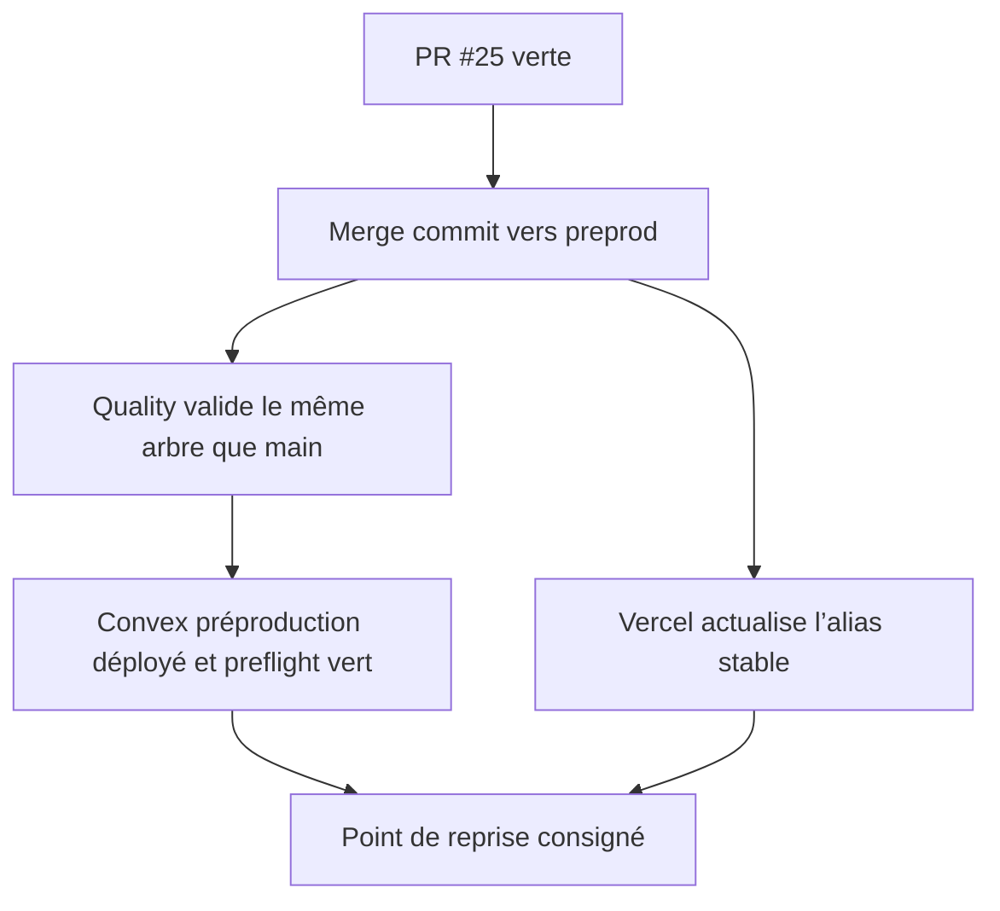

# Instruction: Figer le point de reprise préproduction

## Architecture projection

> Tree of the final files. ✅ create · ✏️ modify · ❌ delete

```txt
.
└── aidd_docs/tasks/2026_08/2026_08_22_integrate-open-pull-requests/
    └── verification.md                                      ✅ consigner les SHA et preuves de chaque promotion sans valeur fournisseur
```

## User Journey



## Test Scope

```mermaid
---
title: Test scope
---
journey
  section Setup
    Vérifier que #25 vise le HEAD courant de main et que tous ses checks sont verts => candidat immuable identifié: 5: cli
  section Happy path
    Merger #25 avec un merge commit => push preprod créé sans réécriture: 5: system
    Suivre Quality et Vercel => arbre égal à main et deux déploiements réussis sur le même SHA: 5: system
  section Edge case - pipeline rouge
    Un check ou preflight échoue => aucun contournement ni nouvelle feature promue avant diagnostic: 1: system
```

## Tasks to do

### `1)` Revalider la promotion

> Ne merger qu’un candidat toujours identique au `main` courant.

1. Vérifier base, head, mergeability, discussions et checks de #25.
2. Refuser la promotion si `main` a avancé sans nouveau run vert.
3. Utiliser exclusivement la méthode merge commit requise par `preprod`.

### `2)` Observer le déploiement post-merge

> Prouver le chemin automatique avant d’empiler les features.

1. Suivre le run Quality déclenché par le push `preprod` jusqu’au job `deploy-preproduction`.
2. Vérifier le gate d’égalité des arbres, le preflight avant et après déploiement et le message Convex portant le SHA.
3. Vérifier que l’alias Vercel stable sert ce même candidat et que l’auth Cloud reste accessible.

### `3)` Conserver une preuve expurgée

> Garder un point de reprise exploitable sans publier d’état fournisseur sensible.

1. Créer `verification.md` avec SHA, URLs publiques de runs et verdicts.
2. Ne consigner ni secret, ni identifiant fournisseur, ni donnée utilisateur.

## Test acceptance criteria

| Task | Acceptance criteria |
| --- | --- |
| 1 | #25 est mergée par merge commit seulement après des checks stricts verts sur le HEAD attendu. |
| 2 | Le run push `preprod` termine avec `deploy-preproduction` vert, un arbre égal à `main` et l’alias Vercel sur le même candidat. |
| 3 | La preuve permet de retrouver les runs et SHA sans exposer de valeur privée. |
