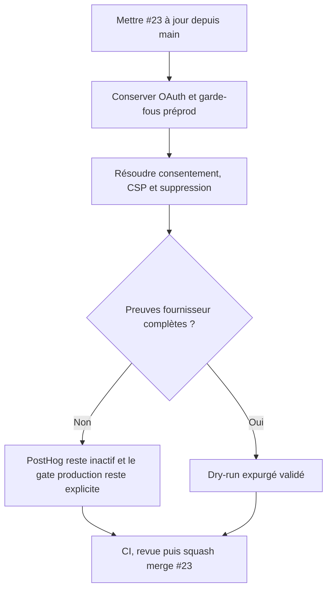

# Instruction: Intégrer PostHog et les pages légales sans activer un traitement incomplet

## Architecture projection

> Tree of the final files. ✅ create · ✏️ modify · ❌ delete

```txt
.
├── .env.example                                             ✏️ conserver OAuth et documenter les seuls noms PostHog
├── .github/workflows/deploy-production.yml                  ✏️ garder la clé source-map bornée à l’étape production
├── apps/backend/convex/
│   ├── accountDeletion.ts                                   ✏️ conserver le nettoyage durable PostHog
│   ├── accountDeletion.test.ts                              ✏️ couvrir succès, absence et reprises
│   ├── posthog.ts                                           ✏️ client serveur minimal et expurgé
│   ├── posthog.test.ts                                      ✏️ prouver filtrage et erreurs temporaires
│   ├── preflight_evaluation.ts                              ✏️ cumuler exigences OAuth et PostHog sans fuite
│   ├── preflight.test.ts                                    ✏️ couvrir les deux contrats
│   └── schema.ts                                            ✏️ conserver la file de nettoyage durable
├── apps/web/
│   ├── privacy.html                                         ✅ publier la politique bilingue
│   ├── terms.html                                           ✅ publier CGU, CGV et mentions
│   └── src/
│       ├── components/privacy/                              ✅ consentement accessible et finalités séparées
│       ├── lib/analytics.ts                                 ✅ chargement tardif, allowlist et identité stable
│       ├── App.tsx                                          ✏️ brancher l’identité sans capturer le projet
│       ├── hooks/use-export.ts                              ✏️ mesurer l’export sans contenu utilisateur
│       └── landing/                                         ✏️ exposer les documents légaux
├── scripts/
│   ├── convex-production-config-gate.mjs                    ✏️ cumuler les variables requises sans les afficher
│   ├── deployment-config-audit.mjs                          ✏️ conserver tous les scopes de secrets
│   └── security-headers-audit.mjs                           ✏️ vérifier la CSP PostHog exacte
├── vercel.json                                              ✏️ fusionner CSP actuelle, Convex et PostHog EU
└── aidd_docs/tasks/2026_08/
    ├── 2026_08_21_screenforge-posthog-rgpd/                 ✏️ distinguer code intégré et activation bloquée
    └── 2026_08_22_integrate-open-pull-requests/verification.md ✏️ consigner rebase, tests et merge #23
```

## User Journey



## Test Scope

```mermaid
---
title: Test scope
---
journey
  section Setup
    Mettre #23 sur le main contenant #21 => diff recalculé sans ancien contrat préflight: 5: cli
  section Happy path
    Démarrer sans variables ni consentement => aucun SDK stockage ou appel PostHog et produit complet: 5: browser
    Consentir séparément => seuls événements structurés autorisés sont émis vers EU: 5: browser
    Supprimer un compte fixture => données Convex retirées et travail PostHog durable jusqu’au succès: 5: api
  section Edge case - fournisseur non prêt
    Rétention ou dry-run absent => code peut rester désactivé mais activation production demeure bloquée et visible: 1: system
```

## Tasks to do

### `1)` Réaligner #23 sur le main courant

> Intégrer les changements #21 avant toute résolution fonctionnelle.

1. Mettre la branche #23 à jour sans réécrire les autres worktrees.
2. Vérifier `.env.example`, les deux preflights et les deux audits de déploiement ligne par ligne.
3. Conserver les quatre variables OAuth obligatoires et ajouter uniquement les noms PostHog nécessaires.

### `2)` Fermer les conflits de confiance

> Garder la télémétrie entièrement optionnelle et consentie.

1. Fusionner la CSP en conservant les hashes du build courant, les origines Convex exactes et les seuls hôtes PostHog EU utiles.
2. Vérifier que `App.tsx`, `use-export.ts`, les erreurs et la suppression n’envoient ni canvas, ni texte, ni image, ni URL utilisateur, ni console brute.
3. Conserver l’application complète lorsque PostHog est absent ou refusé.

### `3)` Séparer merge de code et activation fournisseur

> Ne pas transformer une dépendance externe incomplète en faux feu vert.

1. Rejouer le dry-run de consentement, identité et effacement si les accès PostHog sont disponibles.
2. Sinon, maintenir les phases opérateur et la rétention en `blocked`, avec activation production interdite.
3. Ne jamais consigner payload, personne, token, clé ou identifiant opérateur dans Git ou les logs.

### `4)` Revalider puis merger #23

> Faire du nouveau `main` la seule preuve du code intégré.

1. Exécuter les tests ciblés privacy, analytics, suppression et configuration.
2. Exécuter `pnpm run test:release`, Gitleaks et l’audit de publication.
3. Revoir le diff actualisé, passer la PR hors draft seulement sans finding bloquant, puis squash-merge.

## Test acceptance criteria

| Task | Acceptance criteria |
| --- | --- |
| 1 | Les exigences OAuth, Cloud, Polar, Resend et PostHog coexistent dans un preflight expurgé et testé. |
| 2 | Aucun trafic PostHog ne précède le consentement; aucune donnée de projet ou console brute ne traverse la frontière. |
| 3 | Une preuve fournisseur absente laisse PostHog inactif et garde le lancement production explicitement bloqué. |
| 4 | #23 est squash-mergée seulement après CI complète verte et revue du diff recalculé contre le nouveau `main`. |
