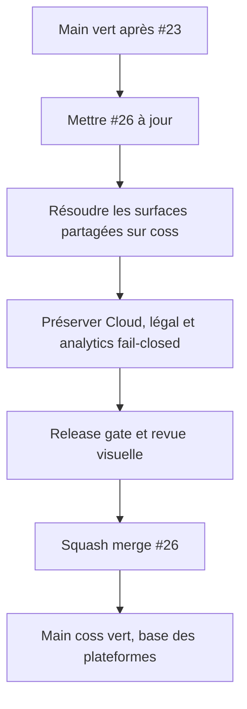

# Instruction: Intégrer la refonte coss UI comme nouvelle fondation frontend

## Architecture projection

> Tree of the final files. ✅ create · ✏️ modify · ❌ delete

```txt
.
├── apps/web/src/
│   ├── components/ui/                                     ✏️ conserver les sources coss vérifiées et non modifiées
│   ├── components/patterns/                               ✅ porter les compositions propres à ScreenForge
│   ├── components/{toolbar,properties-panel}/             ✏️ conserver la nouvelle hiérarchie sans perdre Cloud ni analytics
│   ├── components/{account-dialog,pricing-dialog}/        ✏️ fusionner UX coss, quotas et consentement
│   ├── design-system/{tokens,motion,stage}.css             ✅ devenir les seules extensions visuelles du produit
│   ├── landing/                                            ✏️ conserver refonte, pages légales et consentement
│   ├── App.tsx                                             ✏️ cumuler boot coss et identité analytics consentie
│   └── stores/ui.store.ts                                  ✏️ conserver les nouveaux parcours et les états Cloud
├── apps/web/e2e/                                           ✏️ cumuler les contrats UX, Cloud, confidentialité et shell
├── scripts/{scale-audit,ui-source-audit,visual-probe}.mjs  ✏️ verrouiller la nouvelle fondation
└── aidd_docs/tasks/2026_08/2026_08_22_integrate-open-pull-requests/verification.md ✏️ consigner #26
```

## User Journey



## Test Scope

```mermaid
---
title: Test scope
---
journey
  section Setup
    Mettre #26 sur le main contenant #23 => les fichiers partagés sont résolus sur la nouvelle anatomie coss: 5: cli
  section Happy path
    Ouvrir landing et éditeur => navigation, boot, tiroirs et dialogues restent accessibles: 5: browser
    Se connecter et utiliser Cloud => quotas, rattachement et suppression gardent leurs contrats: 5: browser
    Refuser les analytics => produit complet, pages légales accessibles et aucun chargement PostHog: 5: browser
  section Edge case - migration UI
    Rejouer les projets orphelins et les dialogues démontés => aucune donnée perdue et aucun test Cloud ignoré: 1: browser
    Scrubber Position X après hydratation => la valeur écran, le store et Fabric restent alignés: 1: browser
```

## Tasks to do

### `1)` Réaligner #26 après #23

> Traiter la refonte comme une fondation, pas comme un remplacement global aveugle.

1. Mettre la branche #26 à jour depuis le `main` effectivement mergé.
2. Résoudre individuellement les fichiers partagés, en gardant l'anatomie coss et les comportements #23.
3. Conserver OAuth, quotas Cloud, pages légales, consentement, identité analytics et effacement.
4. Recalculer le lockfile depuis les manifests réconciliés.

### `2)` Auditer la nouvelle frontière du design system

> Le dépôt public doit distinguer clairement composants amont et code ScreenForge.

1. Vérifier provenance, licence et dépendances des sources coss et Base UI.
2. Exécuter `audit:ui` pour prouver que `components/ui/` correspond au registre attendu.
3. Garder les adaptations métier dans `components/patterns/` et les tokens dans `design-system/`.
4. Refuser tout ancien import Radix, primitive locale dupliquée ou contournement d'accessibilité.

### `3)` Refaire les preuves produit et visuelles

> La validation ancienne ne couvre ni le merge #23 ni le dernier correctif de #26.

1. Exécuter le gate de release complet avec le projet Cloud non skippé.
2. Corriger à la racine le décalage du bouton Exporter et la dérive du scrub X observés par la CI #26.
3. Rejouer shell, landing, rattachement Cloud, projets orphelins, consentement et suppression.
4. Exécuter contraste, échelle, audit UI et sonde visuelle aux états prévus.
5. Vérifier la preview Vercel dans les thèmes et largeurs représentatifs.

### `4)` Revoir puis merger #26

> Faire de la nouvelle pile UI la base unique avant Android et les surfaces Apple.

1. Revoir sécurité, accessibilité, performance, pertinence et licence sur le diff réconcilié.
2. Ne merger qu'avec CI GitHub et Vercel vertes et sans commentaire pertinent ouvert.
3. Squash-merger puis attendre le push `main` vert avant de reprendre #22.

## Test acceptance criteria

| Task | Acceptance criteria |
| --- | --- |
| 1 | #26 est alignée sur le `main` contenant #23 sans perte de comportement Cloud, légal ou analytics. |
| 2 | La séparation coss / patterns / design-system est vérifiée, licenciable et verrouillée par `audit:ui`. |
| 3 | Le gate release, y compris stabilité d'hydratation et transform X, la matrice Cloud/confidentialité et les probes visuelles passent sur le même commit. |
| 4 | #26 est squash-mergée avec checks verts; son push `main` devient la base de #22 et #24. |
