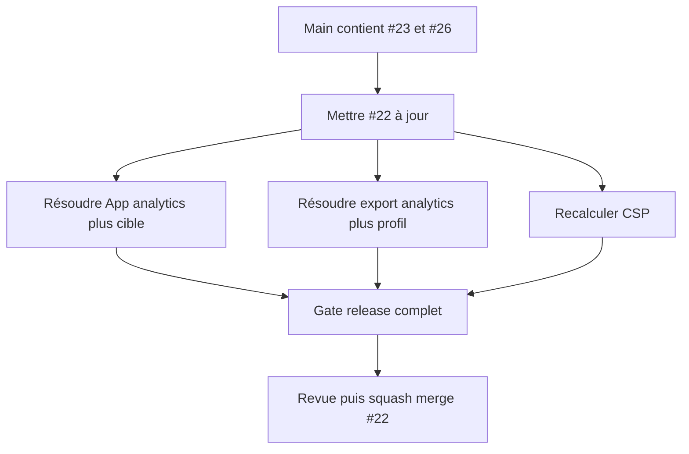

# Instruction: Poser Android comme contrat multi-store générique

## Architecture projection

> Tree of the final files. ✅ create · ✏️ modify · ❌ delete

```txt
.
├── packages/project-format/src/
│   ├── types.ts                                             ✏️ persister une cible de store immuable
│   ├── dimensions.ts                                        ✏️ garder le registre StoreTargetProfile générique
│   ├── catalog-ids.ts                                       ✏️ cataloguer appareils Apple et Android
│   └── project-validation.ts                                ✏️ valider et migrer la cible sans perte
├── apps/web/src/
│   ├── App.tsx                                              ✏️ cumuler identité analytics et cible active
│   ├── hooks/use-export.ts                                  ✏️ cumuler métriques expurgées et export ciblé
│   ├── lib/{storage,export,release,asc}.ts                   ✏️ dériver persistance et livraison de la cible
│   ├── lib/canvas/                                          ✏️ dériver la géométrie de la planche
│   ├── assets/{device-frames,templates}/                    ✏️ ajouter les ressources Android originales
│   └── components/                                          ✏️ création, filtres, export et publication ciblés
├── apps/{bridge,mcp}/                                       ✏️ transmettre et refuser les cibles incompatibles
├── scripts/{validate-export,visual-probe,export-probe}.mjs  ✏️ valider les deux stores
├── vercel.json                                              ✏️ conserver la CSP PostHog fusionnée
└── aidd_docs/tasks/2026_08/2026_08_22_integrate-open-pull-requests/verification.md ✏️ consigner merge #22
```

## User Journey



## Test Scope

```mermaid
---
title: Test scope
---
journey
  section Setup
    Mettre #22 sur le main coss contenant #23 et #26 => les 48 fichiers partagés observés sont reclassifiés sur le diff courant: 5: cli
  section Happy path
    Créer un projet Google Play => cible 1080x1920 persistée et planche 9:16 affichée: 5: browser
    Exporter puis rouvrir le projet => PNG opaque exact ZIP phone et cible inchangée: 5: browser
    Utiliser un projet Apple historique => migration iPhone idempotente et export historique inchangé: 5: browser
  section Edge case - analytics refusée
    Exporter sans consentement => export complet et aucun événement PostHog: 1: browser
```

## Tasks to do

### `1)` Réaligner #22 après #23 et #26

> Résoudre uniquement contre le `main` effectivement mergé.

1. Recalculer les fichiers partagés et les conflits avant toute édition.
2. Porter les surfaces Android sur les primitives coss et les compositions `patterns/`, sans réintroduire les composants supprimés par #26.
3. Dans `App.tsx`, conserver initialisation d’identité consentie et sélection de cible; dans `use-export.ts`, conserver instrumentation expurgée et types `StoreTargetProfile`.
4. Dans `vercel.json`, recalculer les hashes et conserver PostHog EU plus toutes les origines Convex exactes.

### `2)` Valider le socle multi-store

> Faire de la cible persistée l’unique source de géométrie et de limites.

1. Conserver `target: StoreTargetId` sur projet, snapshot et release.
2. Dériver planche, dimensions, plafond d’écrans, dossier ZIP, appareils et gabarits depuis `StoreTargetProfile`.
3. Migrer les projets sans cible vers App Store iPhone sans déplacer leurs calques.
4. Refuser toute combinaison appareil, template, release ou publication incompatible.

### `3)` Rejouer les preuves Android et historiques

> Ne pas accepter un Android vert qui régresse Apple, Cloud ou la confidentialité.

1. Exécuter les unités contrat, stockage, canvas, export, release, MCP et bridge.
2. Exécuter les E2E Android et Apple, puis `pnpm run test:release`.
3. Vérifier Gitleaks, publication, dimensions, opacité, poids et CSP.

### `4)` Revoir puis merger #22

> Squash-merger seulement le contrat générique réconcilié.

1. Faire une revue code, fonctionnelle et pertinence sur le diff contre le nouveau `main`.
2. Passer la PR hors draft uniquement sans finding bloquant.
3. Squash-merger et attendre le run push `main` vert avant de commencer #24.

## Test acceptance criteria

| Task | Acceptance criteria |
| --- | --- |
| 1 | Les trois conflits attendus conservent simultanément analytics consentie, export multi-store et CSP minimale. |
| 2 | Projet, snapshot, release, canvas, MCP et export dérivent tous de la même cible persistée. |
| 3 | Google Play 1080×1920 et App Store iPhone 1320×2868 passent le gate release sans émission PostHog non consentie. |
| 4 | #22 est squash-mergée sur un `main` vert et son contrat devient la base exclusive de l’intégration Apple suivante. |
