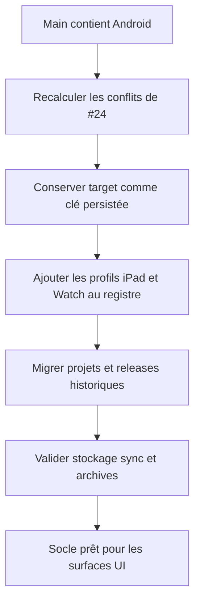

# Instruction: Unifier les contrats Android et Apple

## Architecture projection

> Tree of the final files. ✅ create · ✏️ modify · ❌ delete

```txt
.
├── packages/project-format/src/
│   ├── types.ts                                             ✏️ garder le seul champ projet target
│   ├── dimensions.ts                                        ✏️ enregistrer Google Play et tous les profils App Store
│   ├── catalog-ids.ts                                       ✏️ distinguer store et famille d’appareil
│   ├── project-validation.ts                                ✏️ migrer et vérifier projets, snapshots et releases
│   └── ai-tools.ts                                          ✏️ exposer le même catalogue aux agents
├── apps/web/src/
│   ├── lib/storage.ts                                       ✏️ persister et rouvrir chaque cible
│   ├── lib/project-file.ts                                  ✏️ importer les archives selon le contrat unifié
│   ├── lib/release.ts                                       ✏️ figer et restaurer la cible exacte
│   ├── lib/sync.ts                                          ✏️ conserver la cible entre appareils
│   └── stores/project.store.ts                              ✏️ faire du projet la source de vérité
├── apps/backend/convex/                                     ✏️ accepter le format projet unifié sans élargir les droits
└── aidd_docs/tasks/2026_08/2026_08_22_integrate-open-pull-requests/verification.md ✏️ consigner la matrice de migrations
```

## User Journey



## Test Scope

```mermaid
---
title: Test scope
---
journey
  section Setup
    Partir du main vert après #22 => inventaire des conflits #24 recalculé sans résolution globale: 5: cli
  section Happy path
    Charger un projet historique sans cible => cible App Store iPhone ajoutée sans dérive géométrique: 5: api
    Sauvegarder chaque profil Apple et Android => target identique après archive sync snapshot et restauration: 5: api
  section Edge case - contrat concurrent
    Rencontrer profileId ou une cible inconnue => migration explicitement décidée ou refus sans double source de vérité: 1: api
```

## Tasks to do

### `1)` Recalculer et classer les conflits #24

> Utiliser l’état réel après #22, pas l’inventaire historique comme vérité immuable.

1. Simuler le merge et lister chaque conflit restant.
2. Classer contrat/persistance dans cette phase et UI/export/MCP dans la phase 5.
3. Interdire `ours`, `theirs`, rebase automatique ou suppression de masse comme stratégie globale.

### `2)` Définir le registre cible unique

> Enrichir le modèle générique au lieu de juxtaposer deux schémas.

1. Garder `target: StoreTargetId` sur les objets persistés; ne pas ajouter `profileId`.
2. Garder `app-store-iphone` et `google-play-phone`, puis ajouter des identifiants App Store explicites pour iPad 13 et les six classes Watch.
3. Séparer store, famille d’appareil, planche logique, sortie, dossier, plafond, modèles compatibles et type App Store Connect.
4. Rendre les champs de publication Apple inaccessibles aux cibles Google Play par le type et la validation.

### `3)` Réconcilier migrations et invariants

> Préserver les projets réels et toutes les releases figées.

1. Migrer l’ancien format sans cible vers `app-store-iphone` de façon idempotente.
2. Vérifier que projet, snapshot et release portent la même cible et refuser toute divergence.
3. Conserver coordonnées iPhone historiques et ratios exacts des nouvelles cibles.
4. Propager la cible dans stockage, archives, sync et restauration sans double champ transitoire durable.

### `4)` Verrouiller le contrat par les tests

> Faire échouer le socle avant que l’UI masque une incohérence.

1. Couvrir unicité des IDs/dossiers, dimensions, limites et types de publication.
2. Couvrir migrations répétées, cible inconnue, release divergente et appareil incompatible.
3. Couvrir round-trip stockage, archive, sync et release pour une cible Android et chaque famille Apple.

## Test acceptance criteria

| Task | Acceptance criteria |
| --- | --- |
| 1 | Chaque conflit #24 courant appartient explicitement à la phase 4 ou 5; aucun marqueur ou choix global ne subsiste. |
| 2 | Un seul registre et un seul champ `target` décrivent toutes les cibles Google Play et App Store. |
| 3 | Les projets historiques migrent sans déplacement et chaque snapshot/release conserve exactement sa cible. |
| 4 | Les tests refusent IDs, dossiers, dimensions, appareils et releases incompatibles avant toute UI. |
