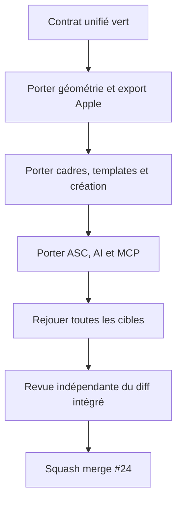

# Instruction: Porter les surfaces iPad et Apple Watch sur le contrat unifié

## Architecture projection

> Tree of the final files. ✅ create · ✏️ modify · ❌ delete

```txt
.
├── apps/web/src/
│   ├── lib/canvas/                                          ✏️ rendre planche, clip, viewport et vignettes target-aware
│   ├── lib/{export,release,asc,stage}.ts                     ✏️ livrer dimensions, ZIP et publication exactes
│   ├── assets/device-frames/                                ✏️ intégrer les silhouettes originales compatibles
│   ├── assets/templates/                                    ✏️ filtrer les compositions par famille
│   ├── components/{project-switcher,device-picker}/         ✏️ créer et éditer la cible choisie
│   ├── components/{export-dialog,publish-dialog}/           ✏️ exposer le contrat de livraison exact
│   ├── components/{screens-bar,template-picker}/            ✏️ refléter le ratio actif
│   ├── hooks/{use-canvas,use-export}.ts                      ✏️ conserver géométrie et analytics expurgée
│   └── lib/ai/                                              ✏️ composer dans la planche active
├── apps/mcp/
│   ├── src/tools/                                           ✏️ appliquer le registre unifié
│   └── skills/screenforge-mcp/                              ✏️ documenter les cibles sans contrat concurrent
├── scripts/
│   ├── validate-export.mjs                                  ✏️ valider Android, iPhone, iPad et Watch
│   ├── export-probe.mjs                                     ✏️ sonder les dimensions exactes
│   ├── visual-probe.mjs                                     ✏️ capturer les ratios représentatifs
│   └── scale-audit.mjs                                      ✏️ vérifier le chrome sur les nouvelles planches
├── PRD.md                                                   ✏️ décrire le périmètre multi-store final
├── AGENTS.md                                                ✏️ fixer les sources de vérité finales
├── aidd_docs/memory/                                        ✏️ aligner architecture, design et tests
└── aidd_docs/tasks/2026_08/2026_08_22_integrate-open-pull-requests/verification.md ✏️ consigner revue et merge #24
```

## User Journey



## Test Scope

```mermaid
---
title: Test scope
---
journey
  section Setup
    Ouvrir le diff #24 réconcilié sur le contrat unifié => aucune ancienne API profileId restante: 5: cli
  section Happy path
    Créer iPhone iPad Watch et Android => chaque UI propose seulement appareils et templates compatibles: 5: browser
    Exporter chaque famille => PNG opaque exact dossier correct et release restaurable: 5: browser
    Composer via MCP => planche cible respectée et appareil incompatible refusé sans mutation partielle: 5: browser
  section Edge case - ressource Apple
    Importer un bezel Apple local => fichier reste local licencié et aucun asset Apple n’est publié par ScreenForge: 1: browser
```

## Tasks to do

### `1)` Porter la géométrie et l’export

> Utiliser exclusivement le registre cible validé en phase 4.

1. Adapter canvas, clips, sélection, alignement, zoom, filmstrip et miniatures au ratio actif.
2. Conserver les coordonnées historiques iPhone et le rendu pixel-exact sans cache ni `clipPath` Fabric.
3. Adapter export, ZIP, release, restauration, validateur et publication ASC à la cible.
4. Conserver analytics d’export expurgée et entièrement consentie.

### `2)` Porter les surfaces de création

> Préserver le travail #24 sans réintroduire son schéma concurrent.

1. Adapter création de projet, globals, appareils, templates et limites d’écrans à `target`.
2. Conserver les cadres iPad/Watch originaux et l’import local des Product Bezels sous licence.
3. Filtrer toute ressource incompatible côté UI et côté store, pas seulement visuellement.

### `3)` Aligner AI, MCP et documentation

> Faire consommer le même catalogue à tous les producteurs de projets.

1. Adapter outils AI/MCP, schémas et documentation au registre unifié.
2. Mettre à jour PRD, AGENTS et mémoire avec Android plus les huit profils Apple finaux.
3. Retirer les formulations et APIs propres aux branches devenues obsolètes, sans supprimer leurs capacités.

### `4)` Refaire une preuve complète avant merge

> La revue antérieure de #24 ne couvre pas le diff réconcilié.

1. Exécuter unités, probes, typecheck, lint, build, Gitleaks et publication.
2. Exécuter `pnpm run test:e2e:release`, contrast, scale et landing.
3. Revoir les trois axes sur le nouveau diff; ne pas réutiliser l’approbation de l’ancienne base.
4. Passer #24 hors draft, squash-merger, puis attendre le push `main` vert.

## Test acceptance criteria

| Task | Acceptance criteria |
| --- | --- |
| 1 | Canvas, export, ZIP, releases et ASC dérivent de `target` pour Android, iPhone, iPad et six classes Watch. |
| 2 | L’UI et les stores refusent appareils/templates incompatibles et aucune ressource Apple sous licence n’entre dans le dépôt. |
| 3 | AI, MCP, PRD et mémoire décrivent le même registre sans `profileId` concurrent. |
| 4 | #24 est squash-mergée seulement après un nouveau gate release et une nouvelle revue approuvée sur la base combinée. |
