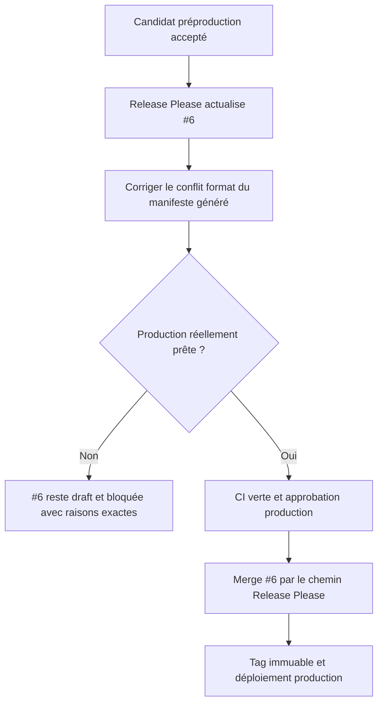

# Instruction: Rafraîchir la release sans contourner le gate production

## Architecture projection

> Tree of the final files. ✅ create · ✏️ modify · ❌ delete

```txt
.
├── .prettierignore                                          ✏️ exclure le manifeste Release Please généré du formatage manuel
├── .release-please-manifest.json                            ✏️ laisser le bot porter la version publiée
├── CHANGELOG.md                                             ✏️ laisser le bot regrouper les features réellement mergées
├── package.json                                             ✏️ laisser le bot aligner la version racine
├── release-please-config.json                               ✏️ conserver la politique de release unique
├── RELEASING.md                                             ✏️ conserver les gates domaine et production
└── aidd_docs/tasks/2026_08/2026_08_22_integrate-open-pull-requests/verification.md ✏️ consigner READY ou BLOCKED pour #6
```

## User Journey



## Test Scope

```mermaid
---
title: Test scope
---
journey
  section Setup
    Laisser Release Please recalculer #6 depuis le HEAD main accepté => changelog et version représentent tout le lot: 5: system
  section Happy path
    Vérifier la PR générée => format CI provenance et changelog verts sans édition de version manuelle: 5: cli
    Satisfaire les gates production => bot crée le tag canonique et le workflow déploie ce SHA exact: 5: system
  section Edge case - production absente
    Domaine email Polar ou configuration finale manque => #6 reste draft aucun tag ni déploiement production: 1: system
```

## Tasks to do

### `1)` Laisser le bot reconstruire #6

> Ne pas merger une release calculée avant les features.

1. Attendre l’actualisation Release Please après le dernier merge `main`.
2. Vérifier version, changelog, titres et absence de wording commercial obsolète.
3. Ne modifier ni tag ni manifeste de version manuellement.

### `2)` Corriger le gate format à sa source

> Éviter que chaque écriture standard du bot recrée la même CI rouge.

1. Confirmer que seul `.release-please-manifest.json` généré échoue sous Prettier.
2. L’ajouter à `.prettierignore` plutôt que reformater après chaque run du bot.
3. Vérifier que les autres JSON restent contrôlés et que la CI #6 repasse verte.

### `3)` Appliquer le vrai gate production

> Une PR verte n’autorise pas seule une production non configurée.

1. Vérifier domaine HTTPS canonique, pages légales, Resend, Polar production, Convex production, Vercel et approbation Environment.
2. Vérifier que le gate PostHog est soit satisfait, soit que PostHog reste absent de production avec documentation cohérente.
3. Tant qu’un prérequis manque, garder #6 draft et consigner `BLOCKED` sans créer de tag.
4. Une fois tout satisfait, merger par Release Please et suivre le tag plus le déploiement immuable.

## Test acceptance criteria

| Task | Acceptance criteria |
| --- | --- |
| 1 | #6 représente le dernier `main` accepté et contient toutes les features intégrées, sans version ou tag manuel. |
| 2 | Le manifeste généré ne rend plus la CI rouge et les autres fichiers restent soumis au formatage. |
| 3 | Sans tous les prérequis, aucun tag n’est créé; avec eux, la release et la production utilisent exactement le SHA validé en préproduction. |
