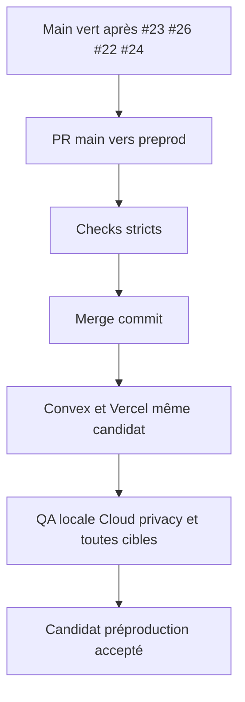
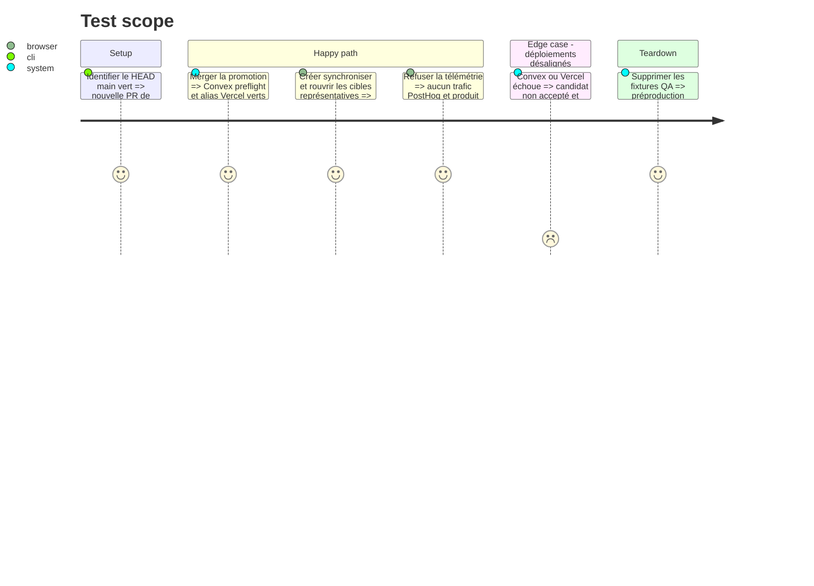

# Instruction: Promouvoir et qualifier le candidat combiné

## Architecture projection

> Tree of the final files. ✅ create · ✏️ modify · ❌ delete

```txt
.
└── aidd_docs/tasks/2026_08/2026_08_22_integrate-open-pull-requests/
    └── verification.md                                      ✏️ consigner promotion, SHA et matrice hébergée expurgée
```

## User Journey



## Test Scope



## Tasks to do

### `1)` Créer la promotion finale du lot

> Ne jamais pousser directement `preprod`.

1. Ouvrir une nouvelle PR `main` vers `preprod` après le dernier push `main` vert.
2. Vérifier que le tree attendu reste identique jusqu’au merge.
3. Merger par merge commit et suivre Quality plus Vercel.

### `2)` Rejouer la matrice hébergée

> Prouver les interactions que la suite locale ne couvre pas complètement.

1. Vérifier Local sans backend et Cloud avec Google, GitHub et lien magique.
2. Créer, modifier, synchroniser et rouvrir au moins Android, iPhone, iPad et une cible Watch depuis deux navigateurs.
3. Vérifier export, ZIP, release, limites, entitlement et conservation locale.
4. Vérifier refus et consentements PostHog; ne pas activer PostHog si le gate de rétention reste ouvert.

### `3)` Nettoyer et conclure

> Laisser la préproduction prête pour le prochain cycle.

1. Supprimer projets, assets, sessions et personnes analytiques de fixture selon les runbooks.
2. Consigner uniquement SHA, résultats, dates et blockers restants.
3. Ne déclarer le candidat accepté que si les deux fournisseurs et la matrice produit sont verts.

## Test acceptance criteria

| Task | Acceptance criteria |
| --- | --- |
| 1 | `preprod` contient par merge commit exactement le tree du `main` vert et déploie Convex/Vercel sur le même candidat. |
| 2 | Local, Cloud, consentement et les quatre familles de cibles fonctionnent sur l’origine hébergée sans perte de cible ni donnée privée. |
| 3 | Toutes les fixtures sont nettoyées et les seules limites restantes sont explicitement documentées. |
