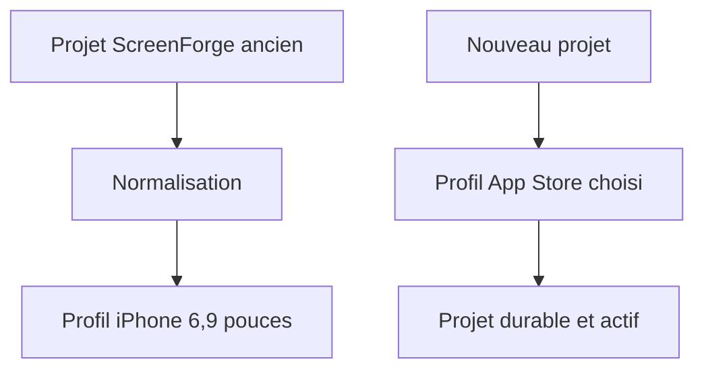
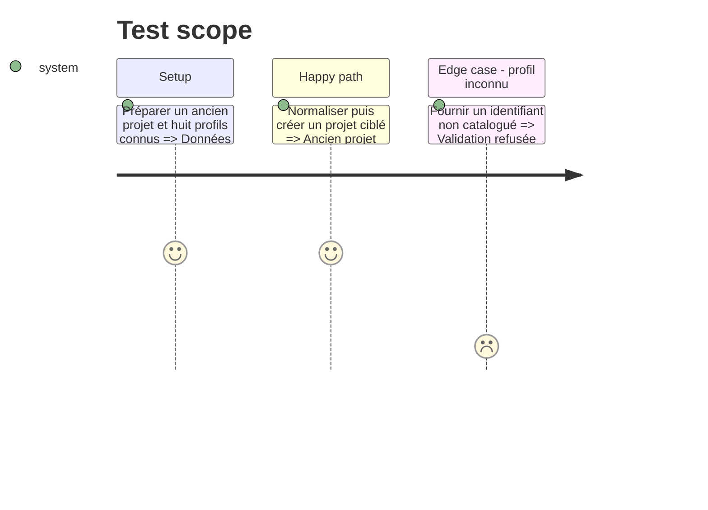

# Instruction: Contrat de profils et compatibilité des projets

## Architecture projection

> Tree of the final files. ✅ create · ✏️ modify · ❌ delete

```txt
.
├── packages/project-format/src/
│   ├── dimensions.ts                              ✏️ catalogue unique des huit profils App Store
│   ├── types.ts                                   ✏️ profil figé dans projet, snapshot et gabarit
│   ├── catalog-ids.ts                             ✏️ identifiants des cadres tablette et montre
│   └── project-validation.ts                      ✏️ validation et migration iPhone des données anciennes
└── apps/web/src/
    ├── stores/project.store.ts                    ✏️ créer et charger un projet avec son profil
    ├── lib/storage.ts                             ✏️ créer durablement puis activer un nouveau projet
    └── lib/__tests__/
        ├── project-validation.test.ts             ✏️ migrations et refus de profils inconnus
        └── storage.test.ts                        ✏️ persistance et activation sans perte du projet courant
```

## User Journey



## Test Scope



## Tasks to do

### `1)` Définir la source unique des profils

> Un profil nomme tout ce qui doit rester d’accord.

1. Déclarer iPhone 6,9 pouces, iPad 13 pouces et les six classes Watch avec identifiant stable, plateforme, libellé, dimensions portrait, dossier ZIP et type App Store Connect.
2. Garder les alias iPhone nécessaires aux consommateurs existants, sans faire de la liste complète une instruction d’export multiple.
3. Prouver l’unicité des identifiants/dossiers et l’exactitude des ratios.

### `2)` Porter le profil dans le document

> Une release doit savoir dans quel repère elle a été composée.

1. Ajouter le profil au projet, à son snapshot et aux gabarits réutilisables.
2. Valider l’identifiant contre le catalogue fermé.
3. Migrer projet, release et gabarit sans profil vers l’iPhone 6,9 pouces, de façon pure et idempotente.
4. Conserver le format portable et la synchronisation cloud sans nouveau schéma binaire ou serveur.

### `3)` Créer un projet ciblé sans perdre l’actuel

> Sauvegarder avant de changer de document.

1. Étendre la création de projet avec un profil explicite, iPhone par défaut pour les anciens appels.
2. Réutiliser la sauvegarde, l’activation, la remise à zéro de l’historique et le registre d’assets existants dans une opération durable.
3. Refuser tout profil inconnu avant mutation.

## Test acceptance criteria

| Task | Acceptance criteria |
| ---- | ------------------- |
| 1 | Les huit profils ont des identifiants et dossiers uniques, et chaque rapport logique correspond exactement à sa résolution officielle |
| 2 | Un projet, un snapshot et un gabarit sans profil ressortent en iPhone ; un profil inconnu est refusé ; une seconde migration ne change rien |
| 3 | Créer un projet ciblé sauvegarde d’abord l’actuel, active le nouveau, vide sélection et historique, puis le projet se recharge avec le même profil |
