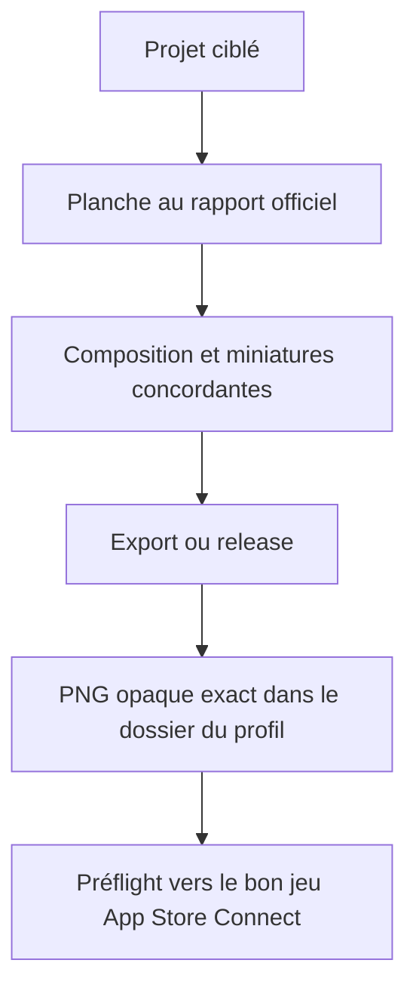
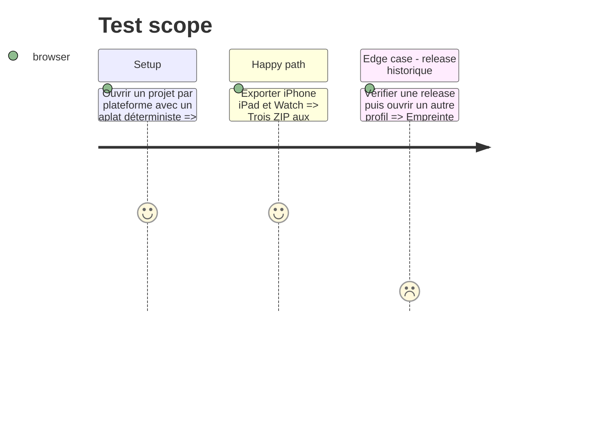

# Instruction: Planche dynamique et cycle d’export officiel

## Architecture projection

> Tree of the final files. ✅ create · ✏️ modify · ❌ delete

```txt
.
├── apps/web/src/
│   ├── lib/canvas/
│   │   ├── canvas-utils.ts                       ✏️ hauteur logique active et géométrie partagée
│   │   ├── canvas-sync.ts                        ✏️ fonds et clips au ratio du profil
│   │   ├── canvas-interactions.ts                ✏️ limites et détection de planche actives
│   │   ├── project-diff.ts                       ✏️ resynchronisation complète au changement de document
│   │   ├── install-interactions.ts               ✏️ transferts et coordonnées au bon repère
│   │   ├── install-viewport.ts                   ✏️ ajustement au profil actif
│   │   └── install-thumbnails.ts                 ✏️ capture au rapport actif
│   ├── hooks/use-canvas.ts                       ✏️ relier profil, synchronisation et viewport
│   ├── stores/canvas.store.ts                    ✏️ limites et coordonnées du panorama actif
│   ├── lib/
│   │   ├── stage.ts                              ✏️ largeur de vignette dérivée du profil
│   │   ├── layer-factories.ts                    ✏️ placements dans la planche active
│   │   ├── locale.ts                             ✏️ revue des débordements au bon format
│   │   ├── export.ts                             ✏️ rendu explicite depuis le profil du document
│   │   ├── release.ts                            ✏️ figement et rejeu avec le profil du snapshot
│   │   ├── asc.ts                                ✏️ préflight et destination App Store par profil
│   │   ├── mcp/session.ts                        ✏️ aperçu agent au rapport du projet
│   │   └── ai/                                   ✏️ planification et revue dans la planche active
│   ├── hooks/use-export.ts                       ✏️ nom de dossier stable et rendu ciblé
│   ├── components/
│   │   ├── screens-bar/                          ✏️ vignettes et glisser-déposer au rapport actif
│   │   ├── export-dialog/ExportDialog.tsx        ✏️ récapitulatif du profil réellement exporté
│   │   └── publish-dialog/PublishDialog.tsx      ✏️ type App Store du profil de la release
│   └── e2e/export.spec.ts                        ✏️ preuve iPhone, iPad et Watch opaque et exacte
└── scripts/validate-export.mjs                   ✏️ validation de tous les dossiers officiels
```

## User Journey



## Test Scope



## Tasks to do

### `1)` Rendre le repère de planche dépendant du profil

> Une largeur logique stable, une hauteur exacte et aucun second moteur de géométrie.

1. Dériver la hauteur logique du profil actif et remplacer les calculs figés dans clipping, hors-planche, alignement, viewport et panorama.
2. Forcer une synchronisation complète et un nouvel ajustement lorsque le document actif change de profil.
3. Calculer vignettes, filmstrip et aperçus depuis ce même rapport.
4. Garder les coordonnées iPhone existantes strictement identiques.

### `2)` Rendre l’export indépendant du projet actuellement ouvert

> Le snapshot dicte son propre rendu.

1. Faire porter au rendu statique des dimensions logiques explicites plutôt qu’un état global implicite.
2. Exporter seulement le profil du projet et utiliser son identifiant comme dossier stable.
3. Fig­er, vérifier et republier une release avec le profil de son snapshot, même si un autre document est ouvert.
4. Conserver RGB opaque, 8 bits, moins de 5 Mio et l’échec atomique du lot.

### `3)` Aligner publication et validation CLI

> Le bon PNG dans le mauvais jeu Apple reste une erreur.

1. Dériver le type App Store Connect et les dimensions acceptées du profil de la release.
2. Construire manifeste, commande et requête du pont avec ce type.
3. Étendre le validateur ZIP aux huit dossiers sans affaiblir les contrôles existants.

## Test acceptance criteria

| Task | Acceptance criteria |
| ---- | ------------------- |
| 1 | Fonds, clips, sélection, alignement, zoom et vignettes suivent le rapport iPhone, iPad ou Watch sans dérive des coordonnées iPhone |
| 2 | Les exports iPhone `1320×2868`, iPad `2064×2752` et Watch sélectionné sont RGB opaques, dans le dossier du profil, et une release se rejoue indépendamment du projet actif |
| 3 | Le préflight et le manifeste utilisent le type Apple du profil, et le validateur refuse dimensions inversées, alpha ou dossier incompatible |
