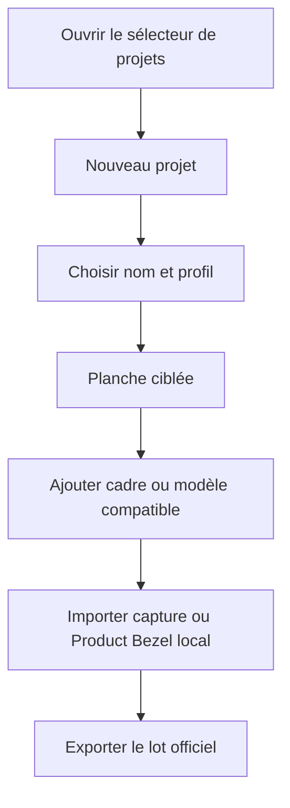
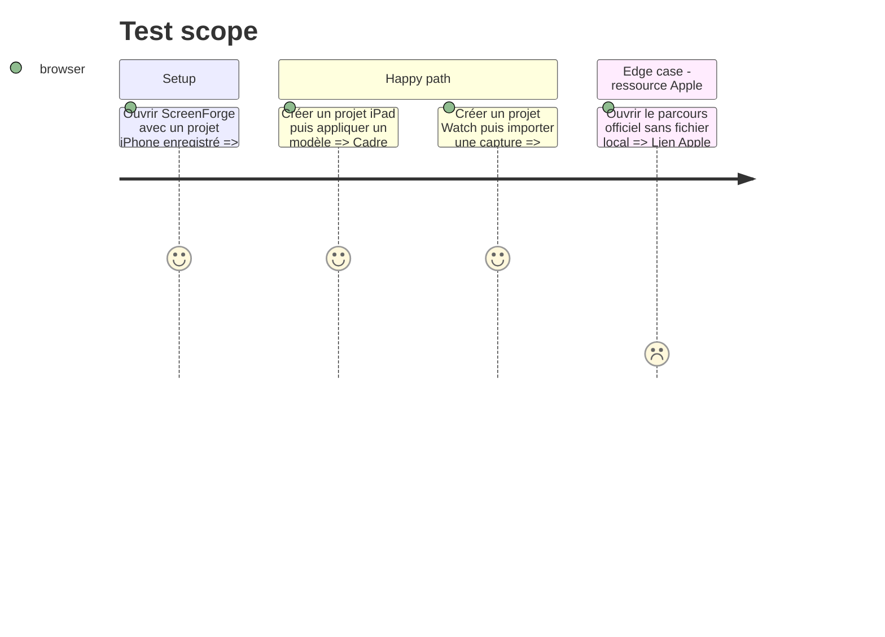

# Instruction: Création de projet, cadres et modèles par plateforme

## Architecture projection

> Tree of the final files. ✅ create · ✏️ modify · ❌ delete

```txt
.
├── packages/project-format/src/
│   ├── catalog-ids.ts                            ✏️ cadres génériques iPad et Watch
│   └── ai-tools.ts                               ✏️ catalogue compatible avec le profil
├── apps/web/src/
│   ├── assets/
│   │   ├── device-frames/index.ts                ✏️ silhouettes originales sans découpe iPhone
│   │   └── templates/index.ts                    ✏️ compositions iPad et Watch contenues
│   ├── components/
│   │   ├── project-switcher/ProjectSwitcher.tsx ✏️ dialogue Nouveau projet et choix de profil
│   │   ├── toolbar/TopBar.tsx                    ✏️ ajout d’appareil filtré et libellé générique
│   │   ├── device-picker/DevicePicker.tsx        ✏️ modèles compatibles et ressources Apple
│   │   ├── globals-editor/GlobalsEditor.tsx      ✏️ afficher le profil immuable
│   │   └── template-picker/                      ✏️ galerie et aperçu filtrés par plateforme
│   ├── lib/custom-templates.ts                   ✏️ profil des gabarits enregistrés et migration iPhone
│   ├── lib/mcp/session.ts                        ✏️ exposer seulement les cadres du projet
│   ├── stores/templates.store.ts                 ✏️ sauvegarder le profil du projet source
│   └── e2e/
│       ├── device-profiles.spec.ts               ✅ création, cadres et filtrage accessibles
│       └── export.spec.ts                        ✏️ parcours complet avec cadre et capture
├── apps/mcp/src/tools/                            ✏️ relayer le catalogue filtré
├── PRD.md                                        ✏️ portée, tailles et règles de ressources officielles
└── aidd_docs/memory/                              ✏️ mémoire architecture, design, brief et tests
```

## User Journey



## Test Scope



## Wireframe

```txt
┌──────────────────────────────────────────────┐
│ (1) Nouveau projet                           │
├──────────────────────────────────────────────┤
│ (2) Nom            [______________________]  │
│ (3) Format App Store [iPad 13″ · 2064×2752]  │
│     Profil unique pour ce projet             │
├──────────────────────────────────────────────┤
│                         [Annuler] [Créer] (4) │
└──────────────────────────────────────────────┘

┌──────────────────────────────┐
│ (5) Appareil                 │
│ Source [ScreenForge | Apple] │
│ Modèle [compatible ▾]        │
│ [Importer la capture]        │
│ [Ressources Apple ↗]         │
├──────────────────────────────┤
│ (6) Modèles de mise en page  │
│ [aperçu cible] [aperçu cible]│
└──────────────────────────────┘
```

1. Dialogue de création séparé du document courant.
2. Nom du nouveau projet.
3. Profil App Store unique avec dimensions visibles.
4. Actions de création, une seule primaire.
5. Panneau existant limité aux appareils de la plateforme.
6. Galerie existante limitée aux compositions compatibles.

## Tasks to do

### `1)` Exposer la création ciblée

> Choisir le repère avant de dessiner.

1. Ajouter au sélecteur existant une action Nouveau projet ouvrant nom et profil.
2. Afficher plateforme, classe et dimensions sans permettre de modifier le profil après création.
3. Sauvegarder l’actuel, créer durablement le nouveau puis restaurer le focus et annoncer l’issue.

### `2)` Ajouter des cadres originaux par plateforme

> Réutiliser le renderer sans simuler un produit Apple officiel.

1. Ajouter au minimum deux cadres tablette et deux cadres montre, avec plateforme, ratio, couleurs neutres, coin adapté et aucune île/encoche iPhone.
2. Filtrer ajout rapide, picker, réglages globaux et schémas d’outils par plateforme.
3. Conserver l’import Product Bezel existant, son verrouillage et son lien vers le hub Apple ; préciser que l’utilisateur fournit le fichier sous licence.
4. Vérifier l’exhaustivité entre identifiants et catalogue, et l’absence de fichier Apple dans le dépôt.

### `3)` Proposer des compositions prêtes à modifier

> Adapter la mise en page au ratio au lieu d’étirer les modèles iPhone.

1. Taguer les gabarits par plateforme et filtrer la galerie au profil actif.
2. Ajouter au moins une composition éditoriale iPad et une Watch, avec texte, cadre et capture remplaçable entièrement contenus.
3. Enregistrer le profil d’un gabarit personnalisé ; migrer les anciens vers iPhone et refuser l’application à une autre plateforme.
4. Rendre les aperçus au rapport actif.

### `4)` Aligner produit et mémoire

> La documentation ne doit plus promettre iPhone uniquement.

1. Remplacer la portée et les tables de dimensions obsolètes par les profils livrés et leurs sources Apple.
2. Documenter l’import local sous licence et l’interdiction de redistribuer les ressources Apple.
3. Mettre à jour architecture, brief, design et stratégie de test avec le profil de projet.

## Test acceptance criteria

| Task | Acceptance criteria |
| ---- | ------------------- |
| 1 | Le dialogue crée un projet du profil choisi après sauvegarde de l’actuel, avec labels, focus et erreur accessibles |
| 2 | Un projet iPad ne propose que les cadres tablette, un projet Watch seulement les cadres montre, et aucun téléchargement Apple n’est déclenché par ScreenForge |
| 3 | Les galeries iPad/Watch montrent chacune une composition contenue ; un gabarit d’une autre plateforme n’est ni proposé ni applicable |
| 4 | PRD et mémoire décrivent les huit profils, les dimensions officielles et la frontière de licence sans prétendre redistribuer un asset Apple |
