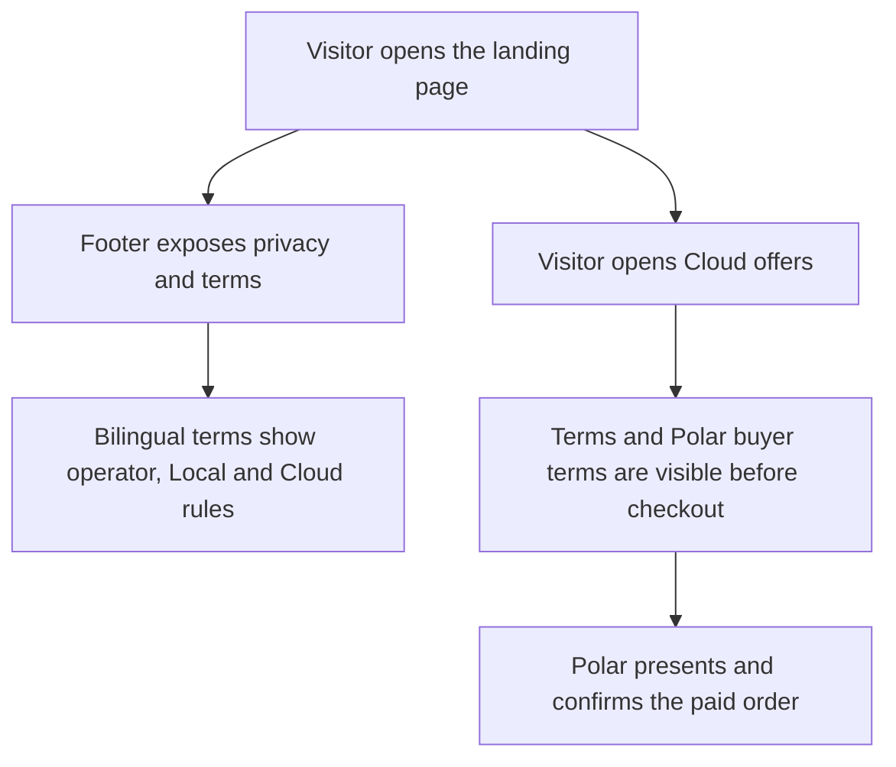
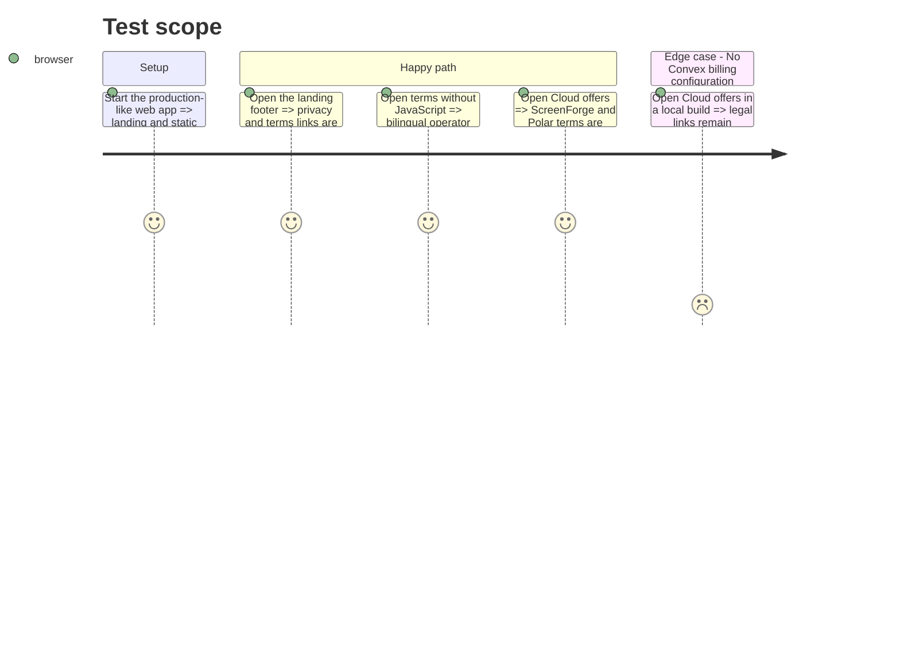

# Instruction: Publish legal terms and purchase links

## Architecture projection

> Tree of the final files. ✅ create · ✏️ modify · ❌ delete

```txt
apps/web/
├── terms.html                                      ✅ bilingual CGU, CGV and legal notices
├── privacy.html                                    ✏️ full controller identity and address
├── vite.config.ts                                  ✏️ terms page build entry
├── e2e/
│   ├── landing.spec.ts                             ✏️ landing, terms and pre-checkout links
│   └── privacy-consent.spec.ts                     ✏️ controller identity assertion
└── src/
    ├── components/pricing-dialog/PricingDialog.tsx ✏️ terms visible before Polar checkout
    └── landing/
        ├── components/Footer.tsx                   ✏️ terms link
        └── copy.ts                                 ✏️ bilingual footer label
```

## User Journey



## Test Scope



## Wireframe

```txt
┌────────────────────────────────────────────────────┐
│ (1) Landing content                                │
├────────────────────────────────────────────────────┤
│ (2) Footer: brand · source · privacy · terms · lang│
└────────────────────────────────────────────────────┘

┌────────────────────────────────────────────────────┐
│ (3) Legal navigation: brand · languages · editor   │
├────────────────────────────────────────────────────┤
│ (4) Document title · update date                   │
├────────────────────────────────────────────────────┤
│ (5) French legal sections                          │
├────────────────────────────────────────────────────┤
│ (6) English legal sections                         │
└────────────────────────────────────────────────────┘

┌────────────────────────────────────────────────────┐
│ (7) Cloud offer dialog                             │
├───────────────────────┬────────────────────────────┤
│ (8) Local plan        │ (9) Cloud plan             │
├───────────────────────┴────────────────────────────┤
│ (10) Legal terms and payment-provider terms        │
└────────────────────────────────────────────────────┘
```

1. Landing: existing marketing document.
2. Footer: permanent access to privacy and contractual documents.
3. Legal navigation: route back to the product and switch document language.
4. Document header: identifies the document and its effective version.
5. French sections: operator, services, sale, withdrawal, rights and disputes.
6. English sections: the same legal substance in English.
7. Dialog: existing offer surface immediately before checkout.
8. Local plan: free local editor information.
9. Cloud plan: paid annual subscription information.
10. Terms: links to ScreenForge terms and Polar buyer terms before payment.

## Tasks to do

### `1)` Publish the bilingual legal document

> State only verified operator, service, price, renewal, cancellation, consumer-right and liability facts.

1. Reuse the standalone privacy-page structure for one bilingual terms page.
2. Describe Local and Cloud from the existing product contract and identify Polar as Merchant of Record.
3. Preserve mandatory Swiss and consumer protections instead of inventing waivers or warranties.

### `2)` Expose the terms at the right moments

> Make the terms permanently reachable and visible before a paid order.

1. Link the document from the bilingual landing footer.
2. Link ScreenForge and Polar terms below the pricing cards.
3. Add the static page to the Vite multi-page build.

### `3)` Align privacy identity and verify the public journey

> Publish the same verified controller identity and guard the links with focused browser tests.

1. Add the operator name and postal address to the privacy controller section.
2. Assert the footer, no-JavaScript legal document and pre-checkout links.
3. Run the targeted checks and production build.

## Test acceptance criteria

| Task | Acceptance criteria |
| ---- | ------------------- |
| 1 | `/terms.html` is readable without JavaScript in French and English and states the verified operator, Local/Cloud contract, renewal, cancellation and mandatory consumer rights. |
| 2 | The landing footer links to `/terms.html`, and the offer dialog links to both ScreenForge terms and Polar buyer terms before checkout. |
| 3 | The privacy page names the same controller and address; targeted tests and the web build pass. |
