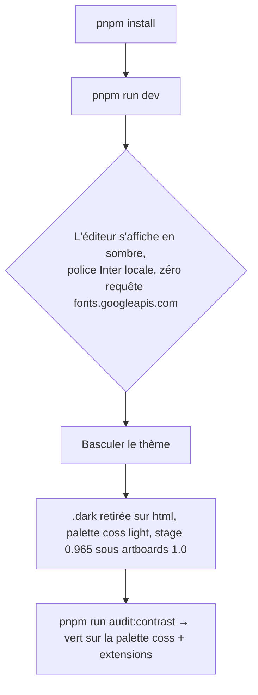
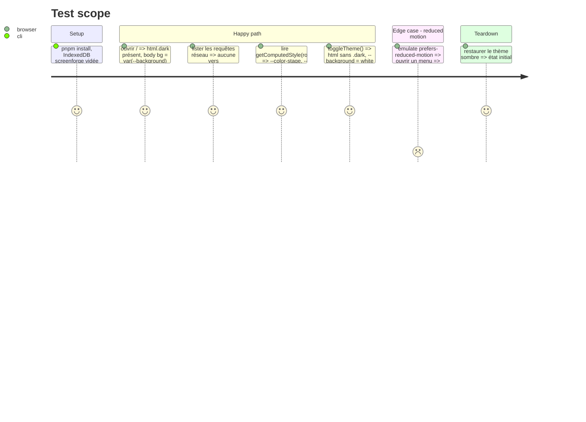

<!-- Fill or omit these sections; never add, rename, or reorder one. -->

# Instruction: fondations — coss installé, tokens coss + extension ScreenForge, motion, police

## Architecture projection

> Tree of the final files. ✅ create · ✏️ modify · ❌ delete

```txt
apps/web
├── components.json                              ✅ style base-nova, registre @coss, alias @/components/ui, iconLibrary lucide (copie de mandat-tan, css: src/index.css)
├── package.json                                 ✏️ + @base-ui/react, @fontsource-variable/inter, @fontsource-variable/geist-mono ; − tw-animate-css, − 10 × @radix-ui/* (retirés en phase 2 quand plus importés)
├── index.html                                   ✏️ supprime preconnect Google Fonts, le <link media="print"> et le flip de /boot.js ; boot skeleton conservé, ses --boot-* lus depuis les mêmes valeurs que tokens.css
└── src
    ├── index.css                                ✏️ réduit à : @import tailwindcss, fontsource inter + geist-mono, design-system/*.css ; @custom-variant dark (&:is(.dark *)) ; @theme inline (contrat coss + extensions) ; :root/.dark coss neutral (installé par @coss/colors-neutral) ; @layer base (cursor par rôle, #root 100dvw/dvh, isolation: isolate, ::selection, focus-visible)
    ├── design-system
    │   ├── tokens.css                           ✅ l'extension ScreenForge : --stage, --stage-dot, --marker, --marker-hover, --marker-ink, --marker-soft, --marker-line, --artboard-ring, --artboard-shadow, --selection-soft, --guide, --guide-halo, --shadow-handle, --shadow-handle-focus, --z-stage-veil/chrome/overlay/modal/popover/toast, --duration-fast/base/slow, --ease-out, --ease-settle ; :root + .dark ; @theme inline qui les expose (--color-stage, --z-*, --shadow-handle…)
    │   ├── motion.css                           ✅ copie de mandat-tan (transition-ui, animate-enter, animate-enter-quick, animate-mark, @keyframes enter/mark) + oa-arrive + @keyframes toast-success/error odd/even + le bloc prefers-reduced-motion unique
    │   └── stage.css                            ✅ ce qui n'est ni token ni composant : utilitaires stage-grain, stage-vignette, checkerboard, filmstrip-scroll, [cmdk-group-heading]
    ├── main.tsx                                 ✏️ pose .dark sur <html> avant le premier rendu (dark par défaut) ; plus de .light
    ├── stores/ui.store.ts                       ✏️ theme: 'dark' | 'light' → applique/retire .dark seulement
    └── lib/stage.ts                             ✏️ aucune valeur ne change ; commentaire : hauteurs de chrome = h-9 coss (36) en barre haute, h-8 (32) en panneau
scripts/contrast-audit.mjs                       ✏️ lit les vars :root/.dark résolues dans un navigateur (Playwright, getComputedStyle) au lieu de regexer oklch() dans @theme static — coss écrit --alpha() et color-mix(), illisibles par regex
```

## User Journey



## Test Scope



## Tasks to do

### `1)` Installer coss par le CLI, comme mandat-tan

> Le registre @coss installe ses composants dans `src/components/ui/` sans qu'on les écrive.

1. Créer `apps/web/components.json` depuis `mandat-tan/components.json` (alias `@/*` déjà résolu par `tsconfig.app.json` + Vite ; vérifier, sinon ajouter).
2. Depuis `apps/web` : `pnpm dlx shadcn@latest add @coss/colors-neutral @coss/fonts` puis la liste de primitives de la phase 2 (ne pas prendre `@coss/style` entier : 54 items dont calendar, otp, sidebar inutiles).
3. `pnpm add @base-ui/react @fontsource-variable/inter @fontsource-variable/geist-mono` ; `pnpm remove tw-animate-css`.
4. Vérifier que le CLI a écrit `@theme inline` + `:root`/`.dark` dans `src/index.css` et non dans un fichier parallèle.

### `2)` Réduire `index.css` à la forme mandat-tan

> Un `index.css` qui importe, déclare le thème et la base ; tout le reste dans `design-system/`.

1. Garder : imports, `@custom-variant dark (&:is(.dark *))`, `@theme inline` coss, `:root`/`.dark` coss, `@layer base`.
2. Dans `@layer base`, reprendre de l'ancien fichier : `#root { width:100dvw; height:100dvh; overflow:hidden; isolation:isolate }`, la règle `cursor: pointer` par rôle (asserté par `semantics.spec.ts`), `::selection`, `color-scheme`, `font-feature-settings: 'cv11','ss01'` (coss) ; supprimer `--leading-*: initial` (coss consomme les `leading-*` nommés ; `audit:scale` vérifie le 4 px en phase 7).
3. Supprimer : `@theme static` (remplacé par `@theme inline`), `.light`, `.island`, `.island-flush`, `.field-surface`, `.surface-inner`, `.surface-modal`, `.menu-shadow`, `.hairline`, `.img-outline`, `.hit-44`, `.hit-24`, `.panel-title`, `.section-title`, `.field-label`, `.tabular`, `.scroll-fade`, neuf `@keyframes`, tous les `--animate-*`.
4. Les classes supprimées restent référencées par les features jusqu'à leur phase : ajouter un bloc temporaire `@layer components { /* ponytail: alias de transition, retiré en phase 7 */ }` qui mappe `.island` → `@apply rounded-2xl border bg-card shadow-lg/5`, `.panel-title` → `@apply text-base font-medium`, `.section-title` → `@apply text-sm font-medium`, `.field-label` → `@apply text-xs text-muted-foreground`, `.tabular` → `@apply tabular-nums`. Ce bloc est la dette nommée de la migration et la phase 7 vérifie qu'il est vide.

### `3)` Écrire l'extension `design-system/tokens.css`

> La seule couche ScreenForge, nommée comme l'extension de mandat-tan.

1. Porter les valeurs OKLCH existantes de `stage`, `stage-dot`, `marker*`, `artboard-*`, `selection-soft`, `guide*`, `shadow-handle*`, `z-*` vers `:root` (valeurs claires) et `.dark` (valeurs sombres), sans en changer une seule.
2. Ajouter `--duration-fast: 120ms`, `--duration-base: 180ms`, `--duration-slow: 260ms`, `--ease-out`, et garder `--ease-settle` (`linear()` 6 % de rebond, seul ressort du produit).
3. `@theme inline` : `--color-stage`, `--color-stage-dot`, `--color-marker*`, `--color-artboard-*`, `--color-selection-soft`, `--color-guide*`, `--shadow-handle`, `--shadow-handle-focus`, `--z-*`, `--ease-*`.
4. En tête du fichier, le commentaire qui dit pourquoi chaque famille existe (stage : l'outil juge des couleurs, le chrome n'en porte aucune ; marker : « vous êtes ici », jamais sur une action).

### `4)` Motion et police

> Motion CSS de mandat-tan + physique oa ; Inter et Geist Mono en local.

1. `design-system/motion.css` : copier celui de mandat-tan ; ajouter `oa-arrive` (`opacity .4 + blur(4px) → net`, 0.3 s) et les quatre keyframes toast de `_root.css` ; un seul bloc `prefers-reduced-motion` (celui de mandat-tan) remplace les deux de l'ancien `index.css`.
2. `index.html` : retirer `preconnect` Google Fonts, le `<link rel=preload as=style>`, le `<link media="print" data-screenforge-font>` et le `<noscript>` ; retirer le flip correspondant de `public/boot.js`. Le squelette de boot reste.
3. `index.css` : `@import '@fontsource-variable/inter'` et `'@fontsource-variable/geist-mono'` ; `--font-sans: 'Inter Variable', …`, `--font-mono: 'Geist Mono Variable', …` dans `:root` (coss lit `--font-sans/--font-heading/--font-mono`).
4. `main.tsx` : `document.documentElement.classList.add('dark')` avant `createRoot` si le thème persisté n'est pas `light` ; `ui.store.ts` ne manipule plus que `.dark`.

### `5)` Adapter `audit:contrast` à des tokens calculés

> coss écrit `--alpha()` et `color-mix()` : la regex OKLCH ne lit plus rien.

1. `scripts/contrast-audit.mjs` : lancer Chromium (Playwright, déjà dépendance racine) sur `BASE_URL`, lire `getComputedStyle(document.documentElement).getPropertyValue('--color-*')` pour la matrice existante, dans les deux thèmes (ajout/retrait de `.dark`).
2. Garder la matrice inks × surfaces et les paires fermées (`marker-ink/marker`, `warning/card`, `success/card`, `destructive/*`) ; les tokens alpha sont composés sur leur surface (`muted` sur `background`, etc.) avant mesure, sinon un lavis à 4 % est mesuré comme du noir.
3. Exemption `stage-dot` conservée.

## Test acceptance criteria

| Task | Acceptance criteria |
| ---- | ------------------- |
| 1 | `src/components/ui/` contient les fichiers coss non modifiés (diff nul contre `coss.com/ui/r/<name>.json`) ; `pnpm ls @radix-ui/react-dialog` encore présent (retiré en phase 2) ; `tw-animate-css` absent du lockfile. |
| 2 | `wc -l src/index.css` < 200 ; `pnpm run build` vert ; le bloc d'alias de transition est le seul `@layer components` du fichier. |
| 3 | Dans le navigateur, `--color-stage`, `--color-marker`, `--z-toast`, `--shadow-handle` résolvent aux valeurs d'avant (comparaison par capture des computed styles avant/après) ; l'artboard courant porte encore son ombre et le citron son badge. |
| 4 | Aucune requête réseau vers `fonts.googleapis.com` / `fonts.gstatic.com` ; `document.fonts.check('14px "Inter Variable"')` vrai ; `html.dark` présent au premier rendu en thème sombre ; `motion.spec.ts` vert. |
| 5 | `pnpm run audit:contrast` vert dans les deux thèmes et échoue (exit 1) si l'on force `--muted-foreground` à `--alpha(black/20%)`. |
