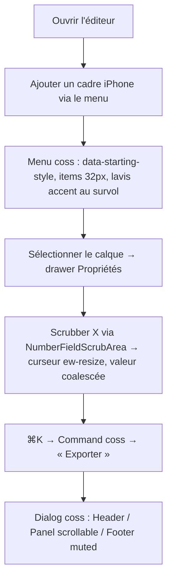
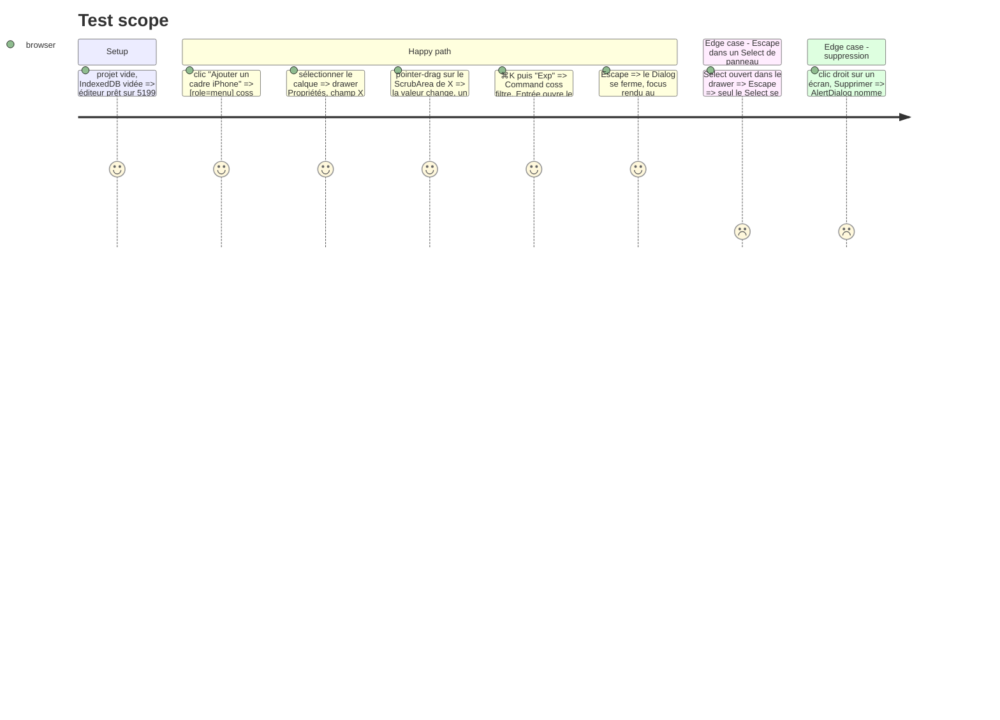

<!-- Fill or omit these sections; never add, rename, or reorder one. -->

# Instruction: primitives — `ui/` = coss, patterns composés, features recâblées

## Architecture projection

> Tree of the final files. ✅ create · ✏️ modify · ❌ delete

```txt
apps/web/src/components
├── ui/                                  (tout installé par `shadcn add @coss/<name>`, jamais édité)
│   ├── button.tsx                       ✅ remplace button.tsx + icon-button.tsx (size="icon|icon-sm|icon-xs", loading garde le libellé)
│   ├── input.tsx textarea.tsx           ✅ remplacent les versions maison
│   ├── input-group.tsx                  ✅ addons d'unité (px, °, %, ×) — remplace les suffixes bricolés de NumberField
│   ├── number-field.tsx                 ✅ NumberField + NumberFieldScrubArea + Increment/Decrement — remplace number-field.tsx maison (178 l.)
│   ├── field.tsx label.tsx              ✅ Field/FieldLabel/FieldDescription/FieldError — remplacent field.tsx + label.tsx
│   ├── select.tsx combobox.tsx          ✅ Select (items + SelectPopup) ; Combobox pour FontPicker (liste filtrable)
│   ├── slider.tsx switch.tsx checkbox.tsx ✅
│   ├── toggle-group.tsx toggle.tsx      ✅ remplacent toggle-group.tsx + segmented.tsx (Segmented = ToggleGroup variant="outline" coss)
│   ├── dialog.tsx alert-dialog.tsx sheet.tsx ✅ Dialog (Popup/Header/Panel/Footer), AlertDialog, Sheet (pour les drawers en phase 3)
│   ├── popover.tsx tooltip.tsx          ✅
│   ├── menu.tsx context-menu.tsx        ✅ remplacent dropdown.tsx + ContextMenu.tsx (portail maison)
│   ├── command.tsx                      ✅ habille cmdk — remplace command-palette.tsx (la logique bouge dans patterns/)
│   ├── scroll-area.tsx                  ✅ coss ScrollArea (scrollFade prop) — remplace le scroller maison
│   ├── kbd.tsx separator.tsx badge.tsx  ✅
│   ├── toolbar.tsx                      ✅ pour TopBar / SelectionToolbar (phase 3)
│   ├── empty.tsx skeleton.tsx spinner.tsx toast.tsx card.tsx collapsible.tsx tabs.tsx ✅ (consommés phases 3–6)
│   ├── angle-control.tsx ContextMenu.tsx dialog.tsx(maison) dropdown.tsx icon-button.tsx segmented.tsx
│   │   setup-flow.tsx shortcuts-overlay.tsx swatch-button.tsx command-palette.tsx number-field.tsx(maison) ❌
├── patterns/                            ✅ compositions ScreenForge sur primitives coss (structure mandat-tan)
│   ├── swatch-button.tsx                ✅ Button size="icon-sm" + pastille + checkerboard ; Tooltip coss
│   ├── angle-control.tsx                ✅ ToggleGroup (0/45/90/…) + Slider coss + NumberField « ° » via InputGroup
│   ├── unit-field.tsx                   ✅ NumberField coss + ScrubArea + addon d'unité ; garde les props (value, onChange, step, min, max, coalesceKey, label)
│   ├── confirm-action.tsx               ✅ AlertDialog coss ; copie de mandat-tan : le bouton nomme l'objet (« Supprimer 3 écrans »)
│   ├── command-palette.tsx              ✅ l'ancien command-palette.tsx re-posé sur ui/command.tsx (registre lib/commands.ts inchangé)
│   ├── shortcuts-overlay.tsx            ✅ Dialog coss + Kbd coss
│   └── setup-flow.tsx                   ✅ l'ancien setup-flow re-posé sur Card/Badge/Button coss ; le copy-bouton garde Kbd
└── (features) toolbar/ layers-panel/ properties-panel/ screens-bar/ canvas/ text-editor/ device-picker/
    background-editor/ gradient-editor/ color-picker/ vector-picker/ project-switcher/ *-dialog/ mcp/
    error-boundary.tsx App.tsx           ✏️ imports recâblés sur l'API coss (render, DialogPopup…, SelectPopup, MenuPopup, NumberField) ; les 24 <button>/<input> natifs passent par Button/Input coss
apps/web/package.json                    ✏️ − 10 × @radix-ui/*, − @radix-ui/react-slot
apps/web/e2e/helpers.ts                  ✏️ sélecteurs génériques (menu, dialog, select) alignés sur les rôles Base UI si un diffère
```

## User Journey



## Test Scope



## Tasks to do

### `1)` Installer la liste coss et purger `ui/`

> `ui/` ne contient que des fichiers coss.

1. `pnpm dlx shadcn@latest add @coss/button @coss/input @coss/textarea @coss/input-group @coss/number-field @coss/field @coss/label @coss/select @coss/combobox @coss/slider @coss/switch @coss/checkbox @coss/toggle @coss/toggle-group @coss/dialog @coss/alert-dialog @coss/sheet @coss/popover @coss/tooltip @coss/menu @coss/context-menu @coss/command @coss/scroll-area @coss/kbd @coss/separator @coss/badge @coss/toolbar @coss/empty @coss/skeleton @coss/spinner @coss/toast @coss/card @coss/collapsible @coss/tabs`.
2. Supprimer (`trash`) les 24 fichiers maison de `ui/` ; `lib/utils.ts` garde `cn`.
3. `App.tsx` : retirer `TooltipProvider` Radix (Base UI Tooltip en a un propre : `TooltipProvider` coss si exposé, sinon aucun).

### `2)` Écrire les patterns composés

> Tout ce qui n'est pas coss est une composition de coss, dans `patterns/`.

1. `unit-field.tsx` : `NumberField` coss avec `NumberFieldScrubArea` autour du libellé (comme la démo coss : le libellé est la zone de scrub, curseur `ew-resize`), `NumberFieldInput` dans un `InputGroup` avec `InputGroupAddon` d'unité ; conserve `coalesceKey` → `updateLayer`, `step`/`largeStep` (⇧), `min`/`max`, `tabular-nums`. Supprime le pointer handling maison.
2. `angle-control.tsx`, `swatch-button.tsx`, `confirm-action.tsx`, `command-palette.tsx`, `shortcuts-overlay.tsx`, `setup-flow.tsx` : porter depuis les anciens fichiers, en ne gardant que la logique (état, commandes, raccourcis) ; le rendu est coss.
3. Chaque pattern expose un `data-slot` propre (`data-slot="unit-field"`) pour que `audit:scale` et les e2e le ciblent sans classe.

### `3)` Recâbler les features, une par une, e2e entre deux

> Ordre par rayon d'impact : ce qui est partout d'abord.

1. `Button`/`IconButton` → `Button` coss (`size="icon"`, `aria-label` obligatoire, `variant="ghost|outline|secondary|default|destructive"`) dans les 20 fichiers ; `loading` garde le libellé (coss le fait : `data-loading` + texte transparent + Spinner ; ne pas retomber sur un swap).
2. `Dialog` maison → `Dialog` + `DialogPopup` + `DialogHeader/Title/Description` + `DialogPanel` + `DialogFooter` coss dans les 13 dialogues ; `DialogColumns` (2 colonnes, empilage sous `DIALOG_STACK_MIN_WIDTH`) devient un pattern `dialog-columns.tsx` sur `DialogPanel` (grid), même seuil de `lib/stage.ts`.
3. `Select` maison (API `<option>`) → `Select items={…}` + `SelectTrigger/SelectValue/SelectPopup/SelectItem` coss ; `FontPicker` → `Combobox` coss (recherche, `Combobox.Input`).
4. `Dropdown`/`ContextMenu` → `Menu`/`ContextMenu` coss ; `layer-menu.tsx` et les menus d'écrans gardent leurs libellés de portée (« Supprimer 3 écrans »).
5. `Segmented` → `ToggleGroup` coss ; `Slider`, `Switch`, `Popover`, `Tooltip`, `Kbd`, `ScrollArea`, `Input`, `Textarea`, `Field` : remplacement direct.
6. Les 24 `<button>`/`<input>` natifs recensés (ColorPicker, DevicePicker, LayerItem, ScreenThumbnail, ZoomHud…) passent par `Button`/`Input` coss, sauf les deux qui sont des cibles de geste (`ScreenThumbnail` tuile-bouton et le `<input type=file>` caché de `App.tsx`).
7. Après chaque feature : `pnpm run test:e2e -- <spec associée>` ; après la dernière : suite complète + `pnpm remove` des 11 paquets Radix.

### `4)` Aligner les helpers e2e

> Les rôles ARIA de Base UI et Radix coïncident presque ; là où non, un seul helper change.

1. `e2e/helpers.ts` : vérifier `menu/menuitem`, `dialog`, `combobox/listbox/option`, `switch`, `slider`, `tooltip` ; Base UI `Select` rend `role=combobox` sur le trigger et `role=listbox` sur le popup, identique à Radix.
2. Les sélecteurs par libellé français (`aria-label="Ajouter un cadre iPhone"`) ne changent pas : les libellés sont portés par les features, pas par `ui/`.

## Test acceptance criteria

| Task | Acceptance criteria |
| ---- | ------------------- |
| 1 | `ls src/components/ui` = la liste coss ; `grep -rn "@radix-ui" apps/web/src` vide ; `pnpm ls @radix-ui/react-dialog` absent ; `pnpm run typecheck` vert. |
| 2 | `canvas-transforms.spec.ts` vert (scrub X/Y/rotation, un seul pas d'undo, pas de dérive) ; `semantics.spec.ts` voit `cursor: ew-resize` sur le ScrubArea ; un AlertDialog de suppression affiche le nombre d'objets dans son bouton. |
| 3 | `pnpm run test:e2e` vert sur les 39 specs ; `grep -rn "<button\b\|<input\b" src/components --include=*.tsx` ne renvoie que `ScreenThumbnail.tsx` et `App.tsx` ; aucun `asChild` dans `src/`. |
| 4 | `dialogs-a11y.spec.ts` vert (Escape dans un Select ne ferme pas le drawer ; anneau de focus partagé ; rien ne déborde à 375 px). |
