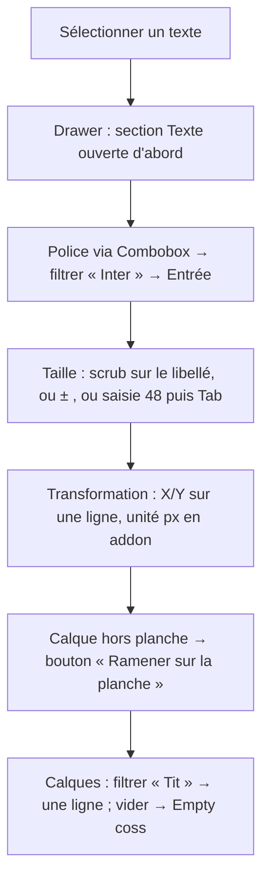

<!-- Fill or omit these sections; never add, rename, or reorder one. -->

# Instruction: panneaux Calques et Propriétés — Field, InputGroup, sections

## Architecture projection

> Tree of the final files. ✅ create · ✏️ modify · ❌ delete

```txt
apps/web/src/components
├── patterns
│   ├── panel-section.tsx                ✅ bande de panneau : Collapsible coss, h3 portant le bouton aria-expanded (forme APG conservée), border-t hairline, contenu en grid gap-2 ; jamais une Card (deux surfaces, pas trois)
│   ├── property-row.tsx                 ✅ une ligne libellé / contrôle : Field coss (FieldLabel inline pour les contrôles mono-ligne, empilé pour Slider/Textarea), grid-cols-[88px_1fr]
│   └── unit-field.tsx                   ✏️ (phase 2) + variante `pair` : X/Y, L/H sur une ligne, deux NumberField dans un InputGroup partagé
├── properties-panel
│   ├── PropertiesPanel.tsx              ✏️ ordre inchangé (type d'abord, Transformation ferme) ; sections en PanelSection ; état vide = Empty coss (« Sélectionnez un calque »)
│   ├── TransformSection.tsx             ✏️ UnitField pair X/Y, L/H ; rotation en AngleControl pattern ; opacité en Slider coss avec valeur ; « Ramener sur la planche » en Button outline sm quand layerOutOfReach
│   ├── TextSection.tsx                  ✏️ FontPicker (Combobox), taille UnitField px, graisse Select, alignement ToggleGroup, interlettrage/interligne UnitField, couleur SwatchButton ; Textarea coss pour le contenu
│   ├── ShadowEditor.tsx                 ✏️ Switch coss + quatre UnitField + SwatchButton
│   ├── DeviceSection.tsx ImageSection.tsx ShapeSection.tsx IconSection.tsx BackgroundSection.tsx ✏️ PropertyRow partout ; Button coss pour « Remplacer la capture » (input file caché conservé)
├── layers-panel
│   ├── LayersPanel.tsx                  ✏️ filtre = InputGroup coss avec icône Search en addon ; liste dans ScrollArea ; état vide = Empty coss (« Aucun calque ne correspond »)
│   ├── LayerItem.tsx                    ✏️ ligne 32 px, lavis accent au survol, marker-soft si sélectionné ; icône = glyphe du type ; visibilité/verrou en Button icon-xs ghost ; renommage Input coss ; drag handle conservé
│   └── layer-menu.tsx                   ✏️ Menu/ContextMenu coss ; MenuSeparator ; items destructifs via ConfirmAction quand > 1 cible
├── text-editor
│   ├── TextEditor.tsx                   ✏️ même grammaire que TextSection (ce fichier est la version Popover)
│   └── FontPicker.tsx                   ✏️ Combobox coss : Input de recherche, liste virtualisée non requise (≤ 200 polices), aperçu dans la police au survol conservé
├── device-picker/DevicePicker.tsx ScreenshotFraming.tsx ✏️ ToggleGroup coss (modèle, couleur), Slider coss (zoom), UnitField (focus), Switch (ombre)
├── background-editor/BackgroundEditor.tsx gradient-editor/GradientEditor.tsx color-picker/ColorPicker.tsx ✏️ ToggleGroup (uni/dégradé/preset), Slider coss (alpha), Input coss hex dans InputGroup « # » ; les stops de dégradé gardent leur handle maison (shadow-handle) ; presets en grille de Button ghost
└── vector-picker/VectorPicker.tsx       ✏️ Popover coss + Tabs coss (Formes / Icônes) + InputGroup recherche + grille de Button ghost icon
```

## User Journey



## Test Scope

```mermaid
---
title: Test scope
---
journey
  section Setup
    projet avec un texte, un iPhone, un fond ; drawer Propriétés ouvert => prêt: 5: browser
  section Happy path
    sélectionner le texte => h3 "Texte" en premier, h3 "Transformation" en dernier, chacun aria-expanded: 5: browser
    ouvrir le Combobox police, taper "Inter", Entrée => la police du calque change, un pas d'undo: 5: browser
    saisir 48 dans Taille puis Tab => fontSize 48 ; scrub sur le libellé => valeur coalescée en un pas: 5: browser
    glisser le calque hors planche => bouton "Ramener sur la planche" ; clic => calque clampé, un pas d'undo: 5: browser
    ⌘⇧L, taper "Tit" dans le filtre => une seule ligne ; vider => toutes les lignes: 5: browser
  section Edge case - aucune sélection
    clic sur le stage vide => drawer Propriétés montre Empty "Sélectionnez un calque", aucune section: 1: browser
  section Edge case - reduced motion
    emulate reduced motion => ouvrir/fermer une section => hauteur change sans transition, contenu visible: 1: browser
```

## Wireframe

```txt
┌ Propriétés ─────────────── × ┐      ┌ Calques ──────────────── × ┐
│ (1) Texte                 ▾  │      │ (5) [🔍 Filtrer…        ]  │
│  Police     [Inter        ▾] │      │ (6) ≡ T  Titre       👁 🔒 │
│  Taille     [  48 ][px]  −+  │      │     ≡ 📱 iPhone 16   👁 🔒 │
│  Graisse    [Semibold     ▾] │      │     ≡ ▭  Fond        👁 🔒 │
│  Aligner    [≡][≡][≡][≡]     │      │                             │
│  Couleur    [■] #1A1A1A      │      │ (7)  ┌ Empty ┐               │
│ ─────────────────────────────│      │      │ Aucun calque ne       │
│ (2) Ombre           [Switch] │      │      │ correspond            │
│ ─────────────────────────────│      │      └───────┘               │
│ (3) Transformation        ▾  │      └─────────────────────────────┘
│  X [ 120 ][px]  Y [  88 ][px]│
│  L [ 400 ][px]  H [  96 ][px]│
│  Rotation  [0][45][90] ──●── │
│  Opacité   ───────●  [100][%]│
│ (4) [ Ramener sur la planche ]│
└──────────────────────────────┘
```

1. Section du type en premier : PanelSection, libellés inline via Field coss.
2. Section à interrupteur : le Switch est dans l'en-tête, pas de contenu tant qu'il est off.
3. Transformation ferme : UnitField en paires, addons d'unité, scrub sur le libellé.
4. Action de secours, visible seulement si le calque est hors d'atteinte.
5. Filtre en InputGroup avec icône en addon.
6. Ligne 32 px : poignée, glyphe du type, nom (contenu du texte), visibilité/verrou.
7. État vide coss, une phrase, pas d'excuse.

## Tasks to do

### `1)` `PanelSection` et `PropertyRow`

> Deux patterns portent toute la grammaire des panneaux.

1. `panel-section.tsx` : `Collapsible` coss ; `CollapsibleTrigger render={<h3><button aria-expanded/></h3>}` (la forme APG que `semantics.spec.ts` assert) ; `border-t` hairline sauf la première ; contenu `grid gap-2 px-3 py-2` ; état persistant par section inchangé (ui.store).
2. `property-row.tsx` : `Field` coss avec `FieldLabel` ; mono-ligne = label inline à gauche (`grid-cols-[88px_1fr] items-center`), multi-ligne (Slider, Textarea) = label empilé ; `FieldDescription` pour une aide courte ; `FieldError` jamais (les champs numériques clampent, ils n'échouent pas).

### `2)` Propriétés

> Même ordre, même sections ; chaque contrôle est coss.

1. `TransformSection.tsx` : `UnitField pair` X/Y puis L/H ; `AngleControl` ; `Slider` opacité avec UnitField « % » à droite ; « Ramener sur la planche » en `Button variant="outline" size="sm"` sous `layerOutOfReach` (logique `clampLayerToBoard` inchangée).
2. `TextSection.tsx` / `TextEditor.tsx` : `FontPicker` en `Combobox` coss ; taille/interlettrage/interligne en `UnitField` ; graisse `Select` ; alignement `ToggleGroup` ; contenu `Textarea` coss `autoresize` si coss l'expose, sinon rows=3.
3. `ShadowEditor.tsx` : Switch dans l'en-tête de section ; quatre UnitField ; SwatchButton.
4. Device/Image/Shape/Icon/Background : `PropertyRow` partout ; les boutons de remplacement de capture en `Button outline sm` + `input type=file` caché.
5. Panneau sans sélection : `Empty` coss (`EmptyMedia` icône MousePointer, `EmptyTitle` « Sélectionnez un calque », `EmptyDescription` « Cliquez sur la planche ou dans la liste des calques »).

### `3)` Calques

> Une liste de lignes 32 px, un filtre, un état vide.

1. `LayersPanel.tsx` : `InputGroup` + `InputGroupAddon` Search ; `ScrollArea` ; `Empty` coss quand le filtre ne rend rien.
2. `LayerItem.tsx` : `h-8 rounded-md px-2 hover:bg-accent data-selected:bg-marker-soft` ; glyphe du type (même icône que l'outil, règle existante) ; actions en `Button size="icon-xs" variant="ghost"` visibles au survol/focus ; renommage `Input` coss `h-7` ; `layerDisplayName` inchangé.
3. `layer-menu.tsx` : `Menu` coss ; suppression multiple via `ConfirmAction` ; items nomment la portée.

### `4)` Éditeurs satellites

> Dégradé, couleur, vecteur, appareil : mêmes primitives, pas de cas à part.

1. `ColorPicker.tsx` : zone de saturation maison (canvas) conservée ; `Slider` coss teinte/alpha ; `InputGroup` « # » + Input hex ; récents en grille de `Button ghost icon-xs` avec pastille.
2. `GradientEditor.tsx` : `ToggleGroup` linéaire/radial, `AngleControl`, stops sur rail maison (handles `shadow-handle`, `border-white` littéral conservé), `UnitField` position.
3. `VectorPicker.tsx` : `Popover` + `Tabs` + `InputGroup` recherche + grille `Button ghost icon`.
4. `DevicePicker.tsx` / `ScreenshotFraming.tsx` : `ToggleGroup` modèle et couleur (pastilles), `Slider` zoom, `UnitField` focus, `Switch` ombre ; aperçu de cadrage maison conservé.

## Test acceptance criteria

| Task | Acceptance criteria |
| ---- | ------------------- |
| 1 | `semantics.spec.ts` : `h3` « Transformation » porte le bouton `aria-expanded`, aucun saut de niveau ; `audit:scale` : gaps verticaux dans les panneaux ∈ {4, 8, 12}. |
| 2 | `canvas-transforms.spec.ts`, `sync.spec.ts`, `shared-layers.spec.ts` verts ; saisir 48 + Tab donne `fontSize: 48` ; « Ramener sur la planche » apparaît quand `intersectsScreen` est faux et produit un pas d'undo. |
| 3 | `layers-panel.spec.ts`, `layers-keyboard.spec.ts` verts ; filtre vide → `Empty` rendu avec `role=status` ; une ligne fait 32 px (`getBoundingClientRect().height === 32`). |
| 4 | `vector-catalog.spec.ts`, `screenshot-framing.spec.ts`, `device-bezel-*.spec.ts` verts ; le hex saisi dans l'InputGroup met à jour la couleur ; `probe:visual` peuplé montre le panneau sans troisième surface. |
