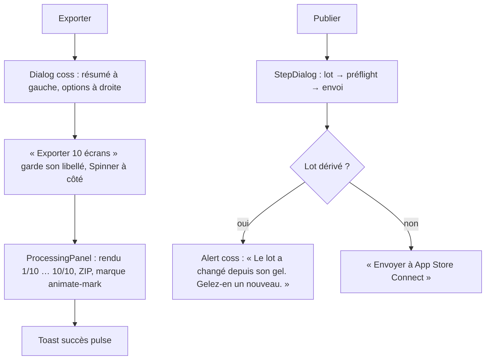

<!-- Fill or omit these sections; never add, rename, or reorder one. -->

# Instruction: dialogues — anatomie coss, AlertDialog, parcours multi-étapes

## Architecture projection

> Tree of the final files. ✅ create · ✏️ modify · ❌ delete

```txt
apps/web/src/components
├── patterns
│   ├── dialog-columns.tsx              ✏️ (phase 2) DialogPanel en grid [DIALOG_SIDEBAR_WIDTH_1fr], empile sous DIALOG_STACK_MIN_WIDTH ; la colonne gauche = navigation (Tabs coss orientation vertical) ou résumé
│   ├── step-dialog.tsx                 ✅ dialogue multi-étapes : en-tête avec Progress coss (étape n/N), DialogPanel dont les étapes glissent (x ±12 px, opacité, --duration-base) par data-step, Footer h-12 fixe avec « Retour » secondary + action primaire ; hauteur : min-h fixée par l'étape la plus haute mesurée une fois (ResizeObserver, pas d'animation de hauteur — ponytail)
│   ├── async-panel.tsx                 ✅ copie mandat-tan : état idle / pending (Skeleton pixel-matched) / ready (oa-arrive) / failed (Alert coss + action de reprise) — pour les aperçus (release, campagne, locale)
│   └── processing-panel.tsx            ✅ copie mandat-tan : liste d'étapes avec marque d'état (animate-mark), pour export, rafraîchissement, publication
├── export-dialog/ExportDialog.tsx       ✏️ DialogColumns ; gauche = résumé cible (dimension, écrans, poids estimé) ; droite = options ; Footer = « Annuler » + « Exporter 10 écrans » (nomme la quantité) ; ProcessingPanel pendant le ZIP ; le bouton garde son libellé + Spinner
├── template-picker/TemplatePicker.tsx   ✏️ Dialog large ; grille de Card coss cliquables (render=button), Badge « Vide » ; Empty si aucun modèle sauvegardé
├── globals-editor/GlobalsEditor.tsx     ✏️ Dialog ; PropertyRow ; SwatchButton ; Footer « Appliquer à 10 écrans »
├── auth-dialog/AuthDialog.tsx           ✏️ Dialog ; Field coss + FieldError (le seul endroit où un champ peut échouer : e-mail) ; bouton loading
├── pricing-dialog/PricingDialog.tsx     ✏️ Dialog ; deux Card coss (Local / Cloud), Badge « Actuel » ; un seul Button default
├── account-dialog/AccountDialog.tsx     ✏️ Dialog ; sections PanelSection ; suppression de compte via ConfirmAction (AlertDialog, bouton « Supprimer mon compte »)
├── migrate-dialog/MigrateProjectsDialog.tsx ✏️ Dialog ; liste plate sémantique conservée (Checkbox coss, visuellement plate) ; action quantifiée « Ajouter 3 projets à Cloud »
├── refresh-dialog/RefreshDialog.tsx     ✏️ StepDialog (déposer → associer → vérifier) ; Select coss par slot ; ProcessingPanel
├── release-dialog/ReleaseDialog.tsx     ✏️ DialogColumns ; gauche = liste des lots (Card par release, Badge vérifié/dérivé) ; droite = AsyncPanel (diff, vérification) ; « Vérifier » en outline avec sa phrase d'explication (contrat : dry run, pas une porte)
├── publish-dialog/PublishDialog.tsx     ✏️ StepDialog (lot → préflight → envoi) ; Alert coss pour un lot dérivé ; ProcessingPanel pendant le bridge ; aucun champ de credential (contrat phase 9)
├── campaign-dialog
│   ├── CampaignDialog.tsx               ✏️ StepDialog (brief → fournisseur → plan → ajout) ; étapes numérotées conservées ; provider row titrée « Qui écrit les accroches »
│   ├── AssistantSetup.tsx               ✏️ SetupFlow pattern (Card + Badge d'état + Button copier avec Kbd) ; champ token désactivé tant que le pont ne répond pas (inchangé)
│   └── PlanPreview.tsx                  ✏️ aperçus CSS inchangés ; cadre en Card coss ; AsyncPanel pendant la génération
├── locale-dialog/LocaleDialog.tsx       ✏️ DialogColumns ; gauche = Tabs verticales par locale ; droite = table coss des débordements (Badge par sévérité)
├── mcp/McpDialog.tsx                    ✏️ Dialog ; SetupFlow pattern ; StatusChip
└── App.tsx                              ✏️ LazyDialogFallback = DialogPopup coss + Skeleton (Header + 3 lignes) avec role=status ; le Suspense unique conservé
```

## User Journey



## Test Scope

```mermaid
---
title: Test scope
---
journey
  section Setup
    projet de 3 écrans, une release gelée => éditeur prêt: 5: browser
  section Happy path
    ouvrir Export => role=dialog, titre "Export officiel", deux colonnes à 1600 px: 5: browser
    cliquer "Exporter 3 écrans" => le bouton garde son texte, aria-disabled, Spinner visible: 5: browser
    fin d'export => ZIP 1320×2868 × 3, toast succès, dialog refermé, focus rendu: 5: browser
    ouvrir Publier => étape 1/3 ; "Suivant" => 2/3 avec glissement < 300 ms ; "Retour" => 1/3: 5: browser
  section Edge case - viewport 600
    ouvrir Export à 600 px => les deux colonnes sont empilées, rien ne déborde: 1: browser
  section Edge case - lot dérivé
    modifier le projet puis ouvrir Publier => Alert coss nomme la dérive, le bouton d'envoi est désactivé: 1: browser
  section Edge case - suppression de compte
    Compte → Supprimer => AlertDialog "Supprimer mon compte", Annuler ne supprime rien: 1: browser
```

## Wireframe

```txt
┌ Export officiel ───────────────────────────────────────────── × ┐
│ (1) Cible                  │ (2) Options                        │
│  6,9″ · 1320 × 2868        │  Format      [PNG        ▾]         │
│  3 écrans · ~4,2 Mo        │  Dossier     [par dimension ▾]     │
│  ● Prêt                    │  Langue      [fr-FR      ▾]         │
│                            │  [ ] Inclure les 6,5″ (dérivé)      │
│                            │                                     │
│                            │ (3) ┌ ProcessingPanel ──────────┐   │
│                            │     │ ✓ Rendu 3/3               │   │
│                            │     │ ○ Archive ZIP             │   │
│                            │     └───────────────────────────┘   │
├────────────────────────────┴─────────────────────────────────────┤
│ (4)                          [ Annuler ]  [ Exporter 3 écrans ⟳ ]│
└──────────────────────────────────────────────────────────────────┘

┌ Publier sur App Store Connect ─────── (5) ●●○ 2/3 ───────── × ┐
│ (6)                                                            │
│  ⚠ Le lot a changé depuis son gel (2 calques).                 │
│    Gelez un nouveau lot pour publier ce qui est sur la planche.│
│                                                                │
│  Lot   [ v3 · 21 août · vérifié ▾ ]                            │
│  App   [ Mon app ▾ ]   Locale  [ fr-FR ▾ ]                     │
├────────────────────────────────────────────────────────────────┤
│ (7)                              [ Retour ]  [ Lancer le préflight ] │
└────────────────────────────────────────────────────────────────┘
```

1. Colonne résumé : ce qui sera produit, en chiffres tabulaires.
2. Colonne options : PropertyRow, Select coss.
3. Panneau de progression, n'apparaît qu'en cours ; marques d'état animées.
4. Footer coss `border-t bg-muted/72` : une action secondaire, une primaire quantifiée.
5. Progress coss en en-tête, étape n/N.
6. Alert coss pour une condition qui tient (pas un toast).
7. Footer h-12 fixe : Retour secondary + primaire ; les libellés nomment l'action.

## Tasks to do

### `1)` Les trois patterns de dialogue

> StepDialog, AsyncPanel, ProcessingPanel : copiés de mandat-tan, posés sur coss.

1. `step-dialog.tsx` : props `steps: {id, title, content}[]`, `step`, `onStep` ; `Progress` coss dans `DialogHeader` ; les étapes dans `DialogPanel` avec `data-step` et `transition-ui` (x ±12 px + opacité) ; direction dérivée du sens de navigation ; Footer `h-12` avec `Button variant="secondary" size="sm"` « Retour » et le slot d'action primaire ; min-hauteur = max mesuré une fois à l'ouverture (pas d'animation de hauteur).
2. `async-panel.tsx` / `processing-panel.tsx` : porter depuis mandat-tan ; `Skeleton` coss pixel-matched (même `h-6` que la ligne réelle), `oa-arrive` à l'arrivée, `Alert` coss en échec avec une action de reprise nommée.
3. `App.tsx` `LazyDialogFallback` : `DialogPopup` + `Skeleton` (titre + trois lignes), `role=status`, « Chargement… » en `sr-only`.

### `2)` Les treize dialogues

> Chacun dans l'anatomie Header / Panel / Footer ; un seul bouton plein ; l'action quantifiée.

1. Export, Release, Locale : `DialogColumns` ; Refresh, Publish, Campaign : `StepDialog` ; les autres : `Dialog` simple.
2. Footers : `DialogFooter` coss `variant="default"` (bande muted) ; libellés : « Exporter N écrans », « Appliquer à N écrans », « Ajouter N projets à Cloud », « Supprimer N écrans », « Envoyer à App Store Connect » ; jamais « OK », « Valider », « Confirmer » seuls.
3. Conditions qui tiennent (lot dérivé, pont absent, quota Cloud, stockage indisponible) en `Alert` coss inline, jamais en toast ; elles disparaissent avec la condition.
4. `AccountDialog` suppression, `layer-menu` multi-suppression, `ScreensBar` suppression, `ProjectSwitcher` suppression de projet : `ConfirmAction`.
5. `PricingDialog` : deux `Card` coss, un seul `default` (Cloud) ; `MigrateProjectsDialog` : `Checkbox` coss dans une liste plate (contrat : visuellement plat, jamais renommé) ; `AuthDialog` : `FieldError` sur l'e-mail, bouton `loading`.

### `3)` Motion des dialogues

> Pop à l'entrée, plus doux à la sortie ; les étapes glissent ; rien au-delà de 300 ms.

1. Le `DialogPopup` coss porte déjà `data-starting-style` (scale .98 + opacité, 200 ms) et le backdrop son fondu ; ne rien ajouter.
2. `keepMounted` sur les dialogues lazy est inutile (ils sont démontés par le flag ui.store) ; la sortie est donc celle de coss, 200 ms.
3. Sous `prefers-reduced-motion`, le bloc unique de `motion.css` neutralise scale et translate ; `motion.spec.ts` le vérifie.

## Test acceptance criteria

| Task | Acceptance criteria |
| ---- | ------------------- |
| 1 | Un `StepDialog` navigue avant/arrière au clavier ; l'étape courante est annoncée (`aria-current="step"` sur Progress) ; `AsyncPanel` en échec montre un bouton nommé ; `runtime-resilience.spec.ts` vert (fallback lazy avec `role=status`, focus final dans le dialog). |
| 2 | `export.spec.ts`, `export-tiers.spec.ts`, `release.spec.ts`, `asc-publish.spec.ts`, `batch-refresh.spec.ts`, `campaign-journey.spec.ts`, `ai-campaign.spec.ts`, `ai-provider.spec.ts`, `locale.spec.ts`, `mcp-*.spec.ts`, `project-file.spec.ts` verts ; `grep -rn '>OK<\|>Valider<\|>Confirmer<' src/components` vide ; chaque dialog a exactement un `Button` variant `default`. |
| 3 | `dialogs-a11y.spec.ts` vert (ouverture/parcours/fermeture clavier pour chaque dialog ; deux colonnes empilées sous 612 px ; rien ne déborde à 375 px) ; `motion.spec.ts` : entrées < 300 ms, sortie du menu plus rapide que l'entrée. |
