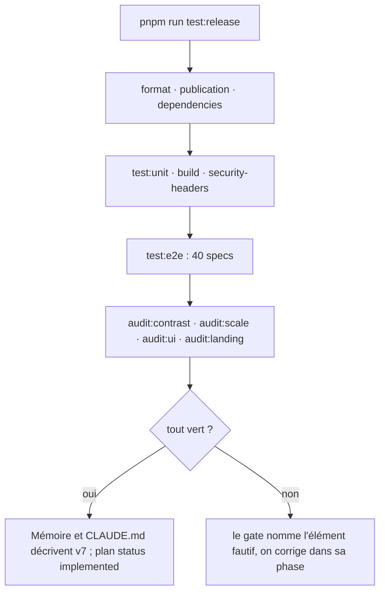
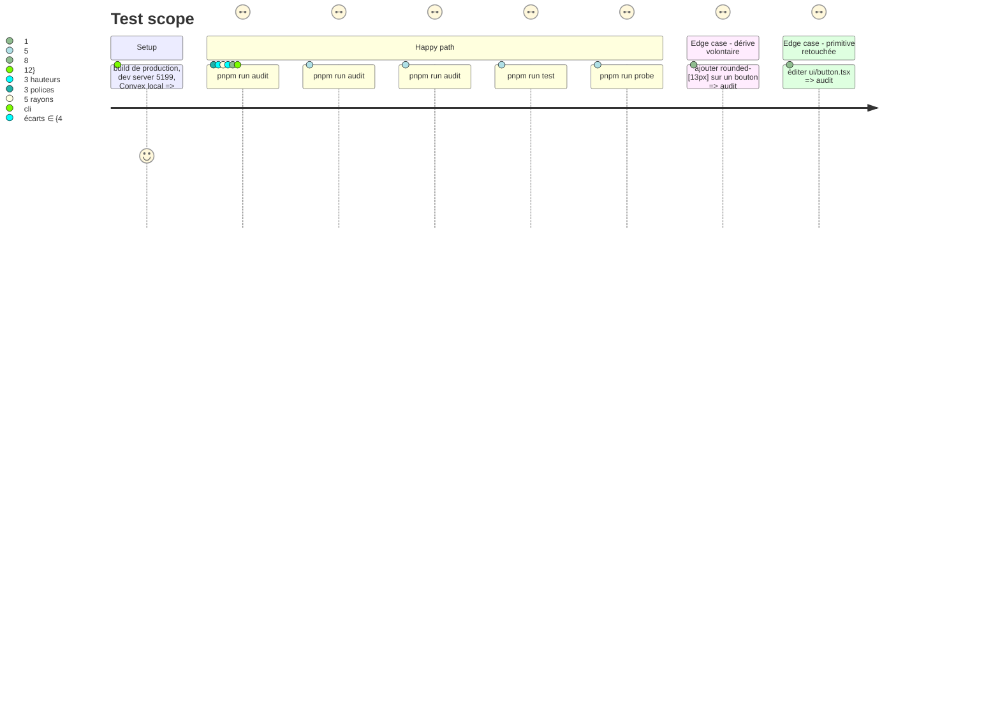

<!-- Fill or omit these sections; never add, rename, or reorder one. -->

# Instruction: gates, tests et mémoire — audits re-calibrés, e2e verts, docs à jour

## Architecture projection

> Tree of the final files. ✅ create · ✏️ modify · ❌ delete

```txt
.
├── scripts
│   ├── scale-audit.mjs                    ✏️ bornes coss : polices ≤ 3 (12/14/16), hauteurs ≤ 3 (28/32/36), rayons ≤ 5 (6/8/10/14/18), écarts ≤ 3 ; line-height sur 4 px conservé ; sélecteurs par data-slot coss (button, input, [data-slot=select-trigger], [data-slot=menu-item]) ; parcours de peuplement inchangé (libellés français)
│   ├── contrast-audit.mjs                 ✏️ (phase 1) + paires coss : primary-foreground/primary, secondary-foreground/secondary, destructive-foreground/card, info-foreground/card, warning-foreground/card, success-foreground/card ; exemption stage-dot
│   ├── ui-source-audit.mjs                ✅ `pnpm run audit:ui` : (a) chaque fichier de apps/web/src/components/ui/ est identique à coss.com/ui/r/<name>.json (hash du `content`), (b) aucun `@radix-ui`, `tw-animate-css`, `asChild` dans src/, (c) le bloc d'alias de transition de index.css est vide, (d) aucun `<button`/`<input` natif hors ScreenThumbnail.tsx et App.tsx, (e) aucune classe `.island|.field-label|.panel-title|.section-title|.surface-inner` restante
│   └── visual-probe.mjs                   ✏️ + états : dialog Export ouvert, menu ouvert, stage vide (6 captures × 2 thèmes)
├── package.json                           ✏️ scripts audit:ui ; test:release inclut audit:ui après audit:scale
├── apps/web
│   ├── src/index.css                      ✏️ bloc d'alias de transition supprimé
│   ├── e2e/semantics.spec.ts              ✏️ la règle cursor lit aussi [data-slot=menu-item], [data-slot=select-item], NumberFieldScrubArea (ew-resize)
│   ├── e2e/dialogs-a11y.spec.ts           ✏️ sélecteurs data-slot coss pour « un seul anneau de focus » et « Escape dans un Select »
│   └── e2e/motion.spec.ts                 ✏️ (phase 6) + palette ⌘K sans animation de veil (vérifier que Command coss n'en ajoute pas)
├── CLAUDE.md                              ✏️ section « Design language (v6) » → « (v7, coss ui) » : ce qui change (coss installé, extension tokens.css, patterns/, échelles coss, audit:ui) et ce qui ne change pas (stage, marker, artboard, stage.ts, règles mesurées du filmstrip/drawers) ; table Tech Stack : UI = coss ui (Base UI) ; arborescence : + patterns/, + design-system/
├── .impeccable.md                         ✏️ Aesthetic Direction v7 : coss neutral, --radius 10, tailles coss, pilules non, citron oui
└── aidd_docs/memory
    ├── design.md                          ✏️ System/Tokens/Components réécrits sur l'état v7 ; les règles mesurées conservées mot pour mot
    ├── codebase-map.md                    ✏️ + components/patterns, design-system/, scripts/ui-source-audit.mjs
    ├── coding-assertions.md               ✏️ + audit:ui dans la chaîne de release
    └── testing.md                         ✏️ + empty-state.spec.ts, audit:ui, contrast via navigateur
```

## User Journey



## Test Scope



## Tasks to do

### `1)` Re-calibrer `audit:scale` et `audit:contrast`

> Le garde compte toujours ; ses bornes sont celles de coss.

1. `scale-audit.mjs` : limites `polices ≤ 3`, `hauteurs ≤ 3`, `rayons ≤ 5`, `ecarts ≤ 3` ; sélecteurs de contrôles étendus à `[data-slot=select-trigger]`, `[data-slot=menu-item]`, `[data-slot=toggle-group-item]`, `[data-slot=number-field-input]` ; exclusion du filmstrip conservée ; mesure en 1600 × 1000 (desktop : coss rend ses tailles `sm:`).
2. Line-height : coss `text-sm` rend 20, `text-xs` 16, `text-base` 24 ; la règle 4 px tient sans `--leading-*: initial` ; vérifier et retirer toute classe `leading-none`.
3. `contrast-audit.mjs` : ajouter les paires coss ci-dessus ; `muted-foreground` coss clair (`color-mix(neutral-500 90%, black)`) sur `background` mesure ≥ 4.5 (vérifier, sinon c'est une extension `tokens.css`, pas une retouche de `ui/`).

### `2)` `audit:ui` : la primitive coss reste coss

> Un fichier de `ui/` retouché redevient une primitive maison ; le garde le dit.

1. `scripts/ui-source-audit.mjs` : pour chaque `ui/<name>.tsx`, télécharger `https://coss.com/ui/r/<name>.json` (cache dans `node_modules/.cache/coss/`, `--offline` lit le cache), comparer `files[0].content` normalisé (imports `@/` réécrits par le CLI tolérés) ; échec nommé.
2. Mêmes passes statiques : `@radix-ui`, `tw-animate-css`, `asChild`, `<button`/`<input` hors liste blanche, classes v6 mortes, bloc d'alias non vide.
3. `package.json` racine : `audit:ui`, ajouté à `test:release` après `audit:scale`.

### `3)` E2E : alignement et nouvelle spec

> Quarante specs vertes, dont une nouvelle.

1. `semantics.spec.ts`, `dialogs-a11y.spec.ts`, `motion.spec.ts` : sélecteurs `data-slot` coss là où un rôle ne suffit pas ; le reste par libellé français, inchangé.
2. `empty-state.spec.ts` (phase 6) intégré à la suite ; `helpers.ts` expose `openMenu`, `expectOneFocusRing` sur les slots coss.
3. `visual-probe.mjs` : six états × deux thèmes ; captures relues à l'œil (dark/light, vide/peuplé, dialog, menu).

### `4)` Mémoire et instructions

> Ce que le code ne dit pas est écrit, une fois, au bon endroit.

1. `CLAUDE.md` : réécrire « Design language » en v7 ; garder mot pour mot les paragraphes mesurés (artboard courant qui flotte, filmstrip, drawers, thresholds, curseur par rôle, hiérarchie déclarée) ; remplacer les paragraphes sur les tokens, îlots, échelles, `.island`, rayons 6/9/12/15/21, `--island-padding` ; ajouter `patterns/` (« composé de coss, jamais une primitive maison ») et `audit:ui`.
2. `.impeccable.md` : Aesthetic Direction v7.
3. `aidd_docs/memory/{design,codebase-map,coding-assertions,testing}.md` : état v7 ; supprimer ce qui décrit des fichiers disparus.
4. `plan.md` de ce dossier : `status: implemented` (écrit par l'étape implement, pas ici).

## Test acceptance criteria

| Task | Acceptance criteria |
| ---- | ------------------- |
| 1 | `pnpm run audit:scale` vert et son rapport liste exactement 3 polices, 3 hauteurs, 5 rayons ; un `rounded-[13px]` ajouté à la main fait échouer en nommant l'élément ; `pnpm run audit:contrast` vert dans les deux thèmes avec les nouvelles paires. |
| 2 | `pnpm run audit:ui` vert ; une ligne modifiée dans `ui/button.tsx` le fait échouer en nommant le fichier ; `grep -rn "@radix-ui\|tw-animate-css\|asChild" apps/web/src` vide ; le bloc d'alias de `index.css` n'existe plus. |
| 3 | `pnpm run test:e2e` : 40 specs vertes ; `pnpm run test:release` vert de bout en bout. |
| 4 | `CLAUDE.md` ne mentionne plus `.island`, `--island-padding`, `6 / 9 / 12 / 21`, `tw-animate-css`, Radix ; `aidd_docs/memory/design.md` décrit coss, `tokens.css`, `patterns/`, `audit:ui` ; `grep -rn "index.css" aidd_docs/memory` ne cite que des faits encore vrais. |
