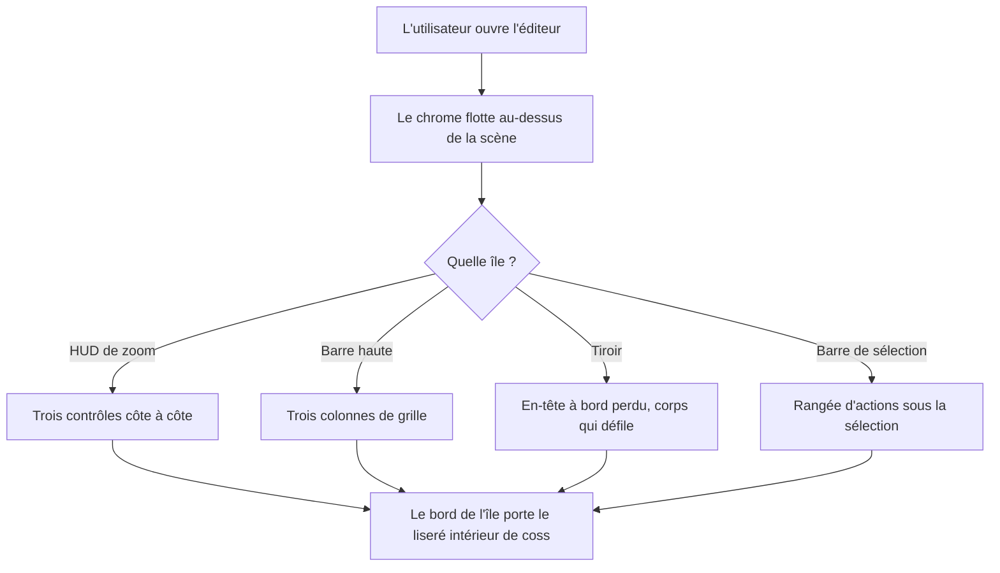
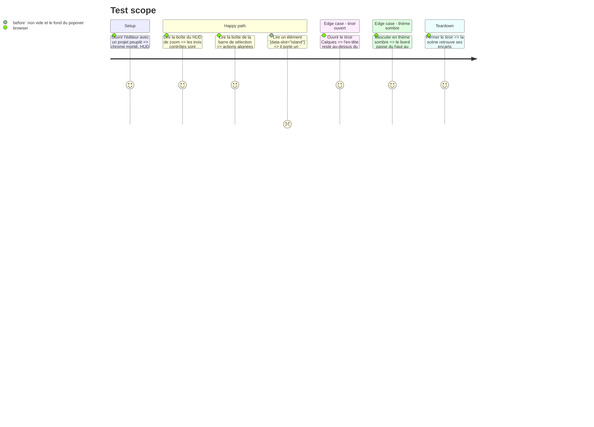

# Instruction: La surface flottante compose `Card`

## Architecture projection

> Tree of the final files. ✅ create · ✏️ modify · ❌ delete

```txt
.
├── CLAUDE.md                                        ✏️  corriger l'affirmation « wraps coss's own Card anatomy »
├── apps/web/src
│   ├── components
│   │   ├── patterns/island.tsx                      ✏️  rend un `Card`, ne garde que ce qui lui est propre
│   │   ├── toolbar/ZoomHud.tsx                      ✏️  `flex-row` explicite
│   │   ├── canvas/SelectionToolbar.tsx              ✏️  `flex-row` explicite
│   │   ├── toolbar/TopBar.tsx                       ✏️  vérifié seulement (grille, `flex-col` inerte)
│   │   └── patterns/drawer-island.tsx               ✏️  vérifié seulement (déclare déjà `flex-col`)
│   └── design-system/stage.css                      ✏️  `squircle` couvre aussi `::before`
└── apps/web/e2e/semantics.spec.ts                   ✏️  la rangée du HUD reste une rangée
```

## User Journey



## Test Scope



## Wireframe

```txt
Coupe verticale d'une île, avant / après

     AVANT (coque recopiée)              APRÈS (Card coss)
  ┌───────────────────────────┐     ┌───────────────────────────┐
  │(1)                        │     │(1)                        │
  │ ┌───────────────────────┐ │     │┌─────────────────────────┐│  ← (2)
  │ │(3)                    │ │     ││(3)                      ││
  │ └───────────────────────┘ │     │└─────────────────────────┘│
  └───────────────────────────┘     └───────────────────────────┘
        (4) ombre portée                  (4) ombre portée

En plan, ce que la direction de flex décide :

   ZoomHud attendu (1 rangée)      ZoomHud si `flex-col` l'emporte
  ┌───────────────────────┐        ┌────────┐
  │ (5) [−] [ 100% ] [+]  │        │ (5)[−] │
  └───────────────────────┘        │   [%]  │
                                   │   [+]  │
                                   └────────┘
```

1. Le bord de l'île : `border` + `rounded-2xl` + `squircle`. Inchangé — `Card` porte déjà les deux premiers, `squircle` reste propre au projet.
2. Le liseré intérieur `before:` de coss, gagné par la composition : 1px noir/4% en haut en thème clair, blanc/6% en bas en thème sombre. Il n'a jamais atteint le chrome parce que la coque était recopiée sans lui.
3. Le contenu, à `p-1` du cadre — l'écart que l'île déclare elle-même.
4. `shadow-lg/5`, réécrit par-dessus le `shadow-xs/5` de `Card`.
5. La rangée de contrôles. `Card` pose `flex-col` ; `display` et `flex-direction` sont deux groupes de conflit distincts, donc écrire `flex` sans direction ne le remplace pas — la rangée tomberait en colonne.

## Tasks to do

### `1)` Faire de `Island` un `Card` habillé

> Ne plus écrire dans `island.tsx` que ce qui n'est pas dans `Card`.

1. Importer `Card` depuis `@/components/ui/card` et le rendre au lieu de `useRender` en direct : `Island` garde sa signature (`useRender.ComponentProps<'div'>` + `flush`) et transmet `render` et le reste des props à `Card`.
2. Retirer de la `className` tout ce que `Card` pose déjà : `rounded-2xl`, `border`. Garder `squircle`, `bg-popover`, `text-popover-foreground`, `shadow-lg/5`, le `p-1`/`p-0` de `flush`, puis la `className` de l'appelant.
3. Poser `data-slot="island"` en prop de `Card` — `mergeProps(defaultProps, props)` donne le dernier mot aux props, donc il remplace `card`. Vérifier que `scripts/scale-audit.mjs:147` (`[data-slot="island"]`) trouve toujours ses éléments.
4. Réécrire le commentaire d'en-tête : il dit aujourd'hui « Coque `Card` coss » alors que le fichier n'importait pas `Card`. Nommer ce que la composition apporte (liseré `before:`, `bg-clip-padding`) et ce que l'île ajoute.

### `2)` Rendre la direction de flex explicite

> `Card` pose `flex-col` ; deux îles s'en remettaient à son absence.

1. `ZoomHud.tsx:24` : `flex items-center gap-0.5` → `flex flex-row items-center gap-0.5`.
2. `SelectionToolbar.tsx:127` : ajouter `flex-row` à la rangée d'actions.
3. Constater sans modifier : `TopBar.tsx:208` déclare `grid`, qui l'emporte sur `flex` (même groupe) et rend `flex-direction` inerte ; `drawer-island.tsx:42` déclare déjà `flex-col`. Les laisser tels quels.

### `3)` Le liseré intérieur doit suivre le squircle

> Le `::before` de `Card` est une boîte distincte, `corner-shape` ne s'hérite pas.

1. Étendre l'utilitaire `squircle` (`design-system/stage.css:76`) pour qu'il pose aussi `corner-shape: squircle` sur `&::before` — une seule définition, plutôt qu'une classe `before:[…]` répétée sur l'île.
2. Regarder le coin d'une île dans un navigateur qui gère `corner-shape` et dans un qui ne le gère pas : dans le second, `corner-shape` est ignoré des deux côtés et les deux courbes restent d'accord par construction.

### `4)` Constater le changement plutôt que l'affirmer

> Le liseré touche toutes les surfaces flottantes d'un coup.

1. Lancer `pnpm run probe:visual` (serveur de dev sur 5173) et comparer les captures clair/sombre avant/après : le seul écart attendu est un liseré de 1px au bord des îles.
2. Lancer `pnpm run audit:scale`, `pnpm run audit:contrast`, `pnpm run audit:ui`, `pnpm run lint`, `pnpm run typecheck`.
3. Ajouter à `e2e/semantics.spec.ts` une assertion sur la boîte du HUD : sa hauteur reste celle d'un contrôle plus le `p-1`, ce qui échoue si la rangée bascule en colonne.

### `5)` Corriger `CLAUDE.md`

> Le fichier décrivait une composition qui n'existait pas.

1. Dans la puce « The floating surface is a component, not a CSS class », remplacer l'énumération de classes recopiées par ce que `Island` fait désormais : rend un `Card`, y ajoute le squircle, le fond de popover, l'élévation d'île et le `p-1`.
2. Ajouter la contrainte mesurée : une île qui veut une rangée écrit `flex-row`, parce que `Card` pose `flex-col`.

## Test acceptance criteria

| Task | Acceptance criteria                                                                                                                                                                |
| ---- | ------------------------------------------------------------------------------------------------------------------------------------------------------------------------------------ |
| 1    | `island.tsx` importe `Card` et n'écrit plus ni `rounded-2xl` ni `border` ; un `[data-slot="island"]` rendu porte un `::before` de largeur non nulle, et `scale-audit` trouve toujours ses îles |
| 2    | Le HUD de zoom et la barre de sélection rendent leurs contrôles sur une seule rangée ; la barre haute et les tiroirs sont inchangés au pixel                                          |
| 3    | Sur un navigateur qui gère `corner-shape`, le liseré intérieur suit la même courbe que le bord de l'île — aucun décrochage visible au coin                                            |
| 4    | `probe:visual` ne montre d'écart qu'au bord des îles ; `audit:scale`, `audit:contrast`, `audit:ui`, `lint`, `typecheck` passent ; la nouvelle assertion échoue si l'on retire `flex-row` du HUD |
| 5    | `CLAUDE.md` décrit la composition réelle et énonce la règle `flex-row`                                                                                                              |
