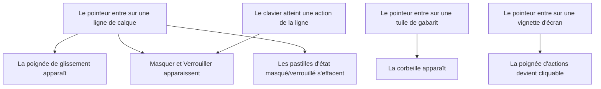
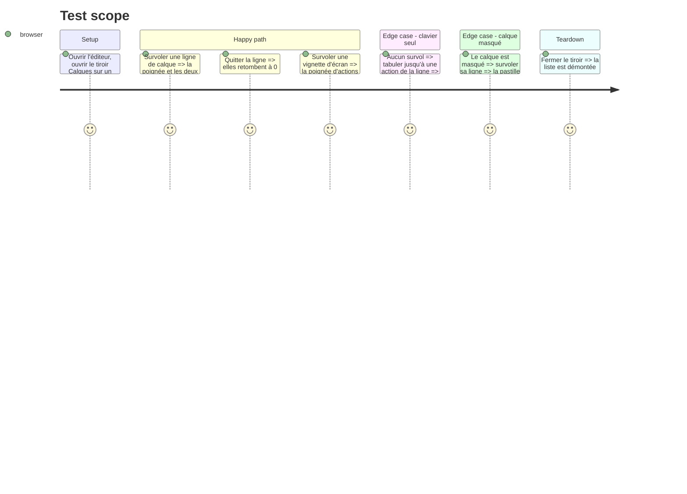

# Instruction: `group-hover` devient `in-*`, ce que coss écrit

## Architecture projection

> Tree of the final files. ✅ create · ✏️ modify · ❌ delete

```txt
.
├── CLAUDE.md                                             ✏️  la règle, et pourquoi elle n'est pas cosmétique
└── apps/web
    ├── src/components
    │   ├── layers-panel/LayerItem.tsx                    ✏️  `group` → `data-slot="layer-item"`, 3 sites
    │   ├── template-picker/TemplatePicker.tsx            ✏️  `group/tile` → `data-slot="template-tile"`, 1 site
    │   └── screens-bar/ScreenThumbnail.tsx               ✏️  `group/thumb` → `data-slot="screen-thumbnail"`, 1 site
    └── e2e/semantics.spec.ts                             ✏️  survoler révèle, la garde qui manque
```

## User Journey



## Test Scope



## Tasks to do

### `1)` La ligne de calque se nomme au lieu de se marquer

> Trois révélations sur une même ligne, toutes accrochées à une classe positionnelle.

1. `LayerItem.tsx:217` : retirer `group` de la `className` et poser `data-slot="layer-item"` sur le `div[role="option"]` (l. 185), à côté de `data-layer-id`.
2. `:239` (poignée `GripVertical`) : `group-hover:opacity-100` → `in-[[data-slot=layer-item]:hover]:opacity-100`.
3. `:267` (rangée Masquer/Verrouiller) : `group-focus-within:opacity-100 group-hover:opacity-100` → les deux variantes `in-[[data-slot=layer-item]:focus-within]:` et `in-[[data-slot=layer-item]:hover]:`.
4. `:311` (pastilles masqué/verrouillé) : même substitution avec `:hidden`.

### `2)` La tuile de gabarit et la vignette d'écran

> Deux `group/<nom>` nommés, un site chacun.

1. `TemplatePicker.tsx:167` : retirer `group/tile`, poser `data-slot="template-tile"` sur le `div` d'enrobage ; `:213` → `in-[[data-slot=template-tile]:hover]:opacity-100`.
2. `ScreenThumbnail.tsx:151` : retirer `group/thumb`, poser `data-slot="screen-thumbnail"` sur le `div` d'enrobage ; `:377` → `in-[[data-slot=screen-thumbnail]:hover]:pointer-events-auto` et `…:opacity-100`.
3. Ne pas toucher aux quatre `group` de `group-open` (`landing/AgentSection.tsx`, `landing/Faq.tsx`, `release-dialog/ReleaseDialog.tsx`) : `open` est un attribut du `<details>`, pas un état de l'ancêtre, et coss ne propose rien à la place.

### `3)` Vérifier au lieu de supposer

> `in-[…]` s'écrit en valeur arbitraire : une faute de frappe n'émet rien, sans erreur.

1. Mesurer dans le navigateur l'opacité calculée de la poignée, ligne survolée puis non survolée. Une variante mal écrite rend 0 dans les deux cas et se lit tout de suite.
2. Contrôler l'ordre de cascade : `opacity-0` et la variante `in-*` ont la même spécificité (`:where()` en pèse zéro), c'est la source qui tranche. Si la révélation ne prend pas, c'est là qu'il faut regarder, pas dans le sélecteur.
3. Vérifier que la révélation au clavier tient toujours sur la ligne de calque (`focus-within`) et sur la tuile de gabarit (`focus-visible`, qui n'était déjà pas un `group`).

### `4)` Laisser une garde derrière

> Aucune de ces cinq révélations n'était couverte ; c'est pour ça que le remplacement fait peur.

1. Dans `e2e/semantics.spec.ts`, survoler une ligne de calque et affirmer que la poignée passe à une opacité de 1, puis qu'elle retombe à 0 hors survol.
2. Vérifier la garde en cassant volontairement une variante (une lettre de moins dans le nom du slot) : la spec doit échouer.

### `5)` Écrire la règle

> Sans le pourquoi, le prochain `group-hover` reviendra.

1. Ajouter à `CLAUDE.md` que le projet écrit `in-[[data-slot=…]:hover]` et non `group-hover`, en citant la règle coss et le gain réel : le sélecteur nomme un contrat que les tests et les audits lisent déjà, et un `group` imbriqué ne peut plus capter la révélation d'un ancêtre — risque concret dans une liste de calques.
2. Nommer l'exception : `group-open` sur un `<details>` reste, faute d'équivalent.

## Test acceptance criteria

| Task | Acceptance criteria                                                                                                                               |
| ---- | --------------------------------------------------------------------------------------------------------------------------------------------------- |
| 1    | `grep -rn "group-hover" apps/web/src/components` ne renvoie rien ; survoler une ligne de calque révèle la poignée et les deux actions, et efface les pastilles d'état |
| 2    | Survoler une tuile de gabarit révèle la corbeille ; survoler une vignette d'écran rend sa poignée d'actions cliquable ; les quatre `group-open` sont intacts |
| 3    | Opacité calculée mesurée à 1 sous le pointeur et 0 hors pointeur, pour les cinq sites ; la révélation au clavier est inchangée                        |
| 4    | La nouvelle assertion passe, et échoue quand on altère d'un caractère le nom du slot dans la variante                                                 |
| 5    | `CLAUDE.md` énonce la règle, son gain et son exception                                                                                                |
