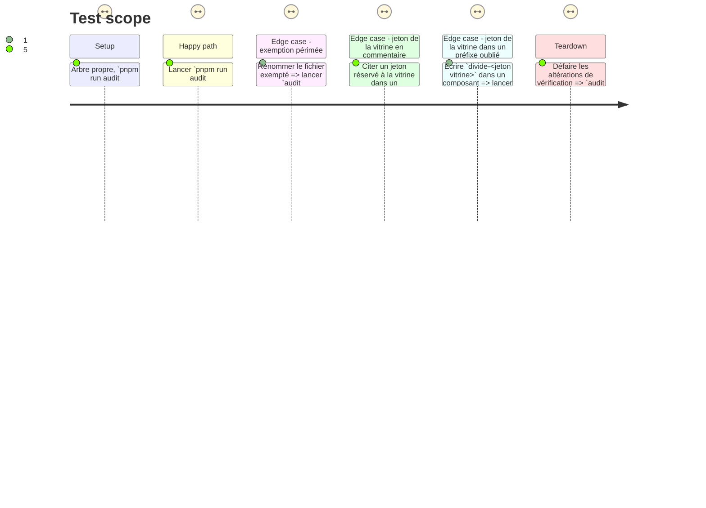

# Instruction: Les exemptions muettes de l'audit

## Architecture projection

> Tree of the final files. ✅ create · ✏️ modify · ❌ delete

```txt
.
├── scripts/ui-source-audit.mjs                                          ✏️  l'exemption se justifie et se périme
└── aidd_docs/tasks/2026_08/2026_08_23_coss-button-auto-height
    └── phase-2.md                                                       ✏️  chiffres périmés du critère
```

## Test Scope



## Tasks to do

### `1)` L'exemption de la vignette dit pourquoi, et se périme

> `ui-source-audit.mjs:138` retire `ScreenThumbnail.tsx` du balayage des contrôles natifs, sans un mot.

1. Sortir le chemin dans une constante nommée, associée à sa raison en une phrase : la tuile porte un `draggable`, un menu contextuel, un double-clic de renommage et ses propres `aria-pressed`/`aria-current` ; l'envelopper dans un `Button` coss reviendrait à en neutraliser la variante classe par classe.
2. Faire échouer l'audit si le chemin exempté n'existe plus : un renommage doit rouvrir la question, pas dissoudre l'exemption en silence.
3. Imprimer l'exemption dans la sortie de la section, pour qu'elle se lise à chaque exécution au lieu de vivre dans un `filter`.

### `2)` Le balayage des jetons de la vitrine lit ce qui peint

> `:252` lit tout le fichier : un nom de jeton cité dans un commentaire fait échouer l'audit sur une ligne qui ne peint rien.

1. Restreindre la recherche aux valeurs de `className` (et `cn(...)`), comme le faisait la version précédente de la garde.
2. À défaut, nommer la ligne fautive dans le message — le sens de l'erreur est bon (bruyant plutôt que muet), c'est la désignation qui manque.

### `3)` La liste de préfixes de `--color-` est complète

> `:192` en compte dix ; Tailwind en expose davantage sur le même espace de noms.

1. Ajouter `divide`, `caret`, `accent`, `decoration`, `placeholder` à l'entrée `['--color-', […]]`.
2. Vérifier qu'aucun de ces préfixes ne produit un faux positif sur l'application telle quelle.

### `4)` Le critère périmé de la tâche précédente

> `2026_08_23_coss-button-auto-height/phase-2.md:41` cite « boîte 286×43, débord 8 » ; la ligne a été redessinée, le débord mesuré est 3.

1. Remplacer les valeurs par ce que la garde constate : elle nomme le bouton et son débord. Le critère reste vrai sur le fond, ses chiffres non.

## Test acceptance criteria

| Task | Acceptance criteria                                                                                                                          |
| ---- | ------------------------------------------------------------------------------------------------------------------------------------------------ |
| 1    | `audit:ui` imprime l'exemption de `ScreenThumbnail.tsx` avec sa raison, et échoue si le fichier est renommé                                     |
| 2    | Un jeton réservé à la vitrine cité dans un commentaire ne fait plus échouer l'audit ; le même jeton dans une `className` le fait toujours échouer |
| 3    | `divide-<jeton vitrine>` dans un composant fait échouer `audit:ui` en nommant le fichier et le jeton ; l'application inchangée passe toujours    |
| 4    | Le critère de `phase-2.md:41` ne cite plus de mesure datée                                                                                      |
