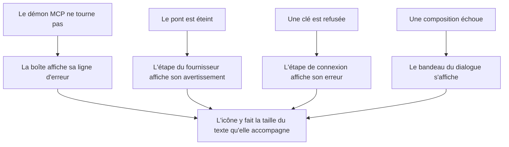
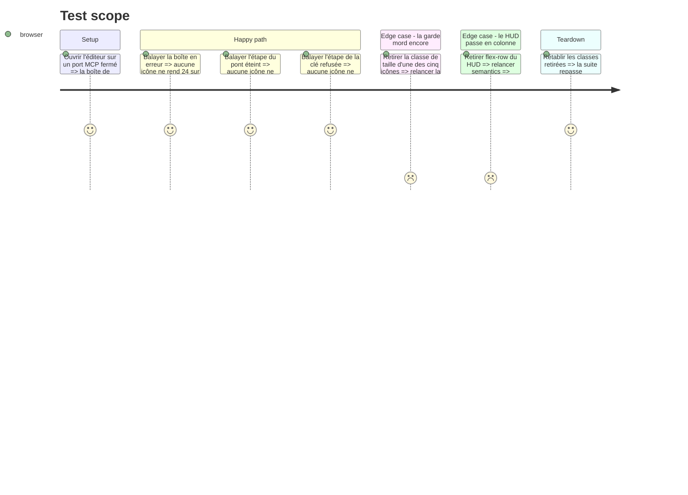

# Instruction: Les icônes de repli, et les états qui les montrent

## Architecture projection

> Tree of the final files. ✅ create · ✏️ modify · ❌ delete

```txt
.
└── apps/web
    ├── src/components
    │   ├── mcp/McpDialog.tsx                             ✏️  l'icône de la marche en erreur prend sa taille
    │   ├── campaign-dialog/AssistantSetup.tsx            ✏️  trois icônes de la même forme, même correction
    │   └── campaign-dialog/CampaignDialog.tsx            ✏️  le bandeau d'erreur, même correction
    └── e2e
        ├── mcp-live.spec.ts                              ✏️  l'état « sans démon » est balayé
        ├── ai-provider.spec.ts                           ✏️  « pont éteint » et « clé refusée » sont balayés
        └── semantics.spec.ts                             ✏️  l'assertion du HUD dérive sa marge au lieu de la citer
```

## User Journey



## Test Scope



## Tasks to do

### `1)` Les cinq icônes prennent leur taille

> Mesuré : 24 × 24 dans une ligne de 12px, contre 10 et 16 pour leurs voisines.

1. `McpDialog.tsx:238` : `className="mt-0.5 shrink-0"` → `className="mt-0.5 size-3.5 shrink-0"`.
2. `AssistantSetup.tsx:136`, `:282`, `:350` : même substitution, même échelon.
3. `CampaignDialog.tsx:591` : même substitution.
4. `size-3.5` et pas autre chose : c'est l'échelon que `CLAUDE.md` donne pour une icône dans du texte de 12px, et les autres icônes de ces mêmes boîtes rendent 14 ou 16.

### `2)` Les états d'erreur passent sous la garde

> `expectNoRawIcon` est exacte sur ce qu'elle voit, et ne voit que ce qu'un scénario a ouvert.

1. `mcp-live.spec.ts`, test « sans démon » : appeler `expectNoRawIcon(page)` après l'assertion sur la ligne d'alerte, la boîte étant ouverte sur la marche en erreur.
2. `ai-provider.spec.ts`, test « le pont éteint est constaté » : même appel, une fois l'avertissement du fournisseur visible.
3. `ai-provider.spec.ts`, test « une clé refusée le dit » : même appel, une fois le message de connexion visible.
4. Ne pas chercher à couvrir le bandeau de `CampaignDialog` : aucun scénario n'ouvre cet état aujourd'hui, et en fabriquer un pour une icône coûterait plus que ce qu'il garde. Le noter dans le commentaire de la tâche 1, à l'endroit de la correction.

### `3)` L'assertion du HUD nomme ce qui a bougé

> `+ 10` est le `p-1` de l'île plus le bord de `Card` : deux valeurs de coss, citées comme une constante.

1. `semantics.spec.ts:151` : lire le `padding-top`/`padding-bottom` et le `border-top-width`/`border-bottom-width` calculés de l'île, et comparer la hauteur de la boîte à celle d'un contrôle augmentée de leur somme.
2. Garder l'assertion sur l'égalité et le message d'échec : ce qui doit rester lisible, c'est qu'une île passée en colonne empile ses contrôles.

## Test acceptance criteria

| Task | Acceptance criteria                                                                                                                                                              |
| ---- | ------------------------------------------------------------------------------------------------------------------------------------------------------------------------------------ |
| 1    | Dans l'état « démon absent », l'icône de la marche 1 est mesurée à 14 × 14 et non plus 24 × 24 ; les quatre autres sites portent la même classe                                    |
| 2    | Les trois specs appellent `expectNoRawIcon` sur un état d'erreur ouvert, et échouent si l'on retire la classe de taille de l'icône que cet état affiche                            |
| 3    | L'assertion du HUD ne cite plus de nombre écrit à la main, passe sur l'application telle quelle, et échoue toujours si l'on retire `flex-row` du HUD                              |
