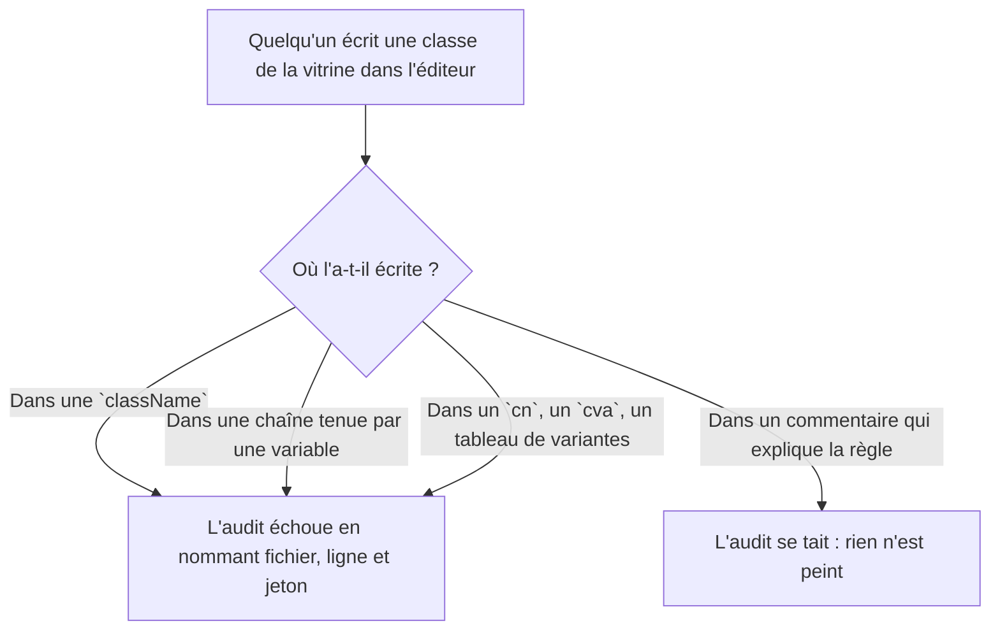
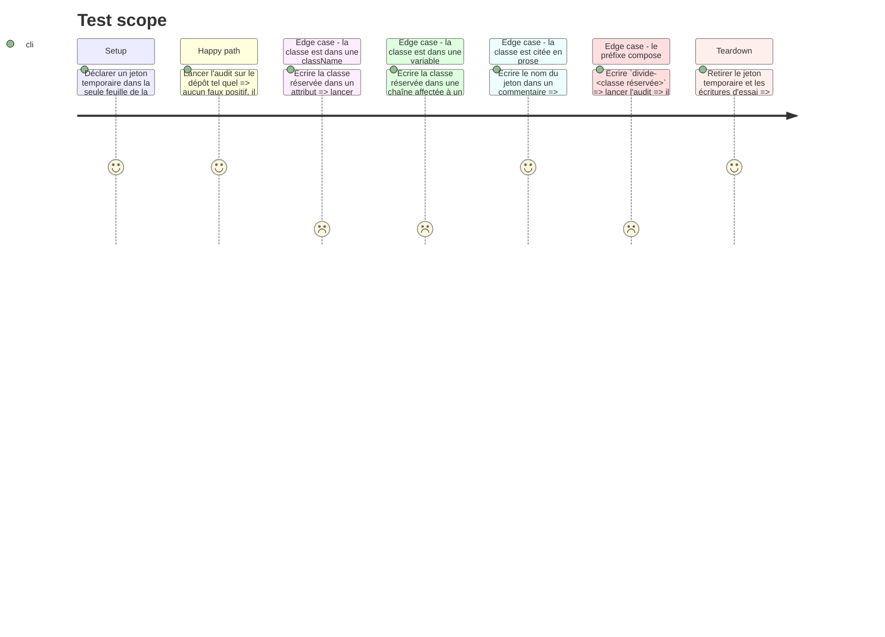

# Instruction: Le balayage lit des littéraux, pas des segments

## Architecture projection

> Tree of the final files. ✅ create · ✏️ modify · ❌ delete

```txt
.
└── scripts
    └── ui-source-audit.mjs                               ✏️  `paintedSegments`/`balanced()` cèdent la place à l'analyseur TypeScript
```

## User Journey



## Test Scope



## Tasks to do

### `1)` Le balayage passe par l'arbre, plus par des segments

> Une chaîne, un commentaire : l'analyseur sait ce que c'est, un compteur de parenthèses non.

1. Importer `typescript` dans `scripts/ui-source-audit.mjs` — dépendance déjà présente à la racine, rien à installer.
2. Remplacer `paintedSegments(content)` par une lecture d'arbre : `ts.createSourceFile(file, content, ts.ScriptTarget.Latest, true)`, puis `ts.forEachChild` récursif, retenant les nœuds que `ts.isStringLiteralLike` reconnaît (`'…'`, `"…"`, gabarit sans substitution) ainsi que les fragments d'un `ts.isTemplateExpression`.
3. Retourner, pour chaque littéral, sa valeur et sa ligne — `source.getLineAndCharacterOfPosition(node.getStart(source)).line + 1` — au lieu d'un index à recompter à coups de `split('\n')`.
4. Supprimer `balanced()` avec son appelant : plus rien ne compte de paires, donc le constat sur les commentaires internes aux `cn(` disparaît avec le mécanisme.
5. Ne pas retirer les commentaires : ils ne sont plus des nœuds parcourus, ce qui était l'objet de la plainte d'origine.

### `2)` La couverture perdue est reprise, et prouvée

> Le constat vaut par sa démonstration : une classe dans une variable échappait au balayage.

1. Vérifier sur la forme réelle du dépôt (`processing-panel.tsx:111`, `const base = 'animate-mark …'`) : y écrire la classe réservée doit désormais faire échouer l'audit.
2. Vérifier les trois formes qui passaient déjà — `className="…"`, `className={cn(…)}`, une variante de `cva` — et le préfixe composé `divide-…`.
3. Vérifier qu'un jeton cité dans un commentaire ne fait toujours rien échouer.
4. Lancer l'audit sur le dépôt inchangé : aucune des classes réservées ne doit être signalée.

### `3)` Le commentaire dit ce que la garde couvre

> Le bloc au-dessus décrit un balayage par segments qui n'existera plus.

1. Réécrire l'en-tête de la fonction : ce qui est lu, ce sont les littéraux de chaîne du fichier ; un commentaire n'en est pas un, et une classe tenue dans une variable en est un.
2. Nommer le prix : un nom de classe construit par concaténation ou par interpolation reste hors de portée, comme il l'était déjà.

## Test acceptance criteria

| Task | Acceptance criteria                                                                                                                                  |
| ---- | -------------------------------------------------------------------------------------------------------------------------------------------------------- |
| 1    | `scripts/ui-source-audit.mjs` ne contient plus ni `balanced` ni `paintedSegments` ; `pnpm run typecheck` et `pnpm run lint` passent sur le script       |
| 2    | La classe réservée écrite dans une chaîne affectée à un identifiant fait échouer l'audit, en nommant fichier, ligne et jeton d'origine                  |
| 2    | La même classe écrite dans une `className`, dans un `cn(…)`, dans une variante `cva` ou préfixée `divide-` fait échouer l'audit                          |
| 2    | Le nom du jeton écrit dans un commentaire ne fait pas échouer l'audit, et le dépôt inchangé passe                                                       |
| 3    | Le commentaire de la fonction décrit la lecture par littéraux et nomme ce qui reste hors de portée                                                      |
