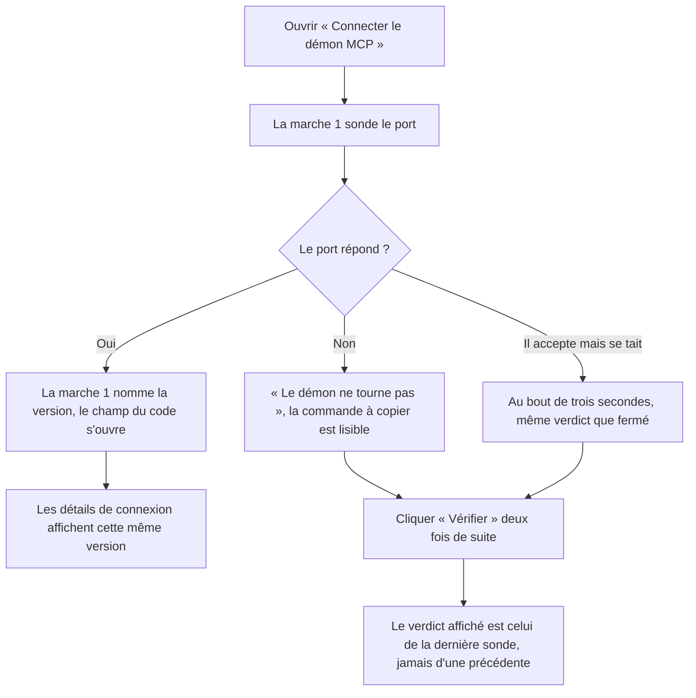
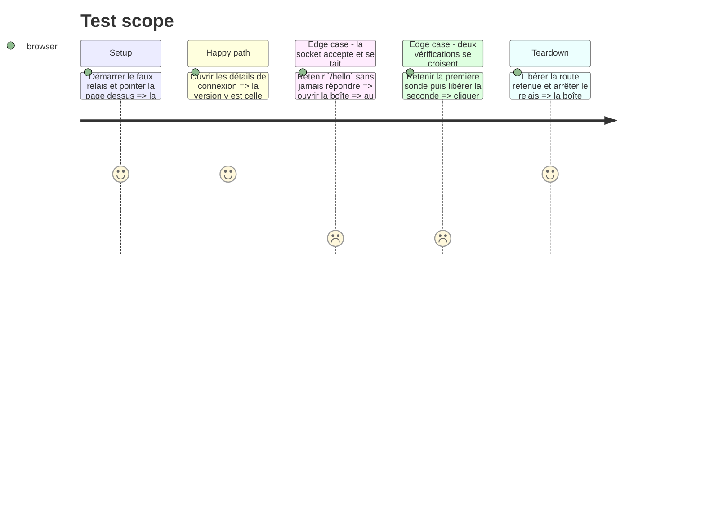

# Instruction: La sonde a une fin, la boîte a une sortie

## Architecture projection

> Tree of the final files. ✅ create · ✏️ modify · ❌ delete

```txt
.
└── apps/web
    ├── src
    │   ├── lib/mcp/client.ts                             ✏️  la sonde est bornée dans le temps
    │   └── components/mcp/McpDialog.tsx                  ✏️  « Vérifier » ne se double plus ; les détails lisent la même version que la marche 1
    └── e2e
        ├── mcp-relay.ts                                  ✏️  le faux relais sait retenir `/hello` sans jamais répondre
        └── mcp-live.spec.ts                              ✏️  une socket muette laisse quand même une sortie
```

## User Journey



## Test Scope



## Tasks to do

### `1)` La sonde s'arrête d'attendre

> Une socket qui accepte sans répondre laissait la boîte sans aucune sortie : champ désactivé, « Appairer » désactivé, « Vérifier » relançant la même attente.

1. `client.ts:187` : passer `{ signal: AbortSignal.timeout(PROBE_TIMEOUT_MS) }` au `fetch`.
2. Déclarer `PROBE_TIMEOUT_MS = 3000` à côté, avec une phrase sur ce qu'il achète : le verdict, pas la performance. C'est du loopback — trois secondes n'y sont pas une latence, c'est un port qui ne répondra pas.
3. Ne rien ajouter au `catch` : l'abandon y arrive comme un refus de connexion, et `down` est déjà le bon verdict. Le dire dans le commentaire, sinon la branche a l'air de manquer un cas.

### `2)` Le faux relais sait se taire

> Sans une route qui accepte et ne répond pas, le défaut n'est pas reproductible depuis le navigateur.

1. `mcp-relay.ts` : ajouter au `Relay` un interrupteur (`holdHello: (on: boolean) => void`), lu par la route `/hello`.
2. Retenu, `/hello` ne clôt pas sa réponse ; garder la `ServerResponse` pour la refermer à l'arrêt du serveur, ou `stop()` attendra la socket.
3. Libérer les réponses retenues quand l'interrupteur retombe, pour que la sonde suivante réponde normalement.

### `3)` L'attente muette a un test

> Le constat vient d'une lecture ; la garde doit venir d'une mesure.

1. `mcp-live.spec.ts` : nouveau test — relais démarré, `/hello` retenu, ouverture de la boîte.
2. Attendre le verdict `down` sur la marche 1, avec un délai d'assertion supérieur à `PROBE_TIMEOUT_MS`.
3. Assertion sur la sortie, pas seulement sur le texte : la commande à copier est visible, et le bouton « Vérifier » est actionnable.
4. Vérifier par mutation que retirer le `signal` fait échouer ce test.

### `4)` « Vérifier » ne se double plus

> L'effet de montage pose déjà une garde d'annulation ; la relance à la demande n'en a aucune.

1. `McpDialog.tsx:89` : un compteur de requête en `useRef`, incrémenté à chaque `recheck()`, comparé au retour — une sonde plus ancienne ne repeint rien.
2. Ne pas dupliquer la logique : la garde est la même intention que le `cancelled` de l'effet, et le commentaire doit renvoyer à celui-ci.

### `5)` Les détails lisent la version que la marche 1 affiche

> Deux affirmations contradictoires sur le même écran : « Démon MCP 0.1.0 joignable » au-dessus de « Non détectée ».

1. `McpDialog.tsx:325` : lire `daemonVersion` (déjà calculé l. 141) au lieu de `version`.
2. Aucun autre changement dans le bloc : la ligne « Non détectée » reste le cas où ni la sonde ni le store ne savent.

## Test acceptance criteria

| Task | Acceptance criteria                                                                                                                                          |
| ---- | ---------------------------------------------------------------------------------------------------------------------------------------------------------------- |
| 1    | Face à une socket qui accepte sans répondre, `probeMcpDaemon` résout `down` en moins de quatre secondes au lieu de rester en suspens                             |
| 2, 3 | Le nouveau test passe, et échoue si l'on retire le `signal` de la sonde                                                                                          |
| 3    | Dans cet état, la commande de lancement est visible et « Vérifier » reste actionnable — la boîte a une sortie                                                    |
| 4    | Deux relances rapprochées affichent le verdict de la dernière, jamais celui d'une sonde partie plus tôt                                                          |
| 5    | Relais joignable, boîte ouverte : « Détails de connexion » affiche la même version que la marche 1, et non « Non détectée »                                     |
