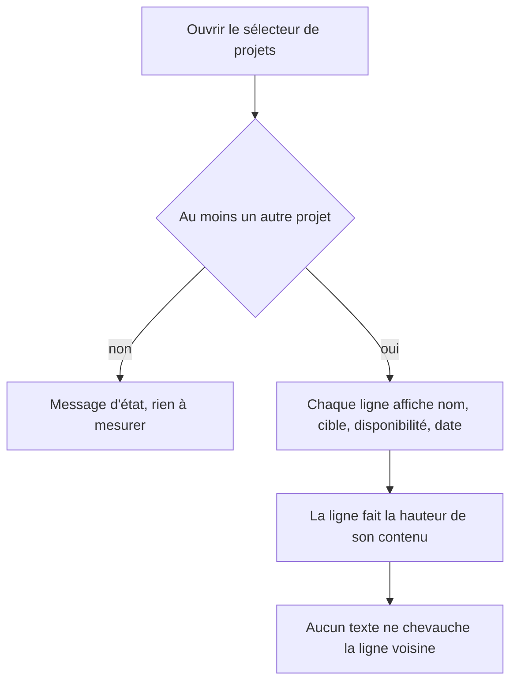
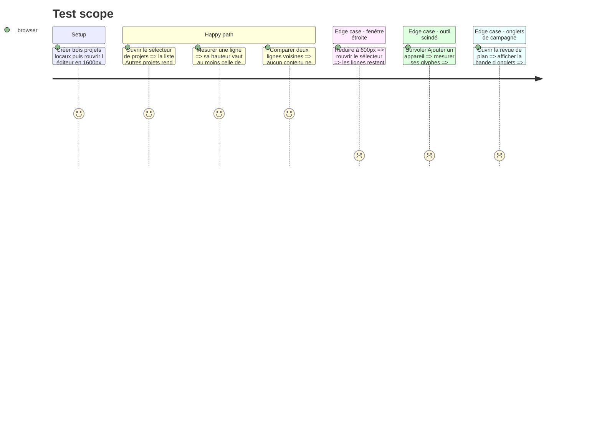

# Instruction: Décoincer les boutons qui doivent grandir

## Cause mesurée

`buttonVariants` déclare sa hauteur deux fois : `default: "h-9 px-… sm:h-8"`. `cn()`
(tailwind-merge) indexe ses groupes de conflit par modificateur, donc un `h-auto`
écrit par l'appelant remplace `h-9` et laisse `sm:h-8` intact. Au-dessus de 640px —
c'est-à-dire dans l'éditeur, toujours — le bouton est donc figé à 32px alors que son
contenu en demande une cinquantaine, et `items-center` répartit le débordement de
part et d'autre : le nom sort par le haut, la pastille par le bas, chacun sur la
ligne du voisin. C'est exactement ce que montre la capture. Mesuré sur la ligne
avant correctif : boîte de 43px, contenu de 60px.

La même primitive impose sa taille aux icônes : `[&_svg:not([class*='size-'])]:size-4.5
sm:…:size-4` gagne sur les attributs `width`/`height` que pose la prop `size` de
Lucide. Mesuré : le chevron du sélecteur d'appareil, déclaré `size={9}`, rend 16px
comme le téléphone à côté de lui, et la paire déborde de 2px de chaque côté de sa
boîte de 32 — le survol, qui est exactement cette boîte, ne contient plus ses
propres glyphes. C'est le second défaut signalé, et il tient à la même cause : une
intention d'appelant qu'une classe coss recouvre en silence.

## Architecture projection

> Tree of the final files. ✅ create · ✏️ modify · ❌ delete

```txt
.
└── apps/web/src/components/
    ├── project-switcher/ProjectSwitcher.tsx        ✏️ ligne de projet (le défaut signalé) + boutons « Destination »
    ├── campaign-dialog/CampaignDialog.tsx          ✏️ onglet de visuel : une vignette de 87px dans une boîte de 32
    ├── export-dialog/ExportDialog.tsx              ✏️ ligne d'écran à cocher : vignette + deux lignes de texte
    ├── publish-dialog/PublishDialog.tsx            ✏️ entrée de release : deux lignes empilées
    ├── migrate-dialog/MigrateProjectsDialog.tsx    ✏️ CTA en `whitespace-normal` : coupé dès qu'il passe à la ligne
    ├── device-picker/ScreenshotFraming.tsx         ✏️ lien « Réinitialiser le cadrage » : pas encore coupé, même piège
    └── toolbar/TopBar.tsx                          ✏️ outil « Ajouter un appareil » : le chevron déborde de la surface de survol
```

## User Journey



## Test Scope



## Wireframe

```txt
┌──────────────────────────────────────────────┐
│ (1) Autres projets                        2  │
│ ┌──────────────────────────────────────────┐ │
│ │ (2) Filtrer par nom                      │ │
│ └──────────────────────────────────────────┘ │
│ ┌──────────────────────────────────────────┐ │
│ │ (3) ▤  Nom du projet        (4) 17 août  │ │
│ │        App Store · iPhone       (5) [🗑] │ │
│ │        [ Cet appareil ]                  │ │
│ ├──────────────────────────────────────────┤ │
│ │ (3) ▤  Autre projet             13 août  │ │
│ │        App Store · iPhone           [🗑] │ │
│ │        [ Cet appareil ]                  │ │
│ └──────────────────────────────────────────┘ │
└──────────────────────────────────────────────┘
```

1. En-tête de section : titre et nombre d'autres projets.
2. Filtre par nom, focalisé à l'ouverture.
3. Bouton d'ouverture : icône, puis trois lignes empilées — nom, cible, disponibilité. C'est cette pile qui doit dicter la hauteur de la ligne.
4. Date de dernière modification, alignée en haut à droite, hors de la pile.
5. Suppression, hors du bouton d'ouverture.

## Tasks to do

### `1)` La ligne du sélecteur de projets

> Le défaut signalé : rendre au bouton de ligne la hauteur de sa pile.

1. Dans `ProjectSwitcher.tsx`, ligne du `others.map`, remplacer `h-auto` par `h-auto sm:h-auto` dans la `className` du `Button` d'ouverture.
2. Vérifier au navigateur, fenêtre large (≥ 640px), avec au moins deux autres projets : nom, cible, pastille et date tiennent dans la ligne, la bordure basse sépare deux lignes intactes.
3. Vérifier que la liste (`max-h-60`) défile au lieu de pousser le pied de l'îlot.

### `2)` Les cinq autres boutons contraints par la même variante

> Même correctif, appliqué là où le contenu dépasse déjà.

1. `ProjectSwitcher.tsx`, boutons « Destination » du dialogue Nouveau projet (`min-h-14`, deux lignes) : ajouter `sm:h-auto`.
2. `CampaignDialog.tsx`, onglet de visuel (`flex-col` autour d'un `PlanPreview size="thumb"`, 40×87px plus le numéro) : ajouter `sm:h-auto`.
3. `ExportDialog.tsx`, ligne d'écran à cocher (`min-h-14`, vignette de 40px) : ajouter `sm:h-auto`.
4. `PublishDialog.tsx`, entrée de release (`flex-col`, deux lignes) : ajouter `sm:h-auto`.
5. `MigrateProjectsDialog.tsx`, CTA `whitespace-normal` : ajouter `sm:h-auto`, et vérifier le rendu avec un libellé assez long pour passer à la ligne.
6. `ScreenshotFraming.tsx`, lien « Réinitialiser le cadrage » (`size="xs"`, une seule ligne, pas encore coupé) : ajouter `sm:h-auto` pour que la classe dise la vérité, puis vérifier que la colonne ne bouge pas.

### `3)` L'outil scindé « Ajouter un appareil »

> Deuxième défaut signalé : le survol ne contient pas ses glyphes.

1. Dans `TopBar.tsx`, donner au `ChevronDown` une classe `size-2.5` au lieu de la prop `size={9}` : seule une classe échappe au sélecteur `[&_svg:not([class*='size-'])]` de coss, qui rendait ce chevron à 16px.
2. Resserrer la paire avec `className="gap-0.5"` sur le `ToolbarTool` — le `gap-2` de coss est fait pour une icône et son libellé — et retirer le `-ml-0.5` du chevron, devenu inutile.
3. Vérifier au navigateur, thème clair, souris sur l'outil : le carré de survol contient le téléphone et le chevron, avec la même marge de part et d'autre.

### `4)` Ce qui n'est pas touché, et pourquoi

> Éviter qu'un correctif mécanique déborde sur ce qui fonctionne.

1. Ne pas modifier `components/ui/button.tsx` ni aucune primitive coss : `pnpm run audit:ui` échoue à la première dérive avec le registre.
2. Laisser tels quels les `h-auto` posés sur un `StatusChip` (`patterns/save-status.tsx`, `toolbar/TopBar.tsx`) : ils portent sur `Badge`, dont la variante rend 18px pour un contenu de 16px. La classe y est inopérante mais rien n'est coupé ; les réduire déplacerait la barre supérieure sans qu'un défaut le demande.
3. Ne pas normaliser les tailles d'icônes ailleurs : la règle coss recouvre **tous** les `size={13}`, `size={12}`, `size={11}` posés dans un bouton, qui rendent 16px. Les corriger changerait l'aspect de toute l'application ; c'est un arbitrage à part, signalé et non exécuté ici.
4. Passer `pnpm run lint` et `pnpm run typecheck`.

## Test acceptance criteria

| Task | Acceptance criteria                                                                                                                                                            |
| ---- | -------------------------------------------------------------------------------------------------------------------------------------------------------------------------------- |
| 1    | Sélecteur ouvert en fenêtre large avec deux autres projets : la boîte de chaque bouton de ligne contient entièrement son nom, sa cible et sa pastille, et aucune ne recouvre sa voisine. |
| 2    | Onglets de campagne, lignes d'export, entrées de release, boutons Destination et CTA de migration : le contenu de chacun tient dans sa boîte, à 1600px comme à 600px.            |
| 3    | Sur l'outil « Ajouter un appareil » survolé, aucun glyphe ne sort de la boîte du bouton, et la paire téléphone + chevron est centrée dans le carré de survol.                    |
| 4    | `pnpm run lint`, `pnpm run typecheck` et `pnpm run audit:ui` passent ; aucun fichier de `components/ui/` n'apparaît au diff.                                                     |
