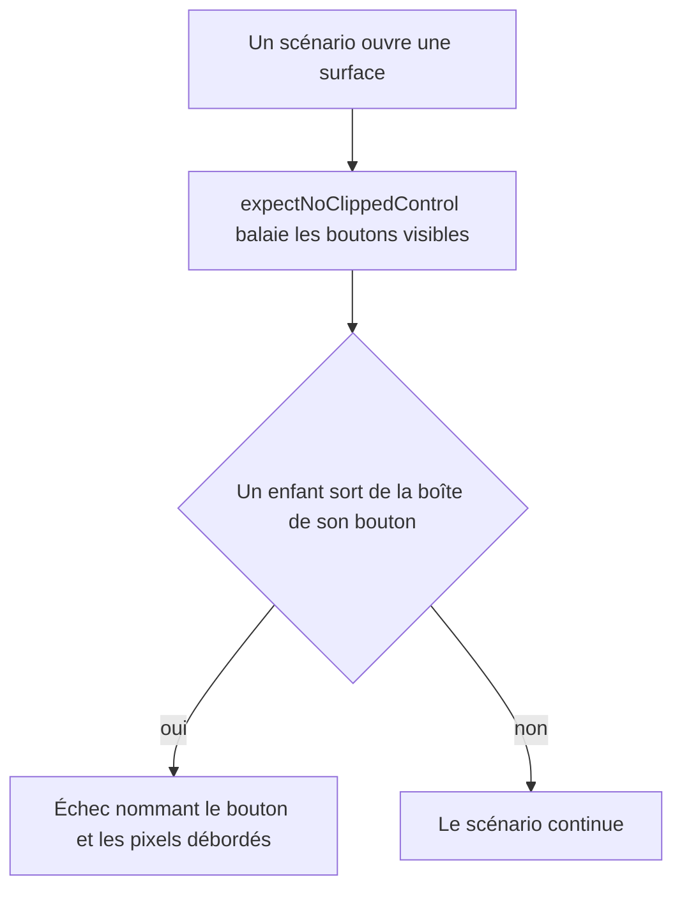
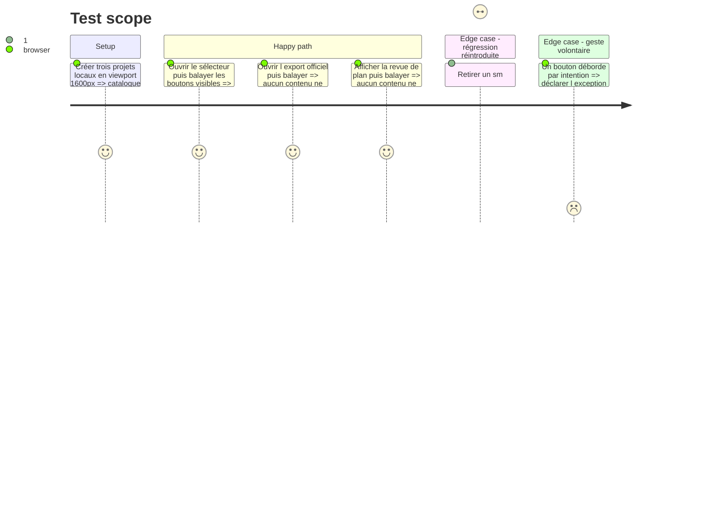

# Instruction: Interdire le retour du défaut, et l'écrire

## Pourquoi une garde rendue

Le défaut est muet par construction : la classe demandée est bien écrite, le
composant est bien celui du registre, rien n'échoue à la compilation, et
`audit:scale` ne voit qu'une hauteur de 32px de plus — une valeur parfaitement
légitime de l'échelle coss. Seule la géométrie rendue distingue « ce bouton
mesure 32px » de « ce bouton peint 50px de contenu dans 32px de boîte ».

## Architecture projection

> Tree of the final files. ✅ create · ✏️ modify · ❌ delete

```txt
.
├── apps/web/e2e/
│   ├── helpers.ts               ✏️ `expectNoClippedControl(page)`, la mesure partagée
│   ├── project-file.spec.ts     ✏️ appel sélecteur ouvert, en 1600px, avant la réduction à 600
│   ├── export.spec.ts           ✏️ appel dialogue « Export officiel » ouvert
│   └── ai-campaign.spec.ts      ✏️ appel bande d'onglets « Visuels proposés » affichée
└── CLAUDE.md                    ✏️ une puce dans « Design language » : la variante coss déclare sa hauteur deux fois
```

## User Journey



## Test Scope



## Tasks to do

### `1)` La mesure partagée

> Un contrôle ne peint rien hors de sa boîte.

1. Ajouter `expectNoClippedControl(page)` à `apps/web/e2e/helpers.ts`, sur le modèle du balayage de curseurs de `semantics.spec.ts` : un seul `page.evaluate`, puis `expect(offenders).toEqual([])`.
2. Dans la page : pour chaque `[data-slot="button"]` de boîte non nulle, comparer le rectangle de chaque enfant élément visible à celui du bouton, tolérance 1px en haut comme en bas.
3. Retourner un objet parlant par fautif — libellé accessible ou texte tronqué, hauteur de la boîte, hauteur du contenu, dépassement en pixels — pour que l'échec nomme le bouton sans qu'on ait à ouvrir la trace.
4. Prévoir, comme le `gesture` du balayage de curseurs, une liste d'exceptions déclarées et commentées, vide au départ ; un débordement voulu s'y écrit plutôt que d'affaiblir la mesure.

### `2)` Les trois points d'appel

> Là où la suite ouvre déjà la surface, la mesure ne coûte qu'une ligne.

1. `project-file.spec.ts`, scénario « structures, filters and opens local projects… » : appeler la garde juste après l'ouverture du sélecteur, **avant** le `setViewportSize({ width: 600 })`, sinon la mesure passe sous le point d'arrêt `sm` et rate précisément le cas fautif.
2. `export.spec.ts` : appeler la garde une fois le dialogue « Export officiel » visible, la liste d'écrans rendue.
3. `ai-campaign.spec.ts` : appeler la garde une fois la tablist « Visuels proposés » visible.
4. Confirmer la valeur de la garde : retirer temporairement un `sm:h-auto` de la phase 1 et vérifier que la suite échoue, puis le remettre.

### `3)` L'écrire une fois

> Le prochain appelant doit lire le piège avant de le retrouver.

1. Ajouter à la section « Design language » de `CLAUDE.md` une puce courte : une variante de taille coss déclare sa hauteur deux fois (`h-9 sm:h-8`), `cn()` indexe ses conflits par modificateur, donc un `h-auto` nu ne gagne qu'en dessous de 640px — un bouton qui doit épouser son contenu s'écrit `h-auto sm:h-auto`, et la garde e2e le mesure.
2. Refléter la même règle en une phrase dans `aidd_docs/memory/design.md`, section « System », là où vit déjà la règle « jamais éditer `components/ui/` ».

## Test acceptance criteria

| Task | Acceptance criteria                                                                                                                                       |
| ---- | ------------------------------------------------------------------------------------------------------------------------------------------------------------ |
| 1    | Le helper renvoie une liste vide sur l'application corrigée, et une entrée nommant le bouton, sa boîte et son dépassement dès qu'un contenu sort de sa boîte. |
| 2    | Les trois scénarios passent ; retirer un seul `sm:h-auto` de la phase 1 en fait échouer au moins un, avec le nom du bouton fautif dans le message.            |
| 3    | `CLAUDE.md` et `aidd_docs/memory/design.md` énoncent la règle `h-auto sm:h-auto` et nomment la garde qui la tient.                                            |
