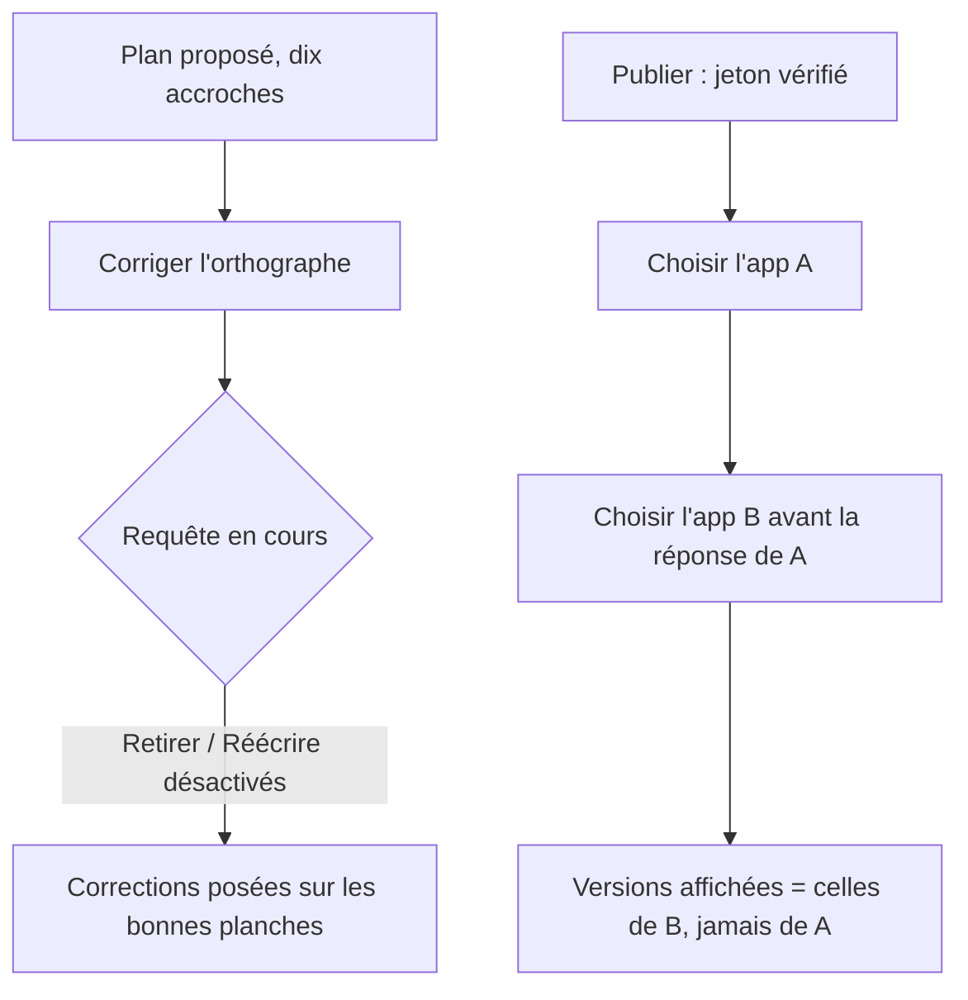
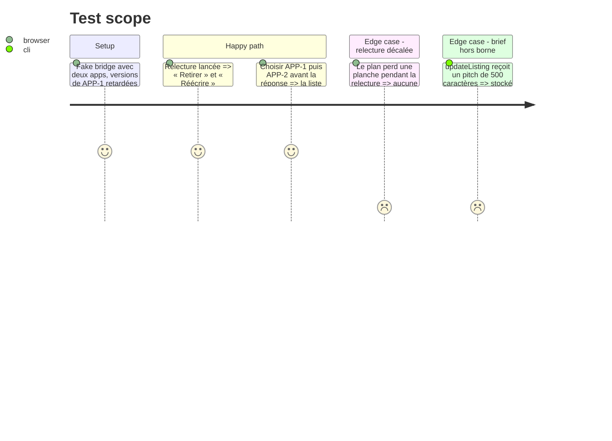

# Instruction: Fiche et publication — relecture sûre, séquencement des lectures Apple, bornes du brief

## Architecture projection

> Tree of the final files. ✅ create · ✏️ modify · ❌ delete

```txt
.
├── apps/web/src/components/campaign-dialog/CampaignDialog.tsx   ✏️ relecture gardée, listingFromFields(), bornes MAX_LISTING_*
├── apps/web/src/components/publish-dialog/PublishDialog.tsx     ✏️ génération de requête, sonde unique, setPreparedBundle, ConfirmAction dans StepDialog
├── apps/web/src/stores/project.store.ts                          ✏️ updateListing(partial) : défauts + fusion + bornes
├── apps/web/src/stores/__tests__/project.store.test.ts           ✅ un brief hors borne est tronqué et le projet reste valide
├── apps/web/src/lib/__tests__/project-validation.test.ts         ✏️ LISTING_DIRECTIONS === DIRECTIONS.map(d => d.id)
├── apps/web/e2e/asc-publish.spec.ts                              ✏️ un changement d'app pendant une liste lente garde la bonne liste
├── packages/project-format/src/project-validation.ts             ✏️ LISTING_DIRECTIONS satisfies readonly ListingDirection[]
└── packages/project-format/src/types.ts                          ✏️ « Voir lib/listing.ts » → l'écrivain réel
```

## User Journey



## Test Scope



## Tasks to do

### `1)` Relecture des accroches sûre (🟡 CampaignDialog.tsx:522)

> Une correction ne se pose que sur l'accroche qu'elle a relue.

1. Ajouter `proofreading` aux `disabled` de « Réécrire » (:1316) et « Retirer » (:1333).
2. Dans le `setPlan` de `proofread()` : rendre `current` inchangé si `current.screens.length !== headlines.length` ; n'appliquer `corrected[index]` que si `screen.headline === headlines[index]`.
3. Étendre le test de relecture d'`ai-provider.spec.ts` (:317) : pendant la requête (réponse retardée), les deux boutons sont `disabled`.

### `2)` Un seul brief assemblé (🟢 CampaignDialog.tsx:251, project.store.ts:230)

> Le store possède la forme du brief ; la boîte ne fait que lire ses champs.

1. `listingFromFields()` dans `CampaignDialog` : `appName.trim()`, `pitch.trim()`, `productContext`/`landingUrl` élagués et omis si vides ; lu par le `useMemo` du `brief` (:209) et par `saveListing` (:248).
2. `updateListing(patch: Partial<ProjectListing>)` dans `project.store` : fusion sur `state.project.listing`, défauts `appName: ''`, `pitch: ''`, `direction: 'sobre'`, `language` = courant sinon `defaultSourceLanguage()` ; chaque chaîne tronquée à sa borne `MAX_LISTING_*` avant `structuredClone`.
3. Remplacer les `maxLength` littéraux des champs (:667 `60`, :688 `AI_LIMITS.maxCampaignHeadlineLength`, :959 `2048`, :975) par `MAX_LISTING_NAME_LENGTH`, `MAX_LISTING_PITCH_LENGTH`, `MAX_LISTING_URL_LENGTH`, `MAX_LISTING_CONTEXT_LENGTH`.
4. `project.store.test.ts` : un correctif hors borne est tronqué, `isProject` reste vrai, un `runEditorTransaction` suivant s'engage.

### `3)` Lectures Apple séquencées (🟡 PublishDialog.tsx:364, 🟢 :303, :274, :1039)

> La dernière destination choisie est la seule qui écrit.

1. `const requests = useRef(0)` ; dans `selectApp` et `selectVersion`, `const seq = ++requests.current` avant l'`await`, et `if (seq !== requests.current) return` avant chaque `set*`/`edit` qui suit un `await`.
2. Une seule `probeBridge()` gardée par la même génération, appelée par l'effet de montage et par `recheckBridge` (plus de `cancelled` local).
3. Renommer `setBundle` → `setPreparedBundle`.
4. Rendre `ConfirmAction` dans les enfants de `StepDialog`, comme `ReleaseDialog` (:508) et `LocaleDialog` (:559).
5. `asc-publish.spec.ts` : le faux pont accepte un délai par app ; test « choisir APP-2 pendant que APP-1 répond » → le `combobox` Version liste les versions de APP-2 et `target` n'a jamais porté une version de APP-1.

### `4)` Une seule liste de directions (🟢 project-validation.ts:356, types.ts:215)

> Trois copies des mêmes quatre identifiants ne dérivent plus en silence.

1. `LISTING_DIRECTIONS = [...] as const satisfies readonly ListingDirection[]`.
2. `project-validation.test.ts` : `expect([...LISTING_DIRECTIONS]).toEqual(DIRECTIONS.map((d) => d.id))`.
3. `types.ts:215` : « Voir `stores/project.store.ts` (`updateListing`), lu par les boîtes fiche et langues ».

## Test acceptance criteria

| Task | Acceptance criteria |
| ---- | ------------------- |
| 1    | Pendant une relecture, « Retirer » et « Réécrire » sont désactivés ; une planche retirée entre l'envoi et le retour ne reçoit aucune correction et rien n'est décalé |
| 2    | Un pitch de 500 caractères passé à `updateListing` est stocké à 140 ; le champ pitch refuse au-delà de 140 ; `brief.pitch` et `listing.pitch` sont identiques et élagués |
| 3    | Choisir une seconde app avant la réponse de la première affiche les versions de la seconde ; « Vérifier » deux fois de suite ne laisse aucune sonde écrire après le démontage ; la confirmation d'envoi s'ouvre et se ferme depuis l'étape Envoi |
| 4    | Une direction ajoutée à `DIRECTIONS` sans `LISTING_DIRECTIONS` fait échouer un test unitaire nommé |
