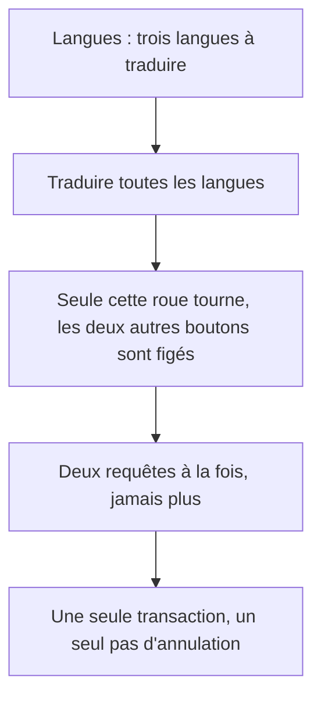
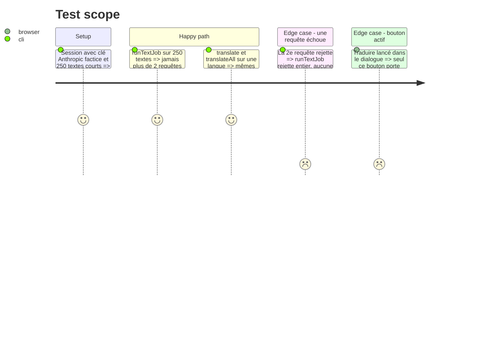

# Instruction: Langues et rédacteur — un état par tâche, un seul chemin de traduction, requêtes bornées

## Architecture projection

> Tree of the final files. ✅ create · ✏️ modify · ❌ delete

```txt
.
├── apps/web/src/components/locale-dialog/LocaleDialog.tsx        ✏️ running, translateInto(), updateListing({ language }), commentaire tenu
├── apps/web/src/components/release-dialog/ReleaseDialog.tsx      ✏️ forget() dit son échec
├── apps/web/src/lib/locale.ts                                    ✏️ applySourceTexts borne avec MAX_LAYER_TEXT_LENGTH
├── apps/web/src/lib/ai/text.ts                                   ✏️ mapPool(items, 2, fn) ; runTextJob l'emploie
├── apps/web/src/lib/ai/direct-api.ts                             ✏️ completeTexts en réserve bornée ; target: TextLanguage
├── apps/web/src/lib/bridge-client.ts                             ✏️ textsViaBridge typé par l'union des deux requêtes
├── apps/web/src/lib/__tests__/text.test.ts                       ✏️ replyFor(body) ; au plus 2 requêtes en vol
└── apps/web/src/lib/__tests__/locale.test.ts                     ✏️ une correction de 401 caractères n'est pas coupée
```

## User Journey



## Test Scope



## Tasks to do

### `1)` Un état par tâche (🟡 LocaleDialog.tsx:491)

> La roue dit quelle tâche tourne.

1. `const [running, setRunning] = useState<'translate' | 'proofread' | 'all' | null>(null)` ; `const busy = running !== null` reste le nom lu partout ailleurs.
2. `translate`/`proofread`/`translateAll` posent et relâchent leur propre valeur.
3. Les trois boutons : `loading={running === '<tâche>'}`, `disabled={busy || …}` inchangé.
4. `locale.spec.ts` : pendant « Traduire toutes les langues » (réponse retardée), seul ce bouton porte `aria-busy`/son spinner.

### `2)` Un seul chemin de traduction (🟢 LocaleDialog.tsx:242, :152, :279)

> `translateAll` est `translate` répété, pas réécrit.

1. `translateInto(target: LocaleVariant): Promise<readonly [code, proposals, skipped]>` : la règle de candidature de `translate` (:186, variante absente ou non relue, ou tout si rien n'est à relire), le filtre `MAX_TEXT_JOB_LENGTH`, l'appel `runTextJob`, la projection en propositions.
2. `translate` = `applyTranslations(Object.fromEntries([await translateInto(locale)]))` ; `translateAll` = `mapPool(pendingLocales, 2, translateInto)` puis une seule `applyTranslations`.
3. `setSourceLanguage` → `useProjectStore.getState().updateListing({ language })` (phase 1).
4. `ReleaseDialog.forget` : sur `!committed`, afficher « La version « … » n'a pas pu être supprimée. » par le même mécanisme d'erreur que `verifyError` ; le commentaire de `forgetLocale` redevient vrai.

### `3)` Requêtes bornées (🟡 text.ts:80)

> Deux requêtes payantes à la fois, un 429 n'emporte qu'un lot.

1. `export async function mapPool<T, R>(items, limit, fn): Promise<R[]>` dans `text.ts` : deux travailleurs consommant un index partagé, résultats rangés par index (forme de `use-export.ts`).
2. `runTextJob` : `mapPool(chunked(texts), 2, …)` à la place de `Promise.all`.
3. `completeTexts` (direct-api.ts:518) : `mapPool(chunkByChars(texts), 2, …)`.
4. `text.test.ts` : 250 textes, fausse API comptant les requêtes en vol → maximum 2, sortie dans l'ordre ; une requête qui rejette → rejet entier.

### `4)` Types et bornes justes (🟢 locale.ts:440, direct-api.ts:540, bridge-client.ts:332, text.test.ts:109)

> Chaque borne est celle de l'objet qu'elle coupe.

1. `applySourceTexts` : `value.slice(0, MAX_LAYER_TEXT_LENGTH)` ; `locale.test.ts` : une correction de 401 caractères est reprise entière.
2. `translateViaApi` : `target: TextLanguage` (le `script` n'est pas lu).
3. `textsViaBridge` : `body` typé `Omit<TranslateRequest, 'protocol'> | Omit<ProofreadRequest, 'protocol'>` (types déclarés dans `bridge-client.ts` si le protocole du pont n'est pas importable côté web).
4. `text.test.ts:109` : `replyFor(body)` nommée, qui compte les lignes `^\d+\. ` du prompt et rend autant de textes.

## Test acceptance criteria

| Task | Acceptance criteria |
| ---- | ------------------- |
| 1    | Une tâche lancée fait tourner une seule roue ; les deux autres boutons sont désactivés sans indicateur de chargement |
| 2    | `translate` sur une langue et `translateAll` réduit à cette langue produisent les mêmes propositions ; supprimer une version figée refusée affiche une erreur au lieu de rien |
| 3    | Sur 250 textes, jamais plus de deux requêtes ouvertes ; l'ordre de sortie est celui d'entrée ; une requête rejetée rejette tout sans écriture |
| 4    | Une correction de 401 caractères sur un calque est reprise entière ; `pnpm run typecheck` passe avec les nouveaux types |
