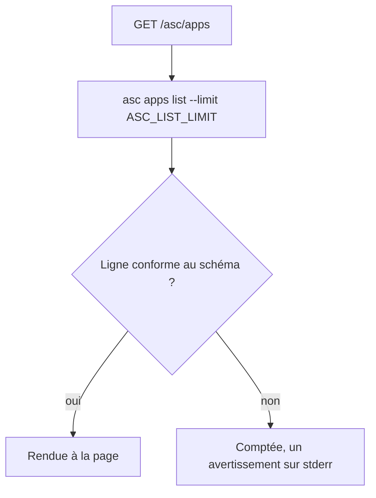
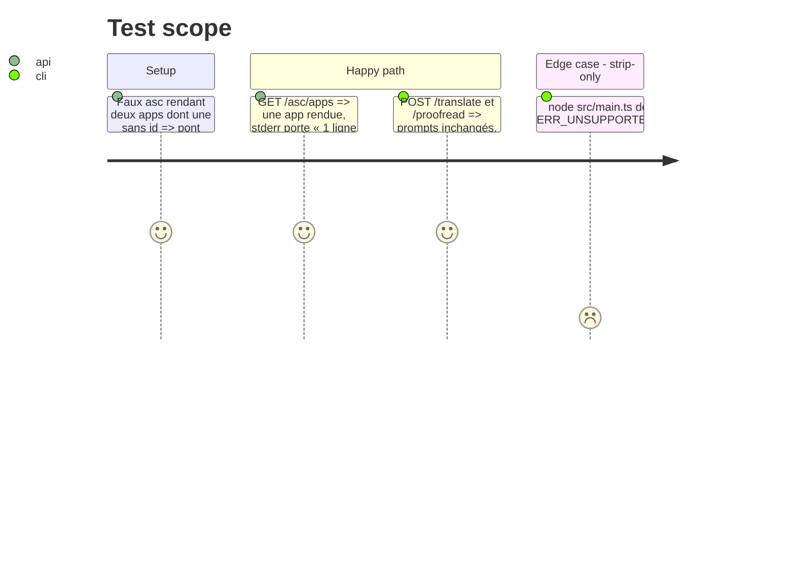

# Instruction: Pont — `textTurn` typé par son schéma, listes `asc` bornées et bavardes

## Architecture projection

> Tree of the final files. ✅ create · ✏️ modify · ❌ delete

```txt
.
├── apps/bridge/src/server.ts        ✏️ textTurn générique sur le schéma, plus de cast en intersection
├── apps/bridge/src/asc.ts           ✏️ ASC_LIST_LIMIT (note ponytail), lignes écartées comptées sur stderr
└── apps/bridge/src/bridge.test.ts   ✏️ une ligne malformée parmi deux → une rendue, un avertissement
```

## User Journey



## Test Scope



## Tasks to do

### `1)` `textTurn` générique (🟢 server.ts:230)

> Un prompt ne lit que ce que son schéma a validé.

1. `function textTurn<S extends ZodType>(context, schema: S, prompt: (request: z.infer<S>) => string)` ; retirer `as TranslateRequest & ProofreadRequest`.
2. Les deux routes (:249-250) compilent sans cast ; `pnpm --filter bridge run typecheck`.

### `2)` Listes bornées et bavardes (🟢 asc.ts:386, :395)

> Une borne a un nom, une ligne perdue laisse une trace.

1. `const ASC_LIST_LIMIT = 200` avec `// ponytail: pas de pagination, suivre links.next au-delà de 200`, utilisé par `listApps`, `listVersions`, `listLocalizations`.
2. Dans chaque `flatMap`, compter les `safeParse` échoués ; si > 0, `console.warn` « asc <liste> : N ligne(s) écartée(s), hors schéma. » — jamais le contenu de la ligne.
3. `bridge.test.ts` : deux lignes dont une sans `id` → une seule rendue, `warn` appelé une fois avec le compte.
4. Lancer `pnpm --filter bridge run start` une fois : le pont démarre sous `node` (strip-only).

## Test acceptance criteria

| Task | Acceptance criteria |
| ---- | ------------------- |
| 1    | Le pont compile sans cast d'intersection et les tests des deux routes texte passent inchangés |
| 2    | Une ligne hors schéma est écartée, comptée sur stderr sans son contenu, et le pont démarre sous `node src/main.ts` |
