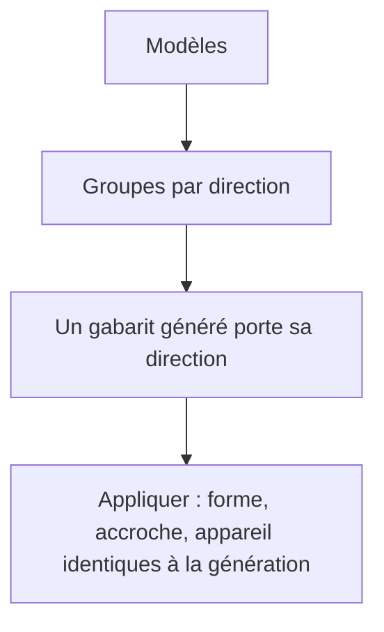
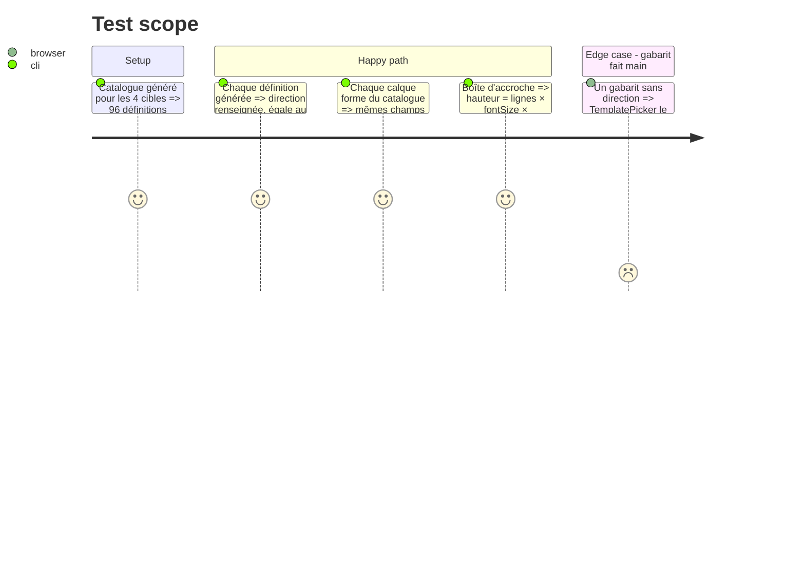

# Instruction: Gabarits — la direction portée, les constantes des archétypes partagées

## Architecture projection

> Tree of the final files. ✅ create · ✏️ modify · ❌ delete

```txt
.
├── packages/project-format/src/types.ts                              ✏️ TemplateDefinition.direction?: ListingDirection
├── apps/web/src/assets/templates/catalog.ts                          ✏️ direction posée, createShapeLayer étalé, LINE_HEIGHT importé
├── apps/web/src/assets/templates/__tests__/templates.test.ts         ✏️ lit template.direction, formes = défauts de createShapeLayer
├── apps/web/src/components/template-picker/TemplatePicker.tsx        ✏️ generatedDirection lit le champ, ne ré-analyse plus l'id
└── apps/web/src/lib/ai/archetypes.ts                                 ✏️ export LINE_HEIGHT ; HEADLINE_CLEARANCE = 16
```

## User Journey



## Test Scope



## Tasks to do

### `1)` La direction est un champ (🟢 TemplatePicker.tsx:31)

> Ce que le catalogue compose, il le déclare.

1. `TemplateDefinition.direction?: ListingDirection` dans `types.ts`.
2. `catalog.ts:84` : `direction: style.id` sur la définition.
3. `generatedDirection(template)` → `template.direction ?? null` ; `isGenerated` inchangé.
4. `templates.test.ts` : lire `template.direction` au lieu de découper l'id.

### `2)` Constantes partagées (🟢 catalog.ts:148, :44, archetypes.ts:438)

> Une valeur, un nom, deux lecteurs.

1. `export const LINE_HEIGHT = 1.2` dans `archetypes.ts` ; `catalog.ts:148` l'importe.
2. `const HEADLINE_CLEARANCE = 16` utilisé aux deux sites (:423, :438).
3. `catalogShapeLayer` = `{ ...createShapeLayer(zIndex, accent.shape, board), id, x, y, width, height, rotation, opacity, fill }`.
4. `templates.test.ts` : pour un calque forme généré, `name`, `stroke`, `visible`, `locked` égalent ceux de `createShapeLayer`.

## Test acceptance criteria

| Task | Acceptance criteria |
| ---- | ------------------- |
| 1    | Les 96 gabarits générés portent une `direction` égale au segment de leur id ; le sélecteur groupe sans relire l'id ; un gabarit fait main reste hors groupe |
| 2    | Changer `LINE_HEIGHT` ou le dégagement change l'archétype et le catalogue ensemble ; `archetypes.test.ts` et `templates.test.ts` passent |
